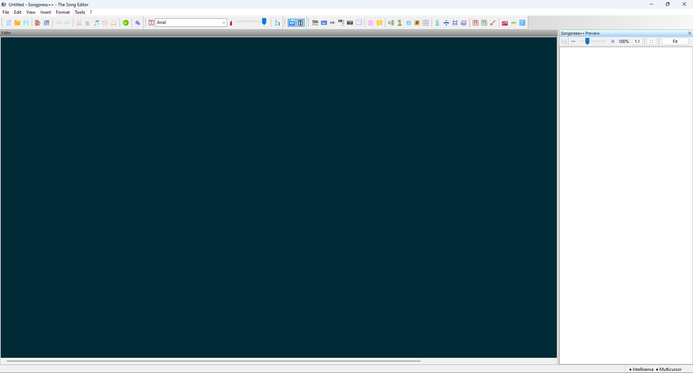
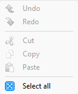

# Songpress++

Songpress++ is a free and easy-to-use program for typesetting songs on Windows (and Linux), generating high-quality songbooks.

Songpress++ is focused on song formatting. Once the song is ready, you can copy/paste it into your favorite application to give your songbook the look you want. Alternatively, you can print it or create a "Song Book".

## Installation on Windows

### End Users

1. Download and run `songpress++-setup.exe`
2. The installer will guide you through the installation step by step
3. **No manual setup required**: the installer automatically downloads Python (if not already present on the system) and all necessary packages directly from the internet
4. Available as either a portable or installable version

> **Note:** An internet connection is required during the first installation.

> **Note — `uv.exe` is not a virus:** The installer includes `uv.exe`, an open-source Python package manager ([astral-sh/uv](https://github.com/astral-sh/uv)). Some antivirus software may flag it as suspicious due to heuristic detection on next-generation executables. This is a **false positive**: `uv.exe` is a legitimate, safe, and widely adopted tool in the Python ecosystem. If your antivirus blocks it, add an exception for the Songpress++ installation folder.

All files are installed in a single folder within the current user's _User_ directory, allowing a clean uninstallation through its own uninstaller.

### Development

#### Prerequisites

- **Python >= 3.12** installed and added to PATH
- Install the required packages:

```
pip install -r requirements.txt
```

Then launch `src/Avvio SONGPRESS.vbs` or `src/Avvio SONGPRESS2.vbs`.

Alternatively, you can start the application directly with Python from the project root:

```
cd E:\Users\Utente\Downloads\SongpressV33_OK\Songpressplusplus
python main.py
```

> **Note:** The path shown above (`E:\Users\Utente\Downloads\SongpressV33_OK\Songpressplusplus`) is an example. Replace it with the actual path where you cloned or extracted the project on your system.

> **Note:** `main.py` must be run from the project root directory (`Songpressplusplus\`), where it is located, so that the `songpressPlusPlus` package is correctly found on the Python path.

There are two differences between the two launchers, both significant:

1. Python detection

`Avvio SONGPRESS2.vbs`: uses a static array of hardcoded versions (3.4 → 3.14) and tries them one by one with RegRead. Simple but fragile — if Python 3.15 is released, it won't be found.
`Avvio SONGPRESS.vbs`: uses reg query to dynamically query the registry, finding any installed 3.x version without a hardcoded list. More robust. Uses **"Add Python to PATH"** to detect the version in use.

1. Error messages

`Avvio SONGPRESS2.vbs`: short, technical messages (shows the raw path), with no title in the window.
`Avvio SONGPRESS.vbs`: more user-friendly messages, with the title "Songpress - Startup Error" and, if Python is missing, suggests where to download it (python.org) and what to do during installation.

In summary: `Avvio SONGPRESS2.vbs` is the development/debug version, `Avvio SONGPRESS.vbs` is the polished end-user version.

## Installation on Linux

(Never tested)

## Installation on MAC

(Never tested)

## Languages Interface

- English
- Italian

## Main Features

### Editing
- Production of **high-quality guitar charts** (lyrics and chords)
- **Easy** to learn, fast to use
- **ChordPro autocomplete (IntelliSense)**: directives are suggested and completed automatically as you type, with smart bracket and colon insertion
- **Multi-Cursor Support**: create and edit with multiple simultaneous cursors
- **Find & Replace**: unified dialog with two tabs (Find / Replace), support for whole-word search, case sensitivity, and **regular expressions**, with configurable highlight colour and search history
### Tools
- **Syntax check**: validates ChordPro syntax and jumps directly to any error found in the document
- **Song Statistics** (`F8`): analyzes the open song and shows a summary dialog with difficulty rating (1–5 stars), structure breakdown (verses, choruses, bridges, pages), lyrics word count, chord complexity, and duration — either declared via `{duration:MM:SS}` or automatically estimated from `{tempo:}` and `{time:}`
- **New from template**: start a new song from a pre-built ChordPro template

### Chords
- **Chord transposition** with automatic key detection
- **Chord simplification** for beginner guitarists: identifies the easiest key to play and automatically transposes the song
- **Chord propagation**: copies chords from the first verse (or first chorus) to all subsequent verses (or choruses) with the same number of lines, with a single click
- **Chord integration**: merge chords from the clipboard into the current selection (*Paste chords*)
- **Move chord left / right**: shift individual chords along the lyric line for precise positioning
- **Remove chords**: strips all chords from the text, leaving lyrics only
- Support for various **chord notations**: American (C, D, E), Italian (Do, Re, Mi), French, German, and Portuguese; with notation conversion between systems
- Support for **ChordPro and Tab** chord formats (on two lines); automatic detection and conversion from Tab to ChordPro

> **Why prefer ChordPro format over Tab?**
>
> The **Tab** (or "two-line") format places chords above the lyrics on separate lines, aligned character by character. While straightforward to type, it has significant limitations: it is fragile when the font or text size changes, difficult to edit without breaking alignment, and not portable across different applications.
>
> **ChordPro** instead embeds chords directly inside the lyrics using square brackets (e.g. `Amaz[G]ing grace`), making them independent of visual formatting. The advantages are substantial:
> - **Robustness**: chords are bound to words, not columns — changing font or size never breaks the layout
> - **Editability**: adding or removing words does not require manually realigning all chords
> - **Reliable transposition**: automatic transposition works accurately because chords are structurally separate from the text
> - **Portability**: ChordPro is an open standard recognised by dozens of applications across all platforms
>
> For these reasons, Songpress++ supports **automatic conversion from Tab to ChordPro**, and it is recommended to convert songs to ChordPro format before working on them.

### Formatting & Layout
- **Chord positioning**: display chords above or below the lyrics
- **Show/hide chords**: slider control to show the full song, one chord pattern per verse only, or no chords at all
- **Verse and chorus labels**: toggle labels on or off, with customisable chorus label text
- **Custom verse labels**: insert verses with a custom label or without a label
- **Structured block insertion**: quickly insert verse, numbered verse, chorus, bridge, chord block, and grid blocks from the menu
- **Metadata fields**: insert title, subtitle, artist, composer, album, year, copyright, key, capo, tempo, time signature, and duration directly from the menu
- **Musical symbol insertion**: dedicated dialog for inserting special music symbols into the text
- **Chord diagram insertion** (*klavier*): insert fingering diagrams for chords, with configurable highlight colour and finger numbering
- **Line and page spacing**: insert custom line spacing, chord-top spacing, manual page breaks (`{new_page}`), and column breaks
- **Page break lines and column break lines**: visual guides shown in the preview panel
- **Duration beats display**: show rhythmic beat markers in the preview

### Preview & Print
- **Live preview panel**: the formatted song updates in real time as you edit; the panel is dockable and resizable
- **Tempo, time signature, and key display** in the preview header, with configurable icon size
- **Chord grid display**: configurable grid rendering mode (pipe style), default label, and sizing direction
- **Page size and margins**: configurable paper size and top/bottom/left/right margins, persisted across sessions
- **Multi-column layout**: print or preview the song in one or two columns per page
- **Two pages per sheet**: print two logical pages side by side on a single physical sheet
- **Fit to page / shrink to fit**: automatically scales the song to avoid content being clipped at the bottom
- **Print Preview**: full print preview before printing
- **Print**: print the song or export it to PDF, with support for explicit page breaks via `{new_page}` / `{np}` commands
- **Create Songbook**: generate a complete PDF collection from all songs in a selected folder

### Export & Clipboard
- Ability to **paste formatted songs** as a vector image into any Windows or Linux application (Affinity, Microsoft Word, LibreOffice, Microsoft Publisher, Inkscape, etc.)
- **Copy as image**: copies the formatted song (or selected verses) to the clipboard as a Windows Metafile (WMF) on Windows, or as SVG + PNG on Linux
- **Export to EMF** (Windows Metafile, Windows only) and to **SVG vector** format
- **Export to PNG** and **HTML** (complete web pages or fragments)
- **Copy plain text only**: copies the lyrics without chord markup to the clipboard

### Cleanup & Import
- **Cleanup of spurious blank lines**: automatically detects and removes extra blank lines (common in songs copied from web pages)
- **Normalize chord notation**: standardises inconsistent chord notation across the document
- **Normalize multiple spaces**: removes extra spaces from the text
- **Import from PDF**: extract song text from a PDF file and open it for editing

### Interface & Preferences
- **Bilingual interface**: English and Italian
- **Customisable editor**: configurable font face, size, background colour, selection colour, and per-element syntax colouring (normal text, chorus, chords, commands, attributes, comments, tab grid)
- **Integrated guide**: built-in help viewer with Markdown rendering, zoom control (50 %–200 %), light/dark theme, full-screen mode, and in-document search
- **Window position and size**: saves and restores the last window position and layout (AUI perspective)

## Screenshot program





## Adding a new ChordPro directive (developer guide)

Adding a new directive (e.g. `{mycommand: value}`) requires touching up to **six files**, depending on whether the directive is purely a metadata field, renders something visually, or has a dedicated UI action.

### 1. `Renderer.py` — parsing and execution *(always required)*

This is the core file. Inside the `Render()` method, locate the large `elif cmd == ...` chain and add a new branch:

```python
elif cmd == 'mycommand':
    a = self.GetAttribute()
    if a is not None and a.strip():
        # do something with a.strip()
```

**Metadata-only directives** (not displayed in the preview) go into the existing silent-consume tuple instead:

```python
elif cmd in ('sorttitle', 'keywords', ..., 'duration', 'mycommand'):
    self.GetAttribute()   # consume the value token without using it
```

### 2. `SyntaxChecker.py` — validation *(always required)*

Add `"mycommand"` to **two** sets inside `_validate_command()`:

- **`_KNOWN_COMMANDS`** — marks the directive as recognised (prevents "unknown command" errors).
- **`_REQUIRES_VALUE`** — if the directive must have a non-empty value; or **`_OPTIONAL_VALUE`** — if it can be used without a value to reset a default.

Optionally add a dedicated `_validate_mycommand()` function for format-level validation (see `_validate_beats_time()` as a reference), and call it at the bottom of `_validate_command()`.

### 3. `SongpressFrame.py` — IntelliSense and optional UI action *(always required)*

- Add `'mycommand'` to `_CHORDPRO_DIRECTIVES` — this makes it appear in the **Ctrl+Space** autocomplete popup.
- If the directive has no value (closes immediately with `}`), add it to `_DIRECTIVES_NO_VALUE`.
- If you want a **menu item** that inserts the directive, add an `OnInsertMycommand()` handler method and bind it with `Bind(self.OnInsertMycommand, 'insertMycommand')`.

### 4. `songpress.xrc` + `songpress_it.xrc` — menu items *(only if adding a menu entry)*

Add a `wxMenuItem` block in the appropriate `<object class="wxMenu">` section:

```xml
<object class="wxMenuItem" name="insertMycommand">
  <label>_My command {mycommand:}...</label>
  <accel></accel>
  <help>Insert ChordPro directive for ...</help>
</object>
```

Add the same block with the Italian label to `songpress_it.xrc`.

### 5. `gui.fbp` — wxFormBuilder source *(only if adding a menu entry)*

Add the corresponding `wxMenuItem` object in the wxFormBuilder project file, mirroring the XRC entry. This keeps the visual designer in sync with the XRC files.

### 6. `PreferencesDialog.po` + translation files *(only if adding UI strings)*

If the new directive introduces new translatable strings (labels, tooltips, error messages), add the corresponding `msgid` / `msgstr` pairs to the `.po` file.

---

### Quick reference — file checklist

| File | When to edit |
|---|---|
| `Renderer.py` | Always — add the `elif cmd == 'mycommand':` branch |
| `SyntaxChecker.py` | Always — add to `_KNOWN_COMMANDS` and `_REQUIRES_VALUE` / `_OPTIONAL_VALUE` |
| `SongpressFrame.py` | Always — add to `_CHORDPRO_DIRECTIVES`; optionally add menu handler |
| `songpress.xrc` | Only if adding a menu item (English UI) |
| `songpress_it.xrc` | Only if adding a menu item (Italian UI) |
| `gui.fbp` | Only if adding a menu item (wxFormBuilder source) |
| `PreferencesDialog.po` | Only if adding new translatable strings |


### Linux: SVG export and display scaling

When the system display scale factor is not set to 1, the SVG output produced by the Copy as Image function may be incorrectly formatted. This is a known issue in the current version of wxPython. The underlying problem [has already been fixed upstream in wxWidgets](https://github.com/wxWidgets/wxWidgets/issues/25707) and will be automatically corrected as soon as the next version of wxPython is available.

## Credits

**Songpress++** is a fork of *Songpress by Luca Allulli - Skeed*, maintained and extended by Denisov21.

- Original project website: <http://www.skeed.it/songpress>
- Fork repository: <https://github.com/Denisov21/Songpressplusplus>

---

*File encoding: UTF-8*
