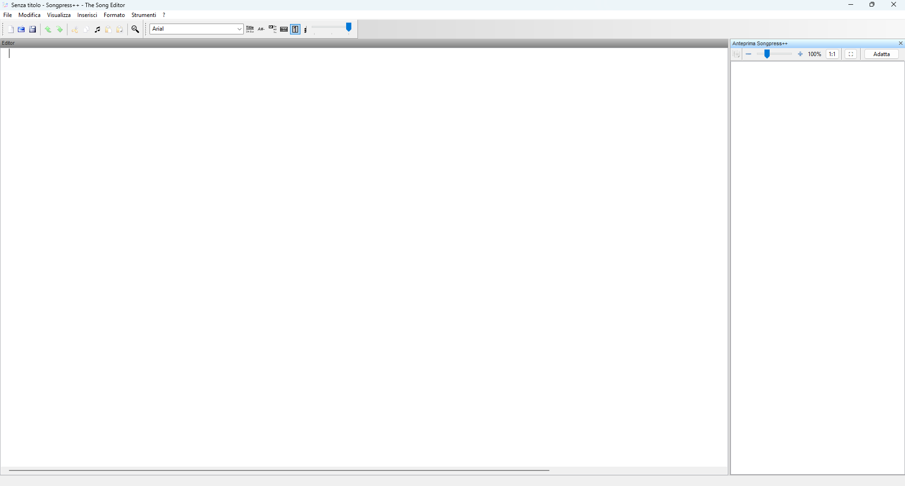

# Songpress++

Songpress++ è un programma gratuito e facile da usare per la composizione tipografica di canzoni su Windows (e Linux), che genera canzonieri di alta qualità.

Songpress++ è incentrato sulla formattazione delle canzoni. Una volta che la canzone è pronta, puoi copiarla/incollarla nella tua applicazione preferita per dare al tuo canzoniere l'aspetto che desideri. In alternativa puoi stamparla o creare un "Libro di canzoni"

## Installazione su Windows

### Utenti finali

1. Scarica ed esegui il file `songpress++-setup.exe`
2. L'installer guida l'utente attraverso l'installazione passo passo
3. **Nessuna configurazione manuale richiesta**: l'installer scarica automaticamente Python (se non già presente nel sistema) e tutti i pacchetti necessari direttamente da internet
4. Disponibile in versione portabile o installabile

> **Nota:** È necessaria una connessione internet durante la prima installazione.

Tutti i file vengono installati in un'unica cartella all'interno della directory _User_ dell'utente corrente, consentendo una disinstallazione pulita tramite il proprio programma di disinstallazione.

### Sviluppo

#### Prerequisiti

- **Python >= 3.12** installato e aggiunto al PATH
- Installare i pacchetti necessari:

```
pip install -r requirements.txt
```

Poi avviare `src/Avvio SONGPRESS.vbs` oppure `src/Avvio SONGPRESS2.vbs`.

Le differenze tra i due launcher sono due, entrambe significative:

1. Ricerca di Python

`Avvio SONGPRESS2.vbs`: usa un array statico di versioni hardcoded (3.4 → 3.14) e le prova una per una con RegRead. Semplice ma fragile — se esce Python 3.15 non lo trova.
`Avvio SONGPRESS.vbs`: usa reg query per interrogare dinamicamente il registro, trovando qualsiasi versione 3.x installata senza lista hardcoded. Più robusto. Usa **"Add Python to PATH"** per la ricerca della versione in uso.

1. Messaggi di errore

`Avvio SONGPRESS2.vbs`: messaggi brevi e tecnici (mostra il path grezzo), senza titolo nella finestra.
`Avvio SONGPRESS.vbs`: messaggi più user-friendly, con titolo "Songpress - Errore avvio" e, in caso di Python mancante, suggerisce dove scaricarlo (python.org) e cosa fare durante l'installazione.

In sintesi: `Avvio SONGPRESS2.vbs` è la versione di sviluppo/debug, `Avvio SONGPRESS.vbs` è la versione rifinita per l'utente finale.

## Installazione su Linux

(Mai testata)

## Installazione su MAC

(Mai testata)

## Lingua interfaccia

- Inglese
- Italiano

## Funzionalità principali

- Produzione di **spartiti per chitarra di alta qualità** (testo e accordi)
- **Facile** da imparare, veloce da usare
- Possibilità di **incollare le canzoni formattate** in qualsiasi applicazione Linux e Windows per impaginare il canzoniere con la massima flessibilità (Affinity, Microsoft Word, LibreOffice, Microsoft Publisher, Inkscape, ecc.)
- **Esportazione** delle canzoni formattate in PNG e HTML (pagine web e frammenti)
- **Trasposizione degli accordi** con rilevamento automatico della tonalità
- **Semplificazione degli accordi** per chitarristi principianti: individua la tonalità più facile da suonare e trasponi la canzone automaticamente
- Supporto per diverse **notazioni degli accordi**: americana (C, D, E), italiana (Do, Re, Mi), francese, tedesca e portoghese; con conversione della notazione
- Supporto per i formati di accordi **ChordPro e Tab** (su due righe)
- **Pulizia** di canzoni disordinate con righe vuote spurie (come quelle copiate e incollate da pagine web) e notazioni degli accordi non omogenee
- **Anteprima di stampa** visualizza l'anteprima di stampa.
- **Stampa** permette di stampare o di esportare in pdf.
- **Crea canzoniere** permette di creare una raccolta in pdf, con tutti i brani in una determinata cartella.
- **Altri comandi** tanti nuovi ed interessanti comandi tutti da scoprire.
- **Supporto per multicursore** possibilità di creare e lavorare con più cursori simultaneamente.
- **Posizionamento accordi** visualizza gli accordi o sopra o sotto il testo.
- **Posizione e dimensioni finestra** Salva e ricorda l'ultima posizione della finestra della finestra.

## Immagini programma




## Problemi noti

### Linux: esportazione SVG e scaling del display

Quando il fattore di scala del display di sistema non è impostato su 1, l'output SVG prodotto dalla funzione Copia come immagine potrebbe essere formattato in modo errato. Si tratta di un problema noto nella versione attuale di wxPython. Il problema sottostante [è già stato risolto a monte in wxWidgets](https://github.com/wxWidgets/wxWidgets/issues/25707) e verrà corretto automaticamente non appena sarà disponibile la prossima versione di wxPython.

## Crediti

**Songpress++** è un fork di *Songpress* di Luca Allulli - Skeed, mantenuto ed esteso da Denisov21.

- Sito web versione originale: <http://www.skeed.it/songpress>
- Repository fork: <https://github.com/Denisov21/Songpressplusplus>

---
*Questo file è codificato UTF-8 senza BOM.*
