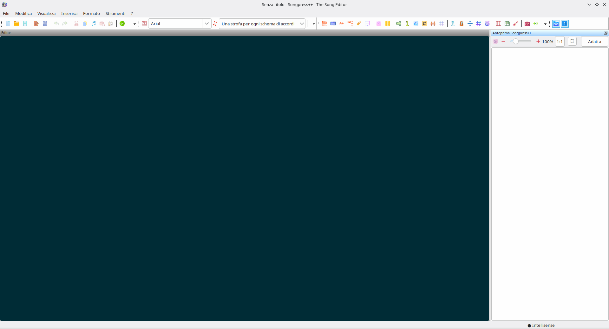
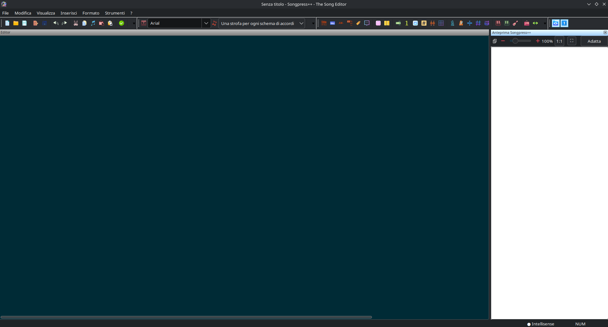
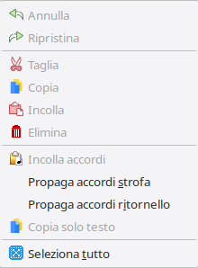
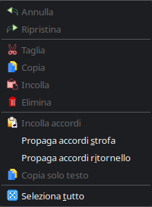

# Songpress++

Songpress++ è un programma gratuito e facile da usare per la composizione tipografica di canzoni su Windows (e Linux), che genera canzonieri di alta qualità.

Songpress++ è incentrato sulla formattazione delle canzoni. Una volta che la canzone è pronta, puoi copiarla/incollarla nella tua applicazione preferita per dare al tuo canzoniere l'aspetto che desideri. In alternativa puoi stamparla o creare un "Libro di canzoni"

## Installazione su Windows

### Utenti finali

1. Scarica ed esegui il file `songpress++-setup.exe`
2. L'installer guida l'utente attraverso l'installazione passo passo
3. **Nessuna configurazione manuale richiesta**: l'installer scarica automaticamente Python (se non già presente nel sistema) e tutti i pacchetti necessari direttamente da internet
4. Disponibile in versione portabile o installabile

> **Nota:** È necessaria una connessione internet durante la prima installazione.

> **Nota — `uv.exe` non è un virus:** L'installer include il file `uv.exe`, uno strumento open source per la gestione dei pacchetti Python ([astral-sh/uv](https://github.com/astral-sh/uv)). Alcuni antivirus potrebbero segnalarlo come sospetto a causa dell'euristica sui file eseguibili di nuova generazione. Si tratta di un **falso positivo**: `uv.exe` è un programma legittimo, sicuro e ampiamente diffuso nella comunità Python. Se il tuo antivirus lo blocca, aggiungi un'eccezione per la cartella di installazione di Songpress++.

Tutti i file vengono installati in un'unica cartella all'interno della directory _User_ dell'utente corrente, consentendo una disinstallazione pulita tramite il proprio programma di disinstallazione.

### Sviluppo

#### Prerequisiti

- **Python >= 3.12** installato e aggiunto al PATH
- Installare i pacchetti necessari:

```
pip install -r requirements.txt
```

Poi avviare `src/Avvio SONGPRESS.vbs` oppure `src/Avvio SONGPRESS2.vbs`.

In alternativa, è possibile avviare l'applicazione direttamente con Python dalla root del progetto:

> **⚠️ Nota:** il percorso qui sotto è solo un **esempio** ed è **da verificare**. Sostituiscilo con il percorso effettivo in cui hai clonato o estratto il progetto sul tuo sistema.

```
cd E:\Users\Utente\Downloads\SongpressV33_OK\Songpressplusplus
python main.py
```

> **Nota:** `main.py` va eseguito dalla directory radice del progetto (`Songpressplusplus\`), dove si trova, affinché il pacchetto `songpressPlusPlus` venga trovato correttamente nel Python path.

Le differenze tra i due launcher sono due, entrambe significative:

1. Ricerca di Python

`Avvio SONGPRESS2.vbs`: usa un array statico di versioni hardcoded (3.4 → 3.14) e le prova una per una con RegRead. Semplice ma fragile — se esce Python 3.15 non lo trova.
`Avvio SONGPRESS.vbs`: usa reg query per interrogare dinamicamente il registro, trovando qualsiasi versione 3.x installata senza lista hardcoded. Più robusto. Usa **"Add Python to PATH"** per la ricerca della versione in uso.

1. Messaggi di errore

`Avvio SONGPRESS2.vbs`: messaggi brevi e tecnici (mostra il path grezzo), senza titolo nella finestra.
`Avvio SONGPRESS.vbs`: messaggi più user-friendly, con titolo "Songpress - Errore avvio" e, in caso di Python mancante, suggerisce dove scaricarlo (python.org) e cosa fare durante l'installazione.

In sintesi: `Avvio SONGPRESS2.vbs` è la versione di sviluppo/debug, `Avvio SONGPRESS.vbs` è la versione rifinita per l'utente finale.

## Installazione su Linux

### Prerequisiti

Assicurati di avere installati i seguenti pacchetti:

```bash
sudo apt install python3 python3-pip python3-venv fakeroot dpkg imagemagick
```

> **Utenti Wayland:** per copiare il brano negli appunti **come immagine** è
> necessario il pacchetto `wl-clipboard` (che fornisce `wl-copy`). Il pacchetto
> `.deb` lo indica tra i `Recommends`, quindi `apt` lo installa automaticamente.
> Se esegui da sorgente su una sessione Wayland, installalo manualmente:
> ```bash
> sudo apt install wl-clipboard
> ```
> Su sessioni X11 non serve. Per sapere su quale sessione sei:
> ```bash
> # rapido
> echo "$XDG_SESSION_TYPE"      # stampa  wayland  oppure  x11
> # autorevole (systemd-logind, consigliato sulle distro recenti)
> loginctl show-session "$(loginctl --no-legend list-sessions | awk -v u="$USER" '$3==u {print $1; exit}')" -p Type --value
> ```

---

### Creazione del pacchetto .deb

Lo script `build_deb.sh` si trova nella root del progetto, accanto a `pyproject.toml`.

#### 1. Entra nella cartella del progetto

> **⚠️ Nota:** il percorso qui sotto è solo un **esempio** ed è **da verificare**. Sostituiscilo con il percorso effettivo in cui si trova il progetto sul tuo sistema.

```bash
cd /home/denis/Songpress_DEFINitiVO3/SongpressPlusPlus
```

#### 2. Rendi eseguibile lo script (solo la prima volta)

```bash
chmod +x build_deb.sh
```

#### 3. Esegui lo script

```bash
./build_deb.sh
```

Lo script esegue automaticamente:

- Lettura di nome e versione da `pyproject.toml`
- Costruzione della wheel Python con `pip` e `hatchling`
- Installazione della wheel nell'albero del pacchetto
- Normalizzazione del layout secondo la Debian Policy (i file vengono spostati
  da `usr/local/` a `usr/`, i moduli in `usr/lib/python3/dist-packages`)
- Creazione del wrapper `GDK_BACKEND=x11` per la compatibilità con Wayland
- Creazione del symlink minuscolo `songpressplusplus` → `SongpressPlusPlus`
- Generazione della voce nel menu applicazioni (file `.desktop`), del tipo MIME
  `text/x-chordpro` e delle icone `hicolor`
- Scrittura degli script `postinst`/`postrm` (aggiornamento delle cache di
  sistema e installazione delle dipendenze solo-PyPI)
- Produzione del file `.deb` finale nella cartella `build_deb/`

Al termine vedrai (il numero di versione mostrato è solo un **esempio**, dipende da quello in `pyproject.toml`):

```
✅  Pacchetto creato: build_deb/songpressplusplus_7.0.2_all.deb
```

---

### Installazione del pacchetto .deb

> **⚠️ Nota:** il numero di versione (`7.0.2`) è solo un **esempio** ed è **da verificare**: usa quello effettivamente prodotto dallo script, mostrato a schermo al termine della build.

```bash
sudo dpkg -i "build_deb/songpressplusplus_7.0.2_all.deb"
```

In caso di dipendenze mancanti:

```bash
sudo apt-get install -f
```

> **🌐 Serve una connessione a Internet.** Due dipendenze Python
> (`python-pptx` e `pyshortcuts`) non esistono nei repository Debian e vengono
> scaricate da PyPI durante l'installazione. Il `postinst` te lo segnala e
> chiede conferma:
>
> ```
> Continuare e scaricare le dipendenze ora? Richiede connessione Internet, attiva! [S/n]
> ```
>
> Rispondendo `n` il pacchetto viene installato lo stesso, ma dovrai poi
> completare a mano:
>
> ```bash
> sudo pip3 install --break-system-packages python-pptx pyshortcuts
> ```
>
> La domanda compare solo da terminale: installando da Discover o GDebi, o con
> `DEBIAN_FRONTEND=noninteractive`, il download parte senza chiedere nulla.

**Cartella di installazione.** Il pacchetto copia i file del programma
nell'albero di sistema `dist-packages`:

```
/usr/lib/python3/dist-packages/songpressplusplus/
```

e l'eseguibile in `/usr/bin/SongpressPlusPlus`.

> **⚠️ Nota:** il percorso **non** contiene il numero di versione di Python
> (`python3` e non `python3.13`): è l'unica directory di sistema realmente
> presente in `sys.path` su Debian, e in questo modo il pacchetto continua a
> funzionare anche dopo un aggiornamento di Python. La cartella appartiene a
> `root` ed è quindi in sola lettura per l'utente: i template e i temi personali
> vengono salvati nella cartella dati utente (vedi "Cartella dei template su
> Linux").

> **⚠️ Aggiornamento da versioni precedenti.** Fino alla 7.0.1 l'installazione
> avveniva sotto `/usr/local/`, percorso che la Debian Policy riserva
> all'amministratore locale. La migrazione è **automatica**: lo script
> `preinst` del pacchetto rimuove i residui prima dello scompattamento e lo
> segnala a schermo.
>
> Rimuove soltanto i file della vecchia installazione, e solo dopo aver
> verificato con `dpkg-query` che nessun pacchetto li rivendichi; qualsiasi
> altro contenuto di `/usr/local` resta intatto.
>
> Serviva perché `/usr/local/bin` precede `/usr/bin` nel `PATH` e
> `/usr/local/lib/pythonX.Y/dist-packages` precede `/usr/lib/python3/dist-packages`
> in `sys.path`: con i residui in posizione, l'app avrebbe continuato a caricare
> il **codice vecchio** pur sembrando aggiornata. Per verificare quale copia è
> effettivamente in uso:
>
> ```bash
> python3 -c "import songpressplusplus, os; print(os.path.dirname(songpressplusplus.__file__))"
> ```

---

### Aggiornamento a una nuova versione

#### 1. Aggiorna la versione in `pyproject.toml`

```toml
[project]
version = "7.0.2"   # ← modifica questo numero
```

#### 2. Rimuovi la versione installata, ricostruisci e reinstalla

```bash
sudo dpkg -r songpressplusplus
./build_deb.sh
```

Al termine dello script, `build_deb/` conterrà il nuovo `.deb` con il numero
di versione aggiornato. Installalo con il comando suggerito a schermo, ad esempio:

```bash
sudo dpkg -i "build_deb/songpressplusplus_7.0.2_all.deb"
```

> **Suggerimento:** non è necessario ricordare il numero di versione esatto —
> puoi usare il completamento automatico della shell con `Tab` dopo aver digitato
> `sudo dpkg -i "build_deb/songpressplusplus_`, oppure copiare il comando
> che lo script stampa al termine della build.

---

### Disinstallazione

```bash
sudo dpkg -r songpressplusplus
```

---

### Avvio del programma

Dopo l'installazione il programma si avvia in tre modi:

**Da terminale:**
```bash
SongpressPlusPlus
# oppure (minuscolo)
songpressplusplus
```

**Dal menu applicazioni** (KDE/GNOME): cerca "Songpress" nel launcher.

> Il wrapper installato imposta automaticamente `GDK_BACKEND=x11` per garantire
> la compatibilità con wxPython su sistemi Wayland. Non è necessario impostare
> la variabile manualmente.
>
> Il wrapper filtra inoltre dalla console tre messaggi noti e innocui di
> GTK/wx (vedi "Note tecniche Linux"). Il filtro è mirato: errori, eccezioni e
> traceback Python restano **sempre** visibili. Per disattivarlo e vedere
> l'output grezzo:
>
> ```bash
> SONGPRESS_VERBOSE=1 SongpressPlusPlus
> ```

---

### Note tecniche Linux

- Il pacchetto è testato su **Debian 13 / Ubuntu 24.04** con Python 3.13 e wxPython 4.2.3 GTK3
- I messaggi GTK alla console (`gtk_image_menu_item_set_image`, `invalid cast from 'GtkMenuItem'`, `ScreenToClient cannot work...`) sono innocui e non indicano errori. La causa è corretta alla radice dalla **Patch 11** (vedi `patch_debian.md`), che chiama `SetBitmap()` prima di `Append()` come richiesto dalla documentazione di wxWidgets; il wrapper li filtra comunque come rete di sicurezza per i casi che la patch non copre. Nessun altro messaggio viene nascosto
- Su sistemi Wayland il programma usa automaticamente il backend X11 tramite XWayland
- Su Wayland, la **Copia come immagine** usa `wl-copy` (dal pacchetto `wl-clipboard`) per mettere l'immagine negli appunti, perché la clipboard di wxGTK su Wayland registra solo formati testo. Il pacchetto è un `Recommends` del `.deb`; se manca, il programma mostra un messaggio che spiega come installarlo.

> **Come scoprire se stai usando X11 o Wayland.** Metodo rapido:
> ```bash
> echo "$XDG_SESSION_TYPE"      # stampa  wayland  oppure  x11
> ```
> Metodo autorevole (systemd-logind, consigliato sulle distro recenti):
> ```bash
> loginctl show-session "$(loginctl --no-legend list-sessions | awk -v u="$USER" '$3==u {print $1; exit}')" -p Type --value
> ```

---

### Associazione file su Linux — avvertenza importante

Songpress++ include una scheda **Associazioni file** nelle Opzioni (`Strumenti → Opzioni → Associazioni file`) con i pulsanti "Associa tutto" e "Disassocia tutto". Su Linux questi pulsanti creano file locali in `~/.local/share/` che **entrano in conflitto** con le associazioni già installate dal pacchetto `.deb` a livello di sistema.

**Non usare "Associa tutto" su Linux** se hai installato il pacchetto `.deb`: le associazioni per `.crd`, `.cho`, `.chordpro`, `.chopro`, `.pro` e `.sng` sono già configurate correttamente dal pacchetto e funzionano senza intervento manuale.

> **Nota:** a partire dalla versione attuale, i pulsanti "Associa tutto", "Disassocia tutto" e "Applica ora" sono **disabilitati automaticamente** su Linux quando il programma viene avviato dal pacchetto `.deb`. Non è quindi possibile creare associazioni locali per errore.

Se hai già premuto "Associa tutto" per errore e vuoi ripristinare le associazioni di sistema, esegui questi comandi da terminale:

```bash
rm -f ~/.local/share/applications/songpress.desktop
rm -f ~/.local/share/mime/packages/songpress-mime.xml
rm -f ~/.local/share/mime/text/x-chordpro.xml
update-desktop-database ~/.local/share/applications
update-mime-database ~/.local/share/mime
kbuildsycoca6 --noincremental 2>/dev/null || true
```

Dopo aver eseguito i comandi, il doppio click sui file `.crd` tornerà ad usare le associazioni del pacchetto `.deb`.

---

### Percorso di installazione dei file

Dopo l'installazione del pacchetto `.deb`, i file del programma vengono copiati in:

> **⚠️ Nota:** il percorso non dipende più dalla versione di Python installata (`python3`, non `python3.13`): resta valido anche dopo un aggiornamento del sistema.

```
/usr/lib/python3/dist-packages/songpressplusplus/
```

### Cartella dei template su Linux

Il pulsante **"Apri cartella template"** (`Strumenti → Opzioni → Generale`) apre la cartella dei template con il gestore file predefinito del desktop (tramite `xdg-open`, fornito dal pacchetto `xdg-utils`, che è una dipendenza del `.deb`).

Con l'installazione tramite `.deb`, la cartella del pacchetto (`/usr/lib/python3/dist-packages/songpressplusplus/`) è di proprietà di `root` e quindi **in sola lettura** per l'utente: i template personali non possono essere salvati lì. Il percorso finale di destinazione è perciò la **cartella dati utente** (`glb.data_path`), che Songpress++ ricava da `wx.StandardPaths.GetUserDataDir()`:

```
~/.Songpress++/templates/
├── .seeded      ← marcatore: i template sono già stati copiati
├── fonts/       ← font personalizzati usati da anteprima ed esportazione
├── slides/      ← template PowerPoint (.pptx) → esportazione presentazioni
├── songs/       ← template di brani (.crd) → menu "File → Nuovo da template"
└── themes/      ← temi colore dell'editor (.ini)
```

Le quattro sottocartelle vengono create automaticamente e sono le stesse che appaiono su Windows. Anche i **temi** dell'editor finiscono qui: `_get_themes_dir()` deriva dalla stessa radice, quindi temi e template stanno sempre insieme.

**Seeding al primo avvio.** Il pacchetto contiene una quinta cartella, `templates/local_dir/`, che *non* è una cartella di template: è lo **scheletro** della cartella dati utente (stessa idea di `/etc/skel`). Non viene mai ricreata nella home dell'utente: `TemplateSeed.seed_user_templates()` la salta e fonde il suo sotto-albero (`local_dir/templates/*`) direttamente in `~/.Songpress++/templates/`, insieme al resto dei template distribuiti con il pacchetto. La copia non può avvenire nel `postinst` del `.deb` (dpkg gira come `root` e non sa in quale home scrivere), quindi avviene al primo avvio **per ciascun utente**, con proprietario e permessi corretti. I file già presenti **non vengono mai sovrascritti** e il marcatore `.seeded` impedisce che i file cancellati dall'utente tornino a ripopolarsi a ogni avvio. Cancellando `.seeded` la copia viene rifatta al riavvio successivo.

> **⚠️ Nota:** su Linux wxWidgets usa il layout "classico" (`~/.<NomeApp>`), quindi il nome esatto della cartella dipende dall'`AppName` impostato dall'applicazione. Per conoscere il percorso effettivo basta premere il pulsante **"Apri cartella template"**: il gestore file si apre esattamente sulla cartella in uso.

**Ordine di risoluzione.** Songpress++ sceglie la prima cartella `templates/` **scrivibile** tra queste:

1. `glb.data_path/templates/` — cartella dati utente (`~/.Songpress++/`)
2. `glb.path/templates/` — cartella del pacchetto: usabile solo nelle installazioni da sorgenti, in un *virtualenv* o in **modalità portable**; **scartata** con il `.deb` di sistema
3. `~/.Songpress++/templates/` — rete di sicurezza, se `glb.data_path` non è ancora inizializzato

La verifica non si limita a `os.makedirs(exist_ok=True)`: su un'installazione di sistema le cartelle **esistono già** ma appartengono a `root`, quindi `makedirs()` non fallirebbe. Ogni candidata viene testata esplicitamente con `os.access(W_OK | X_OK)`, radice e sottocartelle comprese.

**Modalità portable.** Se accanto al pacchetto esiste un file `config.ini`, `Globals.InitDataPath()` fa coincidere la cartella dati con quella del pacchetto: in quel caso i punti 1 e 2 sono lo stesso percorso e tutto (configurazione, temi e template) resta nella cartella del programma. Questa modalità richiede ovviamente che la cartella del programma sia scrivibile, quindi **non** è utilizzabile con l'installazione `.deb` di sistema.

**Precedenza.** Il menu *"Nuovo da template"* legge da entrambe le radici (`glb.path` e `glb.data_path`): i file della cartella dati utente **hanno la precedenza** su quelli omonimi installati a livello di sistema dal pacchetto. Per personalizzare un template preinstallato è quindi sufficiente copiarlo in `~/.Songpress++/templates/songs/` e modificarlo.

## Installazione su MAC

(Mai testata)

## Lingua interfaccia

- Inglese
- Italiano

## Funzionalità principali

### Editing
- Produzione di **spartiti per chitarra di alta qualità** (testo e accordi)
- **Facile** da imparare, veloce da usare
- **Autocomplete ChordPro (IntelliSense)**: le direttive vengono suggerite e completate automaticamente durante la digitazione, con inserimento intelligente delle parentesi e dei due punti
- **Supporto per multicursore**: possibilità di creare e lavorare con più cursori simultaneamente
- **Trova e Sostituisci**: dialogo unificato con due tab (Trova / Sostituisci), ricerca per parola intera, distinzione maiuscole/minuscole e **espressioni regolari**, con colore di evidenziazione configurabile e cronologia delle ricerche
### Strumenti
- **Verifica sintattica**: controlla la sintassi ChordPro e salta direttamente a ogni errore trovato nel documento
- **Statistiche brano** (`F8`): analizza il brano aperto e mostra un dialogo riepilogativo con valutazione della difficoltà (1–5 stelle), struttura (strofe, ritornelli, bridge, pagine stimate), conteggio parole, complessità degli accordi e durata — dichiarata tramite `{duration:MM:SS}` o stimata automaticamente da `{tempo:}` e `{time:}`
- **Nuovo da template**: crea un nuovo brano a partire da un template ChordPro preconfezionato

### Accordi
- **Trasposizione degli accordi** con rilevamento automatico della tonalità
- **Semplificazione degli accordi** per chitarristi principianti: individua la tonalità più facile da suonare e traspone la canzone automaticamente
- **Propagazione degli accordi**: copia gli accordi dalla prima strofa (o dal primo ritornello) a tutte le strofe (o ritornelli) successivi con lo stesso numero di righe, con un solo clic
- **Integrazione degli accordi**: unisce gli accordi copiati negli appunti nella selezione corrente (*Incolla accordi*)
- **Sposta accordo a destra / sinistra**: posiziona con precisione i singoli accordi lungo la riga del testo
- **Rimuovi accordi**: elimina tutti gli accordi dal testo, conservando solo il testo
- Supporto per diverse **notazioni degli accordi**: americana (C, D, E), italiana (Do, Re, Mi), francese, tedesca e portoghese; con conversione tra notazioni
- Supporto per i formati di accordi **ChordPro e Tab** (su due righe); rilevamento automatico e conversione da Tab a ChordPro

> **Perché preferire il formato ChordPro al Tab?**
>
> Il formato **Tab** (o "a due righe") affianca gli accordi al testo su righe separate, allineandoli spazialmente carattere per carattere. Sebbene sia semplice da digitare, presenta limiti importanti: è fragile rispetto ai cambi di font o dimensione del testo, difficile da modificare senza rompere l'allineamento, e non portabile tra applicazioni diverse.
>
> Il formato **ChordPro** incorpora invece gli accordi direttamente nel testo tra parentesi quadre (es. `Amaz[G]ing grace`), rendendoli indipendenti dalla formattazione visiva. I vantaggi sono significativi:
> - **Robustezza**: l'accordo è legato alla parola, non alla colonna; cambiare font o dimensione non rompe mai il layout
> - **Modificabilità**: aggiungere o rimuovere parole non richiede di riallineare manualmente tutti gli accordi
> - **Trasposizione affidabile**: la trasposizione automatica funziona in modo preciso perché gli accordi sono strutturalmente distinti dal testo
> - **Portabilità**: il formato ChordPro è uno standard aperto, riconosciuto da decine di applicazioni su tutte le piattaforme
>
> Per questi motivi, Songpress++ supporta la **conversione automatica da Tab a ChordPro** ed è consigliabile convertire i brani nel formato ChordPro prima di lavorarci.

### Formattazione e impaginazione
- **Posizionamento accordi**: visualizza gli accordi sopra o sotto il testo
- **Mostra/nascondi accordi**: cursore per mostrare l'intero brano, solo un pattern di accordi per strofa, o nessun accordo
- **Etichette strofe e ritornelli**: attiva/disattiva le etichette, con testo del ritornello personalizzabile
- **Etichette strofa personalizzate**: inserisce strofe con etichetta custom o senza etichetta
- **Inserimento blocchi strutturati**: inserisce rapidamente dal menu strofa, strofa numerata, ritornello, bridge, blocco accordi e blocco griglia
- **Metadati**: inserisce dal menu titolo, sottotitolo, artista, compositore, album, anno, copyright, tonalità, capotasto, tempo, metro e durata
- **Inserimento simboli musicali**: dialogo dedicato per inserire simboli musicali speciali nel testo
- **Inserimento diagrammi di accordi** (*klavier*): inserisce diagrammi di diteggiatura, con colore di evidenziazione e numerazione delle dita configurabili
- **Spaziatura righe e pagine**: inserisce spaziatura riga personalizzata, spaziatura sopra gli accordi, interruzioni di pagina manuali (`{new_page}`) e interruzioni di colonna
- **Linee di interruzione pagina e colonna**: guide visive mostrate nel pannello di anteprima
- **Visualizzazione battiti di durata**: mostra indicatori ritmici nell'anteprima

### Anteprima e stampa
- **Pannello di anteprima in tempo reale**: il brano formattato si aggiorna mentre si digita; il pannello è agganciabile e ridimensionabile
- **Visualizzazione di tempo, metro e tonalità** nell'intestazione dell'anteprima, con dimensione icona configurabile
- **Visualizzazione griglia accordi**: modalità di rendering della griglia configurabile (stile barra), etichetta predefinita e direzione del ridimensionamento
- **Formato pagina e margini**: formato carta e margini top/bottom/left/right configurabili, salvati tra le sessioni
- **Layout multi-colonna**: stampa o anteprima del brano su una o due colonne per pagina
- **Due pagine per foglio**: stampa due pagine logiche affiancate su un singolo foglio fisico
- **Adatta alla pagina / riduci automaticamente**: ridimensiona il brano per evitare il ritaglio del contenuto in fondo alla pagina
- **Anteprima di stampa**: anteprima completa prima di stampare
- **Stampa**: stampa il brano o esporta in PDF, con supporto per interruzioni di pagina esplicite tramite i comandi `{new_page}` / `{np}`
- **Crea canzoniere**: genera una raccolta PDF completa da tutti i brani presenti in una cartella selezionata

### Esportazione e appunti
- Possibilità di **incollare le canzoni formattate** come immagine vettoriale in qualsiasi applicazione Windows o Linux (Affinity, Microsoft Word, LibreOffice, Microsoft Publisher, Inkscape, ecc.)
- **Copia come immagine**: copia il brano formattato (o le strofe selezionate) negli appunti come Windows Metafile (WMF) su Windows, o come SVG + PNG su Linux (su Wayland il PNG viene messo negli appunti tramite `wl-copy`)
- **Esportazione in EMF** (Windows Metafile, solo Windows) e in formato **vettoriale SVG**
- **Esportazione in PNG** e **HTML** (pagine web complete o frammenti)
- **Copia solo testo**: copia il testo del brano senza accordi negli appunti

### Pulizia e importazione
- **Pulizia di righe vuote spurie**: rileva e rimuove automaticamente le righe vuote in eccesso (tipiche nei brani copiati da pagine web)
- **Normalizza notazione accordi**: uniforma le notazioni degli accordi non omogenee nel documento
- **Normalizza spazi multipli**: rimuove gli spazi in eccesso nel testo
- **Importa da PDF**: estrae il testo di un brano da un file PDF e lo apre per la modifica

### Interfaccia e preferenze
- **Interfaccia bilingue**: italiano e inglese
- **Adattamento automatico al tema di sistema**: su **Linux** l'interfaccia utente rispecchia automaticamente il tema di sistema, chiaro o scuro, e si aggiorna al volo al cambio di tema **senza necessità di riavviare** il programma. Su **Windows** l'interfaccia rispecchia solo il tema chiaro del sistema.
- **Editor personalizzabile**: tipo e dimensione del carattere, colore di sfondo, colore di selezione e colorazione sintattica per elemento (testo normale, ritornello, accordi, comandi, attributi, commenti, griglia tab)
- **Guida integrata**: visualizzatore di aiuto con rendering Markdown, controllo zoom (50 %–200 %), tema chiaro/scuro, modalità a schermo intero e ricerca nel documento
- **Posizione e dimensioni finestra**: salva e ripristina l'ultima posizione e il layout della finestra (prospettiva AUI)

## Immagini programma

### Sistema operativo Windows (solo tema chiaro)


### Sistema operativo Linux (Debian)










## Aggiungere una nuova direttiva ChordPro (guida per sviluppatori)

Per aggiungere una nuova direttiva (es. `{miocomando: valore}`) è necessario modificare fino a **sei file**, a seconda che la direttiva sia un puro metadato, produca un output visivo nell'anteprima, o abbia un'azione UI dedicata.

### 1. `Renderer.py` — parsing ed esecuzione *(sempre richiesto)*

È il file centrale. All'interno del metodo `Render()`, trovare la catena `elif cmd == ...` e aggiungere un nuovo ramo:

```python
elif cmd == 'miocomando':
    a = self.GetAttribute()
    if a is not None and a.strip():
        # usare a.strip()
```

Le **direttive solo-metadato** (non visualizzate nell'anteprima) vanno invece aggiunte alla tupla di consumo silenzioso già esistente:

```python
elif cmd in ('sorttitle', 'keywords', ..., 'duration', 'miocomando'):
    self.GetAttribute()   # consuma il token `:valore` senza usarlo
```

### 2. `SyntaxChecker.py` — validazione *(sempre richiesto)*

Aggiungere `"miocomando"` a **due** insiemi dentro `_validate_command()`:

- **`_KNOWN_COMMANDS`** — marca la direttiva come riconosciuta (evita errori "comando sconosciuto").
- **`_REQUIRES_VALUE`** — se la direttiva richiede un valore non vuoto; oppure **`_OPTIONAL_VALUE`** — se può essere usata senza valore per ripristinare un default.

Facoltativamente, aggiungere una funzione dedicata `_validate_miocomando()` per validazioni di formato (vedere `_validate_beats_time()` come riferimento) e chiamarla in fondo a `_validate_command()`.

### 3. `SongpressFrame.py` — IntelliSense e azione UI opzionale *(sempre richiesto)*

- Aggiungere `'miocomando'` a `_CHORDPRO_DIRECTIVES` — fa apparire la direttiva nel popup di completamento automatico **Ctrl+Spazio**.
- Se la direttiva non accetta valore (si chiude subito con `}`), aggiungerla a `_DIRECTIVES_NO_VALUE`.
- Se si vuole una **voce di menu** per inserire la direttiva, aggiungere un metodo handler `OnInsertMiocomando()` e collegarlo con `Bind(self.OnInsertMiocomando, 'insertMiocomando')`.

### 4. `songpress.xrc` + `songpress_it.xrc` — voci di menu *(solo se si aggiunge una voce di menu)*

Aggiungere un blocco `wxMenuItem` nella sezione `<object class="wxMenu">` appropriata:

```xml
<object class="wxMenuItem" name="insertMiocomando">
  <label>_Mio comando {miocomando:}...</label>
  <accel></accel>
  <help>Inserisci la direttiva ChordPro per ...</help>
</object>
```

Aggiungere lo stesso blocco con l'etichetta inglese in `songpress.xrc`.

### 5. `gui.fbp` — sorgente wxFormBuilder *(solo se si aggiunge una voce di menu)*

Aggiungere il corrispondente oggetto `wxMenuItem` nel file di progetto wxFormBuilder, specchiando la voce XRC. Questo mantiene il designer visuale sincronizzato con i file XRC.

### 6. `PreferencesDialog.po` + file di traduzione *(solo se si aggiungono stringhe UI)*

Se la nuova direttiva introduce nuove stringhe traducibili (etichette, tooltip, messaggi di errore), aggiungere le corrispondenti coppie `msgid` / `msgstr` nel file `.po`.

---

### Riferimento rapido — checklist dei file

| File | Quando modificare |
|---|---|
| `Renderer.py` | Sempre — aggiungere il ramo `elif cmd == 'miocomando':` |
| `SyntaxChecker.py` | Sempre — aggiungere a `_KNOWN_COMMANDS` e `_REQUIRES_VALUE` / `_OPTIONAL_VALUE` |
| `SongpressFrame.py` | Sempre — aggiungere a `_CHORDPRO_DIRECTIVES`; opzionalmente aggiungere handler di menu |
| `songpress.xrc` | Solo se si aggiunge una voce di menu (UI inglese) |
| `songpress_it.xrc` | Solo se si aggiunge una voce di menu (UI italiana) |
| `gui.fbp` | Solo se si aggiunge una voce di menu (sorgente wxFormBuilder) |
| `PreferencesDialog.po` | Solo se si aggiungono nuove stringhe traducibili |

---

### FAQ per sviluppatori

**Due file `.po` possono contenere le stesse stringhe senza entrare in conflitto?**

Sì, senza alcun problema. I file `.po` in gettext sono **indipendenti** l'uno dall'altro — ogni file è il catalogo di un singolo modulo/dominio, e wxPython carica ciascun dominio separatamente con il suo nome.

Quindi se `SongbookExporter.po` e `SongpressFrame.po` contengono entrambi:

```po
msgid "Browse..."
msgstr "Sfoglia..."
```

non c'è nessun conflitto, perché al momento del caricamento ogni modulo chiama `wx.GetTranslation()` nel contesto del proprio dominio. La stringa viene risolta nel catalogo corretto in base a quale `.mo` è stato caricato per quel modulo.

L'unico caso in cui può sorgere un problema è se si usa un singolo dominio condiviso per tutto il progetto (come fa Django con `django.po`): lì stringhe identiche con traduzioni diverse nelle due lingue si sovrascriverebbero. Ma con la struttura di Songpress++ — un `.po`/`.mo` per file — ogni catalogo è isolato e le stringhe duplicate sono semplicemente ridondanti, non conflittuali.

**Come vengono risolti i percorsi delle immagini in `img/GUIDE/` nella guida integrata?**

I file Markdown della guida (es. `guida.md`) possono contenere riferimenti alle immagini in forme diverse a seconda dell'editor usato per scriverli:

```
   ← Typora / editor esterno
                           ← forma relativa
                             ← forma minimale
```

A runtime, `SongpressFrame.py` normalizza tutte queste varianti con una singola regex che cattura qualsiasi prefisso prima di `img/GUIDE/`:

```python
# Prima — riconosceva solo prefissi specifici (si rompeva con varianti di maiuscole)
r'(!\[[^\]]*\]\()(?:\.\.\/src\/songpressPlusPlus\/|\.\/)?img\/GUIDE\/'

# Dopo — cattura qualsiasi prefisso prima di img/GUIDE/
r'(!\[[^\]]*\]\()(?:[^()]*?/)?img/GUIDE/'
```

Il prefisso trovato viene sostituito con un URL assoluto `file:///` costruito da `os.path.dirname(__file__)`, in modo che le immagini si carichino correttamente sia durante lo sviluppo sia dopo l'installazione tramite `uv tool install`.

### Linux: esportazione SVG e scaling del display

Quando il fattore di scala del display di sistema non è impostato su 1, l'output SVG prodotto dalla funzione Copia come immagine potrebbe essere formattato in modo errato. Si tratta di un problema noto nella versione attuale di wxPython. Il problema sottostante [è già stato risolto a monte in wxWidgets](https://github.com/wxWidgets/wxWidgets/issues/25707) e verrà corretto automaticamente non appena sarà disponibile la prossima versione di wxPython.

## Crediti

**Songpress++** è un fork di *Songpress* di Luca Allulli - Skeed, mantenuto ed esteso da Denisov21.

- Sito web versione originale: <http://www.skeed.it/songpress>
- Repository fork: <https://github.com/Denisov21/Songpressplusplus>

---
*Questo file è codificato UTF-8 senza BOM.*
