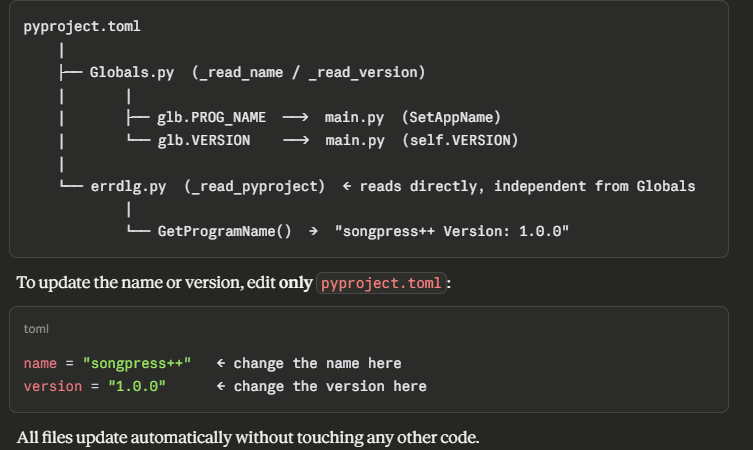

# How to build the Windows installer

In order to build the Windows installer you need to download:

- Windows x64 binaries of `uv`, e.g. [uv-x86\_64-pc-windows-msvc.zip](https://github.com/astral-sh/uv/releases/download/0.9.21/uv-x86_64-pc-windows-msvc.zip)
- The [NSIS compiler](https://nsis.sourceforge.io/Download)

Extract the content of the zip files of `uv` in this folder (`uv.exe` is sufficient).
Then, launch the NSIS compiler and compile the `songpress++-setup.nsi` script.

## NSI file

NSI file encoding: UTF-8 with BOM.

```nsi
!addplugindir /x86-unicode "plugins"
!include "MUI2.nsh"
```

## Notes

URL changed: the internet connection check uses `http://1.1.1.1/` — Cloudflare's IP,
which always responds in a few milliseconds without SSL, avoiding potential TLS hangs.

`inetc::head` → `inetc::get`: HEAD requests via INetC are notoriously unreliable on
Windows 10/11. Using `get` downloads a tiny body and works much more reliably.
The temporary file is deleted immediately afterwards.

## Folder structure

```
installer/
├── songpress++.nsi
├── songpressplusplus.ico
├── uv.exe
├── license.txt
└── plugins/
    └── INetC.dll      ← from the INetC zip, folder Plugins\amd64-unicode\
```

Install path: `%LOCALAPPDATA%\Songpress-local\bin\songpress.exe`

## Change program name and version


