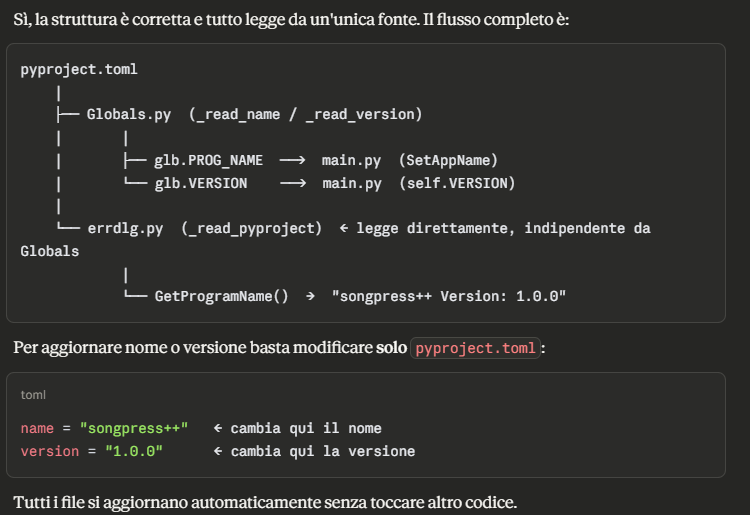

# Come compilare il programma di installazione Windows

Per compilare il programma di installazione Windows e' necessario scaricare:

- I binari Windows x64 di `uv`, ad esempio [Releases · astral-sh/uv](https://github.com/astral-sh/uv/releases/)
- Il [compilatore NSIS](https://nsis.sourceforge.io/Download)
- Il [plug-in INetC – NSIS amd64-unicode](https://nsis.sourceforge.io/Inetc_plug-in) (per l'installer a 64 bit)
- Il [plug-in INetC – NSIS x86-unicode](https://nsis.sourceforge.io/Inetc_plug-in) (per l'installer a 32 bit)

Estrarre `uv.exe` dallo zip in questa cartella.
Avviare poi il compilatore NSIS e compilare lo script `.nsi` appropriato:

- **Installer a 64 bit**: compilare `songpressx64.nsi`
- **Installer a 32 bit**: compilare `songpressx32.nsi`

## Compilazione passo per passo

1. Apri il programma NSIS
2. Clicca su **Compile NSI scripts**
3. Premi **File → Load Script**
4. Seleziona `songpressx64.nsi` (64 bit) oppure `songpressx32.nsi` (32 bit)
5. Clicca **Compile**

## File NSI

Codifica del file NSI: **UTF-16 LE con BOM** (obbligatoria per la modalità Unicode di NSIS).

Lo script contiene:

```nsi
Unicode true
Target: NSIS_TARGET_X86   ; solo installer a 32 bit (songpressx32.nsi)
!addplugindir /amd64-unicode "plugins/64-bit"
!addplugindir /x86-unicode  "plugins/x86-bit"
!include "MUI2.nsh"
```

La versione viene letta automaticamente da `pyproject.toml` tramite `!searchparse`,
quindi non è necessario aggiornarla manualmente nello script NSI.

## Note

URL modificato: il controllo della connessione Internet usa `http://1.1.1.1/` — l'IP di Cloudflare,
che risponde sempre in pochi millisecondi senza SSL, evitando possibili blocchi TLS.

`inetc::head` → `inetc::get`: le richieste HEAD tramite INetC sono notoriamente inaffidabili su
Windows 10/11. L'uso di `get` scarica un body minimo e funziona in modo molto più stabile.
Il file temporaneo viene eliminato immediatamente dopo.

## Struttura delle cartelle

```
installer/
├── songpressx64.nsi
├── songpressx32.nsi
├── songpressplusplus.ico
├── uv.exe
├── license.txt
└── plugins/
    ├── 64-bit/
    │   └── INetC.dll      ← dallo zip di INetC, cartella Plugins\amd64-unicode\
    └── x86-bit/
        └── INetC.dll      ← dallo zip di INetC, cartella Plugins\x86-unicode\
```

La cartella `installer\` deve trovarsi direttamente dentro la radice del progetto
(quella che contiene `pyproject.toml`), perché lo script usa `SRCDIR = ".."`.

## Percorsi di installazione

| Cosa | Percorso |
|------|----------|
| Applicazione (standard) | `%LOCALAPPDATA%\Songpress++\bin\songpress.exe` |
| Applicazione (portabile) | `%DESKTOP%\Songpress++\bin\songpress.exe` |
| Template canzoni (standard) | `%APPDATA%\Songpress++\templates\songs\` |
| Template slide (standard) | `%APPDATA%\Songpress++\templates\slides\` |
| Font (standard) | `%APPDATA%\Songpress++\templates\fonts\` |
| Template canzoni (portabile) | `%DESKTOP%\Songpress++\templates\songs\` |
| Template slide (portabile) | `%DESKTOP%\Songpress++\templates\slides\` |
| Font (portabile) | `%DESKTOP%\Songpress++\templates\fonts\` |

L'intera cartella `templates\` (incluse tutte le sottocartelle: `songs`, `slides`, `fonts`
e qualsiasi aggiunta futura) viene copiata ricorsivamente dall'albero del pacchetto uv
nella destinazione corretta durante l'installazione, così l'utente può modificarli direttamente:

- **Installazione standard**: `%APPDATA%\Songpress++\templates\`
- **Installazione portabile**: `<cartella portabile>\templates\` (accanto all'exe)

In fase di disinstallazione viene chiesto se eliminare la cartella dati (default: No).

## Opzioni della pagina di installazione

Durante l'installazione viene mostrata una pagina con le seguenti opzioni:

| Opzione | Default | Descrizione |
|---------|---------|-------------|
| **Installazione standard** | ✔ | Installa in `%LOCALAPPDATA%\Songpress++`, crea scorciatoie nel menu Start |
| **Installazione portabile** | — | Installa in `%DESKTOP%\Songpress++`, nessuna voce nel registro né scorciatoie |
| **Associa estensioni** | — | Associa `.crd .pro .chopro .chordpro .cho` a Songpress++ |
| **Verifica connessione** | ✔ | Testa la connessione Internet prima di scaricare i pacchetti |
| **Collegamento sul Desktop** | ✔ | Crea un collegamento `.lnk` sul Desktop (solo installazione standard) |

La lingua dell'installer (italiano/inglese) viene selezionata all'avvio.

## Modifica nome e versione programma



## Risultato finale

Se la compilazione va a buon fine, nella cartella `installer/` appariranno i file:

```
songpress++-setup.exe        ← installer a 64 bit
songpress++-setup-x32.exe   ← installer a 32 bit
```

Questi sono gli installer Windows pronti per la distribuzione.

---
*Questo file è codificato UTF-8 senza BOM.*
