# Guida rapida — Songpress++

Questa guida descrive tutti i comandi ChordPro supportati da Songpress++ e le principali funzionalità dell'editor.

> **Legenda** — La colonna **Std** indica se la direttiva fa parte dello standard ChordPro ufficiale (✅) o è specifica di Songpress++ (🔧). La colonna **Menu** indica se la direttiva può essere inserita tramite un menu dell'applicazione (⌨️) o deve essere digitata manualmente nell'editor (🖊).

> **Tooltip** — Tutte le checkbox presenti nei dialoghi delle preferenze dispongono di un **tooltip descrittivo**: tenendo il puntatore del mouse fermo su una checkbox per qualche secondo comparirà una breve spiegazione della funzione corrispondente.

---

## Formato ChordPro — Concetti base

Un file ChordPro è un file di testo in cui gli **accordi** vengono inseriti direttamente nel testo della canzone, racchiusi tra parentesi quadre `[accordo]`. Le **direttive** di metadati e struttura sono racchiuse tra parentesi graffe `{direttiva:valore}`.

```chordpro
{title: Amazing Grace}
{artist: Traditional}
{key: G}

[G]Amazing [G7]grace, how [C]sweet the [G]sound
```

### Come digitare `{` e `}` sulla tastiera

| Sistema | `{` (graffa aperta) | `}` (graffa chiusa) |
| ------- | ------------------- | ------------------- |
| **Windows / Linux** — layout italiano | <kbd>Alt Gr</kbd> + <kbd>Shift</kbd> + <kbd>[</kbd> | <kbd>Alt Gr</kbd> + <kbd>Shift</kbd> + <kbd>]</kbd> |
| **Windows / Linux** — layout USA | <kbd>Shift</kbd> + <kbd>[</kbd> | <kbd>Shift</kbd> + <kbd>]</kbd> |
| **Mac** — layout italiano | <kbd>Option</kbd> + <kbd>Shift</kbd> + <kbd>[</kbd> | <kbd>Option</kbd> + <kbd>Shift</kbd> + <kbd>]</kbd> |
| **Mac** — layout USA | <kbd>Option</kbd> + <kbd>[</kbd> | <kbd>Option</kbd> + <kbd>]</kbd> |
| **Windows** — codice ASCII (qualsiasi layout) | <kbd>Alt</kbd> + <kbd>1</kbd><kbd>2</kbd><kbd>3</kbd> | <kbd>Alt</kbd> + <kbd>1</kbd><kbd>2</kbd><kbd>5</kbd> |

> **Nota sul metodo ASCII** — Tieni premuto <kbd>Alt</kbd>, digita il numero sul tastierino numerico (non i tasti numerici sulla fila superiore), poi rilascia <kbd>Alt</kbd>. Funziona solo su Windows.

> **Suggerimento — Intellisense** — In Songpress++ puoi usare l'autocompletamento: digita `{` seguito dalle prime lettere della direttiva e premi <kbd>Ctrl</kbd>+<kbd>Spazio</kbd> per aprire il menu di completamento. La direttiva verrà inserita completa di `:` e `}` dove necessario. Ogni voce mostra un'icona: **✅** indica una direttiva ChordPro ufficiale, **🔧** indica un'estensione esclusiva di Songpress++.

---

## Metadati della canzone

| Direttiva           | Alias        | Std | Menu | Descrizione                                                                               |
| ------------------- | ------------ | --- | ---- | ----------------------------------------------------------------------------------------- |
| `{title:Titolo}`    | `{t:Titolo}` | ✅  | ⌨️   | Titolo della canzone                                                                      |
| `{subtitle:Testo}`  | `{st:...}`   | ✅  | ⌨️   | Sottotitolo o artista secondario                                                          |
| `{artist:Nome}`     |              | ✅  | 🖊    | Artista / interprete (visualizzato come sottotitolo)                                      |
| `{composer:Nome}`   |              | ✅  | 🖊    | Compositore (visualizzato come sottotitolo)                                               |
| `{lyricist:Nome}`   |              | ✅  | 🖊    | Paroliere / autore del testo (visualizzato come «Testo: …»)                               |
| `{arranger:Nome}`   |              | ✅  | 🖊    | Arrangiatore (visualizzato come «Arrangiamento: …»)                                       |
| `{album:Titolo}`    |              | ✅  | 🖊    | Titolo dell'album (visualizzato come «Album: …»)                                          |
| `{year:Anno}`       |              | ✅  | 🖊    | Anno di pubblicazione (visualizzato come sottotitolo)                                     |
| `{copyright:Testo}` |              | ✅  | 🖊    | Nota di copyright (visualizzata come «© …»)                                               |
| `{key:Tonalità}`    |              | ✅  | ⌨️   | Tonalità (es. `Am`, `C`, `G`, `F#m`); visualizzata come «Key: …» se abilitata             |
| `{capo:N}`          |              | ✅  | 🖊    | Capotasto al tasto N (es. `{capo:2}`); visualizzato come «Capo: N»                        |
| `{tempo:BPM[,M]}`   |              | ✅  | ⌨️   | Tempo in BPM; icona e formato configurabili dal dialogo *Inserisci → Tempo* (es. `{tempo:120}`). Il parametro opzionale `,M` sovrascrive la modalità per il singolo comando (0=Testo, 1=♩, 2=BPM, 3=metronomo, -1=nascosto) |
| `{tempo_m:BPM}`     |              | 🔧  | 🖊    | Tempo con icona **minima** fissa — indipendente dalla modalità di visualizzazione globale  |
| `{tempo_s:BPM}`     |              | 🔧  | 🖊    | Tempo con icona **semiminima** fissa                                                      |
| `{tempo_sp:BPM}`    |              | 🔧  | 🖊    | Tempo con icona **semiminima puntata** fissa                                              |
| `{tempo_c:BPM}`     |              | 🔧  | 🖊    | Tempo con icona **croma** fissa                                                           |
| `{tempo_cp:BPM}`    |              | 🔧  | 🖊    | Tempo con icona **croma puntata** fissa                                                   |
| `{time:N/M}`        |              | ✅  | ⌨️   | Indicazione di tempo (es. `{time:4/4}`, `{time:3/4}`); visualizzata con simbolo grafico   |
| `{beats_time: Acc=N …}` |            | 🔧  | ⌨️   | Durata in battiti degli accordi (es. `{beats_time: Do=2 Sol=1}`); visualizza numero, punti o entrambi sopra gli accordi (configurabile nelle preferenze) |
| `{duration:mm:ss}`  |              | ✅  | 🖊    | Durata totale della canzone (es. `{duration:12:45}`); non visualizzata nell'anteprima né in stampa, ma riportata nelle **Statistiche brano** come «Durata» effettiva al posto della stima automatica. Commentando la riga con `#` la durata torna ad essere calcolata automaticamente. |
| `{sorttitle:Testo}` |              | ✅  | 🖊    | Titolo alternativo usato per l'ordinamento alfabetico (metadato, non visualizzato)        |
| `{keywords:...}`    |              | ✅  | 🖊    | Parole chiave per la ricerca (metadato, non visualizzato)                                 |
| `{topic:...}`       |              | ✅  | 🖊    | Argomento / categoria (metadato, non visualizzato)                                        |
| `{collection:...}`  |              | ✅  | 🖊    | Raccolta o canzoniere di appartenenza (metadato, non visualizzato)                        |
| `{language:...}`    |              | ✅  | 🖊    | Lingua del testo (metadato, non visualizzato)                                             |
| `{meta:chiave valore}` |           | ✅  | 🖊    | Metadato generico in forma libera (non visualizzato)                                      |

> **Nota sui metadati estesi** — Le direttive `{sorttitle}`, `{keywords}`, `{topic}`, `{collection}`, `{language}`, `{meta}` vengono riconosciute e accettate dal parser per garantire la compatibilità con file ChordPro 6, ma il loro valore non viene visualizzato nell'anteprima né in stampa: sono trattate come puri metadati. Il token `:valore` viene consumato silenziosamente. La direttiva `{duration}` ha invece un comportamento speciale: il suo valore viene usato dalla funzione **Statistiche brano** (vedi sotto).

> **Nota sul tempo** — `{tempo:}` ha quattro modalità di visualizzazione selezionabili nel dialogo di inserimento: **Tempo:** (testo semplice), **♩** (nota musicale con valore `♩ = 120`), **BPM** (testo `BPM: 120`), **🎼** (metronomo con valore `♩ = 120`). Spuntando *Metadati*, il valore viene trattato come puro metadato e non appare nell'anteprima né in stampa. La scelta nel dialogo imposta la **modalità globale**; per sovrascriverla per un singolo comando usa la forma `{tempo:BPM,M}` (es. `{tempo:120,1}`). Le varianti `{tempo_m:}`, `{tempo_s:}` ecc. mostrano sempre la propria icona fissa indipendentemente da questa impostazione.

> **Nota sulla tonalità (`{key}`)** — Il dialogo *Inserisci → Tonalità* permette di inserire la direttiva `{key:tonalità}` con tre modalità:
>
> - **Manuale** — digitare direttamente la tonalità nel campo di testo (es. `Do`, `La-`, `Sol#m`, `C`, `Am`, `F#m`). La notazione può essere italiana o inglese a seconda della notazione attiva nel documento.
> - **Rilevamento automatico** — spuntando *Rileva automaticamente dagli accordi*, Songpress++ analizza gli accordi presenti nel brano corrente e calcola la tonalità più probabile, mostrandola immediatamente nel campo di testo con il conteggio degli accordi esaminati (es. «✔ Rilevata: Do (da 326 accordi)»). Il campo diventa di sola lettura finché l'opzione è attiva.
> - **Metadati** — spuntando *Metadati*, la tonalità viene inserita come metadato nascosto: non appare nell'anteprima né in stampa, ma è disponibile per la funzione di trasposizione.
>
> **Rilevamento in file multi-brano** — Quando il file contiene più canzoni separate da `{new_song}`, il rilevamento automatico considera **solo il testo del brano corrente**: parte dalla posizione del cursore fino al prossimo `{new_song}` (o alla fine del documento se il brano è l'ultimo). Questo garantisce che gli accordi dei brani precedenti e successivi non alterino il risultato.
>
> La visualizzazione della tonalità nell'anteprima è abilitabile/disabilitabile in *Opzioni → Formato → Mostra tonalità*.

---

## Struttura della canzone

### Blocchi di testo

| Direttiva                                 | Std | Menu | Descrizione                                                                                                                          |
| ----------------------------------------- | --- | ---- | ------------------------------------------------------------------------------------------------------------------------------------ |
| `{start_of_verse}`/`{end_of_verse}`       | ✅  | ⌨️   | Strofa non numerata, senza etichetta                                                                                                 |
| `{start_verse:Etichetta}`/`{end_verse}`   | 🔧  | ⌨️   | Strofa non numerata con etichetta opzionale                                                                                          |
| `{start_verse_num}`/`{end_verse_num}`     | 🔧  | ⌨️   | Strofa numerata automaticamente                                                                                                      |
| `{verse:Etichetta}`                       | ✅  | ⌨️   | Apre una strofa con etichetta personalizzata (es. `{verse:1}`)                                                                       |
| `{start_of_chorus}`/`{end_of_chorus}`     | ✅  | ⌨️   | Ritornello                                                                                                                           |
| `{soc}`/`{eoc}`                           | ✅  | ⌨️   | Abbreviazione di `start_of_chorus`/`end_of_chorus`                                                                                   |
| `{soc:Etichetta}`                         | ✅  | ⌨️   | Ritornello con etichetta personalizzata                                                                                              |
| `{start_chorus:Etichetta}`/`{end_chorus}` | 🔧  | ⌨️   | Forma alternativa per il ritornello (con etichetta opzionale)                                                                        |
| `{start_bridge:Etichetta}`/`{end_bridge}` | 🔧  | ⌨️   | Bridge con etichetta opzionale; se omessa, il valore predefinito è «Bridge»                                                          |
| `{start_of_bridge}`/`{end_of_bridge}`     | ✅  | 🖊    | Forma ChordPro standard per il bridge; equivalente a `{start_bridge}`/`{end_bridge}`                                                 |
| `{sob}`/`{eob}`                           | ✅  | 🖊    | Abbreviazione di `start_of_bridge`/`end_of_bridge`                                                                                   |
| `{start_chord:Etichetta}`/`{end_chord}`   | 🔧  | ⌨️   | Blocco intro/accordi; se l'etichetta è omessa, il valore predefinito è «Intro»                                                       |
| `{start_of_tab}`/`{end_of_tab}`           | ✅  | 🖊    | Blocco tablatura ASCII; il contenuto viene visualizzato con font monospace (Courier New) e l'etichetta «Tab»                         |
| `{sot}`/`{eot}`                           | ✅  | 🖊    | Abbreviazione di `start_of_tab`/`end_of_tab`                                                                                         |
| `{start_of_grid}`/`{end_of_grid}`         | ✅  | ⌨️   | Blocco griglia accordi; visualizzato con l'etichetta «Grid»                                                                          |
| `{sog}`/`{eog}`                           | ✅  | 🖊    | Abbreviazione di `start_of_grid`/`end_of_grid`                                                                                       |
| `{grid}`                                  | ✅  | 🖊    | Forma alternativa di `start_of_grid` (senza chiusura esplicita)                                                                      |
| `{row}` / `{r}` *(dentro grid)*           | 🔧  | 🖊    | Inserisce una riga vuota separatrice all'interno di un blocco griglia                                                                |
| `{bar}` *(dentro grid)*                   | ✅  | 🖊    | Separatore di battuta esplicito all'interno di un blocco griglia                                                                     |
| `{start_of_part:Etichetta}`/`{end_of_part}` | ✅  | 🖊  | Sezione generica (ChordPro 6): trattata come strofa con etichetta libera; se l'etichetta è omessa viene usato «Part»                |
| `{sop}`/`{eop}`                           | ✅  | 🖊    | Abbreviazione di `start_of_part`/`end_of_part`                                                                                       |
| `{new_song}`                              | 🔧  | 🖊    | Avvia una nuova canzone nello stesso documento: azzera i contatori di strofe e ritornelli (la numerazione riparte da 1) e resetta gli schemi di accordi memorizzati per il filtro *Una strofa per ogni schema* |

> **Nota sul bridge** — Sono supportate entrambe le forme: `{start_bridge}`/`{end_bridge}` (forma Songpress++, inseribile dal menu) e `{start_of_bridge}`/`{end_of_bridge}` (forma ChordPro standard, con abbreviazioni `{sob}`/`{eob}`). Le due forme sono equivalenti e intercambiabili.

### Interruzioni di pagina e colonna

| Direttiva        | Alias    | Std | Menu | Descrizione                                      |
| ---------------- | -------- | --- | ---- | ------------------------------------------------ |
| `{new_page}`     | `{np}`   | ✅  | ⌨️   | Interruzione di pagina esplicita per la stampa   |
| `{column_break}` | `{colb}` | ✅  | ⌨️   | Interruzione di colonna (layout a 2 colonne)     |

---

## Accordi e formattazione inline

### Accordi

Gli accordi si inseriscono nel testo con le parentesi quadre, immediatamente prima della sillaba a cui appartengono:

```chordpro
[Am]Nel [F]blu [C]dipinto di [G]blu
```

### Font e colori locali

Queste direttive cambiano il font per la sezione seguente; usate senza argomento ripristinano il valore predefinito.

| Direttiva di apertura | Direttiva di chiusura | Std | Menu | Descrizione                                                                      |
| --------------------- | --------------------- | --- | ---- | -------------------------------------------------------------------------------- |
| `{textfont:Nome}`     | `{textfont}`          | ✅  | ⌨️   | Famiglia di font del testo                                                       |
| `{textsize:Pt}`       | `{textsize}`          | ✅  | ⌨️   | Dimensione del testo in pt (accetta anche percentuale, es. `{textsize:80%}`)     |
| `{textcolour:#HEX}`   | `{textcolour}`        | ✅  | ⌨️   | Colore del testo in formato `#RRGGBB`                                            |
| `{chordfont:Nome}`    | `{chordfont}`         | ✅  | ⌨️   | Famiglia di font degli accordi                                                   |
| `{chordsize:Pt}`      | `{chordsize}`         | ✅  | ⌨️   | Dimensione degli accordi in pt (accetta anche percentuale)                       |
| `{chordcolour:#HEX}`  | `{chordcolour}`       | ✅  | ⌨️   | Colore degli accordi in formato `#RRGGBB`                                        |

### Spaziatura

| Direttiva             | Std | Menu | Descrizione                                                                                                                        |
| --------------------- | --- | ---- | ---------------------------------------------------------------------------------------------------------------------------------- |
| `{linespacing:N}`     | 🔧  | ⌨️   | Interlinea in punti (es. `{linespacing:1}`); senza argomento ripristina il valore predefinito                                      |
| `{chordtopspacing:N}` | 🔧  | ⌨️   | Spazio sopra gli accordi in punti (es. `{chordtopspacing:0}` per eliminarlo); senza argomento ripristina il valore predefinito     |
| `{row}` o `{r}`       | 🔧  | 🖊    | Inserisce mezza riga verticale vuota (spaziatore) fuori dai blocchi griglia — non disponibile nel menu                            |
| `{bar}`               | ✅  | 🖊    | Separatore di battuta esplicito all'interno di un blocco `{start_of_grid}`; ignorato fuori dal contesto griglia                   |

---

## Direttive di spaziatura in Songpress++

---

## `{linespacing: <valore>}` — **Voce di menu:** *Interlinea*

### Descrizione — linespacing

Imposta l'**interlinea** tra le righe di testo della canzone dal punto in cui viene inserita la direttiva. Agisce sulla spaziatura verticale complessiva tra una riga di testo (con i relativi accordi) e la successiva.

### Sintassi — linespacing

```chordpro
{linespacing: 13}
```

### Parametro — linespacing

| Valore           | Effetto                                                                              |
| ---------------- | ------------------------------------------------------------------------------------ |
| `0`              | Elimina lo spazio extra tra le righe (valore predefinito nella finestra di dialogo)  |
| numero positivo  | Aggiunge spazio verticale tra le righe (in punti tipografici)                        |

### Note d'uso — linespacing

- La direttiva può essere inserita in qualsiasi punto della canzone; agisce sulle righe successive.
- I valori tipici sono compresi tra `10` e `20` a seconda del font e della dimensione utilizzati.
- Utile per regolare la densità del testo in stampa, specialmente con layout a due colonne o formato due pagine per foglio.
- **Scope globale** — `{linespacing}` si propaga per tutta la canzone a partire dal punto di inserimento, attraversando anche le interruzioni di pagina (`{new_page}`). Se la direttiva viene usata più volte, ogni occorrenza sovrascrive il valore precedente; l'ultima `{linespacing}` presente nel file determina l'interlinea per il resto del brano.
- **Coesistenza con `{new_page}` sulla stessa riga** — È consentito e funziona correttamente scrivere le due direttive sulla stessa riga, in entrambi gli ordini:
  ```chordpro
  {new_page} {linespacing:15}
  {linespacing:15} {new_page}
  ```
  Il parser le processa in sequenza da sinistra a destra. In entrambi i casi il nuovo valore di interlinea viene aggiornato nel formato globale prima che venga costruito il blocco della pagina successiva, quindi le righe della nuova pagina adottano regolarmente il valore specificato. Non vi è alcuna differenza di comportamento tra i due ordini.

---

## `{chordtopspacing: <valore>}` — **Voce di menu:** *Spazio sopra gli accordi*

### Descrizione — chordtopspacing

Imposta lo **spazio verticale sopra gli accordi**, ovvero la distanza tra il bordo superiore della riga degli accordi e il contenuto che la precede (es. la riga di testo della strofa precedente). Consente di allentare o comprimere il margine che separa visivamente gli accordi dalla strofa soprastante.

### Sintassi — chordtopspacing

```chordpro
{chordtopspacing: 4}
```

### Parametro — chordtopspacing

| Valore           | Effetto                                                                                      |
| ---------------- | -------------------------------------------------------------------------------------------- |
| `0`              | Elimina lo spazio extra sopra gli accordi (valore predefinito nella finestra di dialogo)     |
| numero positivo  | Aumenta il respiro visivo sopra la riga degli accordi                                        |

### Note d'uso — chordtopspacing

- Agisce in modo indipendente da `linespacing`: i due parametri si sommano nella spaziatura complessiva.
- Utile quando gli accordi appaiono visivamente «schiacciati» contro il testo della riga precedente.
- Come `linespacing`, può essere usato più volte nella stessa canzone in punti diversi per variare la spaziatura sezione per sezione.

## Differenza tra chordtopspacing e linespacing

```text
[riga di testo precedente]
                         ↕  chordtopspacing  (spazio sopra gli accordi)
[riga accordi:  G    D    A]
[riga testo:    Quando il sole...]
                         ↕  linespacing      (spaziatura tra righe complete)
[riga accordi:  Em   B...]
[riga testo:    ...sorge e...]
```

In sintesi: `chordtopspacing` controlla il margine **sopra** la coppia accordo+testo, mentre `linespacing` controlla lo spazio **tra** coppie successive.

## `{row}` / `{r}` 🖊

**Voce di menu:** *nessuna — deve essere digitato manualmente*

### Descrizione — row

Inserisce uno **spazio verticale dimezzato** (spaziatore) tra le righe della canzone. Utile per aggiungere un piccolo respiro visivo tra le strofe senza usare `{linespacing}`.

### Sintassi — row

```chordpro
{row}
```

oppure in forma abbreviata:

```chordpro
{r}
```

### Note d'uso — row

- Inserisce uno spazio pari a circa **metà riga** rispetto all'interlinea corrente.
- Non ha parametri: `{row}` e `{r}` sono equivalenti e non accettano valori.
- Non è accessibile dal menu **Inserisci**: deve essere digitato direttamente nell'editor.

---

## `{start_of_tab}` / `{end_of_tab}` 🖊

**Alias abbreviati:** `{sot}` / `{eot}`

### Descrizione — start_of_tab

Delimita un **blocco di tablatura ASCII**. Il contenuto viene visualizzato nell'anteprima e in stampa con font monospace (Courier New) e l'etichetta «Tab», in modo che l'allineamento colonnare delle corde sia preservato.

### Sintassi — start_of_tab

```chordpro
{start_of_tab}
e|--0--2--3--2--0--|
B|--1--3--3--3--1--|
G|--0--2--0--2--0--|
D|--2--0--0--0--2--|
A|--3--x--2--x--3--|
E|--x--x--3--x--x--|
{end_of_tab}
```

oppure con alias abbreviati:

```chordpro
{sot}
e|--0--2--3--|
B|--1--3--3--|
{eot}
```

oppure con etichetta personalizzata:

```chordpro
{start_of_tab: Assolo}
e|--12-14-15-14-12--|
{end_of_tab}
```

### Note d'uso — start_of_tab

- Il font monospace garantisce che le linee della tablatura siano perfettamente allineate nella stampa.
- Gli accordi inline `[Am]` eventualmente presenti nel blocco **non vengono visualizzati** sopra il testo: la tablatura è già una notazione completa.
- Il blocco viene trattato come una strofa non numerata; riceve un'etichetta «Tab» (o quella personalizzata).
- Nell'editor il contenuto del blocco appare in **marrone corsivo** per distinguerlo visivamente dal testo normale.

---

## `{start_of_grid}` / `{end_of_grid}` 🖊

**Alias abbreviati:** `{sog}` / `{eog}` · Forma alternativa: `{grid}`

### Descrizione — start_of_grid

Delimita un **blocco griglia accordi** (chord grid). Utile per indicare sequenze ritmiche di accordi in formato simbolico, es. per chitarra ritmica o ukulele. Il blocco viene visualizzato con l'etichetta «Grid» (configurabile nelle preferenze).

### Sintassi — start_of_grid

Forma base:

```chordpro
{start_of_grid}
| Am . . . | F . . . | C . . . | G . . . |
{end_of_grid}
```

Alias abbreviati:

```chordpro
{sog}
| G . . . | D . . . | Em . . . | C . . . |
{eog}
```

Forma alternativa (si chiude automaticamente alla riga vuota successiva):

```chordpro
{grid}
| C . . . | G . . . | Am . . . | F . . . |
```

### Opzioni — start_of_grid

Tutte le opzioni si specificano come coppie `chiave=valore` nell'argomento della direttiva, dopo l'eventuale etichetta. Possono essere combinate liberamente.

| Opzione             | Tipo    | Default         | Descrizione                                                                                                                                                       |
| ------------------- | ------- | --------------- | ------------------------------------------------------------------------------------------------------------------------------------------------------------------|
| *(etichetta)*       | testo   | «Grid»          | Etichetta di sezione personalizzata (testo libero, prima di qualsiasi `chiave=valore`)                                                                            |
| `size=N`            | numero  | `1`             | Moltiplicatore dimensione celle: moltiplica il padding orizzontale e/o verticale per N. Accetta interi o decimali fino a 2 cifre, con `.` o `,` (es. `1.5`, `2,50`) |
| `size=N agisce su`  | scelta  | Larghezza e altezza | Controlla quale dimensione viene moltiplicata da `size=N`: **Larghezza e altezza** (entrambi i padding), **Solo larghezza** (solo `_pad_x`), **Solo altezza** (solo `_pad_y`). Si imposta nelle preferenze.  |
| `chordtopspacing=N` | intero  | `0`             | Spazio extra in pixel **sopra** ogni riga di celle                                                                                                                |
| `linespacing=N`     | intero  | `0`             | Spazio extra in pixel **sotto** ogni riga di celle                                                                                                                |
| `sizedir=horizontal\|vertical\|both` | stringa | valore da preferenze | Sovrascrive per questo blocco la preferenza globale **size=N agisce su**: `horizontal` (solo larghezza), `vertical` (solo altezza), `both` (larghezza e altezza) |

> **Nota:** `chordtopspacing` e `linespacing` dentro `{start_of_grid}` agiscono localmente solo su quel blocco griglia, indipendentemente dalle direttive globali `{chordtopspacing}` e `{linespacing}` che influenzano i blocchi strofa/ritornello normali. Anche `sizedir` è locale al blocco e sovrascrive la preferenza globale solo per quella griglia.

### Esempi — start_of_grid

Solo etichetta personalizzata:

```chordpro
{start_of_grid: Strofa}
| Am . . | F . . | G . . |
{end_of_grid}
```

Celle ingrandite (`size=2` o decimale, es. `size=1.5`):

```chordpro
{start_of_grid: size=2}
| Am | F | G | C |
{end_of_grid}
```

```chordpro
{start_of_grid: size=1.5}
| Am | F | G | C |
{end_of_grid}
```

Etichetta + celle ingrandite:

```chordpro
{start_of_grid: Ritornello size=2}
| G . . . | D . . . | Em . . . | C . . . |
{end_of_grid}
```

Spaziatura verticale extra tra le righe:

```chordpro
{start_of_grid: chordtopspacing=8 linespacing=4}
| Am | F |
| C  | G |
{end_of_grid}
```

Tutte le opzioni combinate:

```chordpro
{start_of_grid: Intro size=2 chordtopspacing=6 linespacing=3}
| Am . . . | F . . . |
| C . . .  | G . . . |
{end_of_grid}
```

`sizedir` locale (sovrascrive la preferenza globale per questo blocco):

```chordpro
{start_of_grid: Ritornello size=2 sizedir=horizontal}
| G . . . | D . . . | Em . . . | C . . . |
{end_of_grid}
```

### Inserimento dal menu — start_of_grid

**Menu Inserisci → Griglia `{start_of_grid}\{end_of_grid}`**

Apre un dialogo che propone come etichetta il valore impostato in **Preferenze → Formattazione → Griglia accordi → Etichetta predefinita** (default: «Grid»).

- **Conferma il default o annulla** → inserisce il blocco senza etichetta:
  ```chordpro
  {start_of_grid}
  | | | |
  {end_of_grid}
  ```
- **Digita un'etichetta diversa** → inserisce il blocco con etichetta personalizzata:
  ```chordpro
  {start_of_grid:Ritornello}
  | | | |
  {end_of_grid}
  ```

La riga `| | | |` precompilata fornisce 4 celle vuote come punto di partenza; modificala o aggiungine altre secondo necessità. Con la barra spaziatrice (se abilitata nelle preferenze) puoi navigare rapidamente tra le celle.

### Modalità di visualizzazione — start_of_grid

La modalità di resa per tutti i blocchi griglia si imposta globalmente in **scheda Formattazione → Griglia accordi** nelle preferenze:

| Modalità                   | Aspetto                                                                 |
| ---------------------------| ------------------------------------------------------------------------|
| **Tabella pipe** (default) | `\| Am  \| F   \| G   \| C   \|` — battute separate dal carattere `\|`  |
| **Spaziatura semplice**    | `Am   F   G   C` — accordi distanziati senza separatori                 |
| **Tabella**                | celle con bordi visibili disegnati                                      |

### Comportamento della tastiera nel blocco griglia

Quando il cursore si trova dentro un blocco `{start_of_grid}`:

| Tasto                 | Azione                                                                                                       |
| ----------------------| ------------------------------------------------------------------------------------------------------------ |
| **Barra spaziatrice** | Inserisce un separatore `\|` pipe, spostando la cella corrente verso destra (configurabile nelle preferenze) |
| `{row}` / `{r}`       | Inserisce una riga vuota separatrice (spazio verticale tra le righe)                                         |

> Il comportamento della barra spaziatrice come pipe può essere disabilitato in **Formattazione → Griglia accordi → Barra spaziatrice inserisce il separatore \|**.
> La dimensione scalata da `size=N` si configura in **Formattazione → Griglia accordi → size=N agisce su**: scegli tra *Larghezza e altezza* (default), *Solo larghezza* o *Solo altezza*.

### Note d'uso — start_of_grid

- Il blocco viene trattato come una strofa non numerata con etichetta «Grid» (o quella personalizzata specificata nella direttiva o nelle preferenze).
- Nell'editor il contenuto del blocco appare in **marrone corsivo**, come i blocchi tablatura.
- `size=N` moltiplica `_pad_x` (padding orizzontale, base 8 px) e/o `_pad_y` (padding verticale, base 4 px) per N, ingrandendo le celle. Quale dimensione viene scalata dipende dall'opzione **Preferenze → Formattazione → Griglia accordi → size=N agisce su**: *Larghezza e altezza* (default, entrambi i padding), *Solo larghezza* (solo `_pad_x`), *Solo altezza* (solo `_pad_y`). N può essere un intero o un decimale con al massimo 2 cifre dopo il separatore (`.` o `,`): es. `size=1.5`, `size=2,50`, `size=1.7`.
- `chordtopspacing=N` aggiunge N pixel sopra ogni riga; `linespacing=N` aggiunge N pixel sotto ogni riga. Entrambi hanno default `0` (nessuna spaziatura extra).
- `sizedir=horizontal|vertical|both` sovrascrive localmente la preferenza globale **size=N agisce su** per il singolo blocco; se omesso, viene usato il valore dalle preferenze.
- Più opzioni e un'etichetta possono coesistere in qualsiasi ordine dopo i due punti: `{start_of_grid: Mia Etichetta size=3 linespacing=5 sizedir=horizontal}`.
- In modalità pipe, il testo raw dentro il blocco deve già contenere i delimitatori `|`; in modalità plain, gli accordi separati da spazi vengono distribuiti automaticamente.

---

## `{start_of_part}` / `{end_of_part}` 🖊

**Alias abbreviati:** `{sop}` / `{eop}`

### Descrizione — start_of_part

Delimita una **sezione generica** della canzone secondo la specifica ChordPro 6. È la scelta giusta quando nessun'altra direttiva strutturale (`{start_of_verse}`, `{start_of_chorus}`, `{start_of_bridge}` …) descrive adeguatamente la sezione: ad esempio un'introduzione strumentale, un interludio, una coda o qualsiasi parte con etichetta libera.

In Songpress++ il blocco viene trattato come una strofa non numerata con l'etichetta specificata. Se l'etichetta è omessa, viene usata «Part» come valore predefinito.

### Sintassi — start_of_part

```chordpro
{start_of_part: Intro}
[Am][G][F][E7]
{end_of_part}
```

Con alias abbreviati:

```chordpro
{sop: Coda}
[G]Ritorna a [D]te
{eop}
```

Senza etichetta (usa il default «Part»):

```chordpro
{start_of_part}
[C][G][Am][F]
{end_of_part}
```

### Note d'uso — start_of_part

- Il blocco non è numerato e non incrementa il contatore delle strofe.
- L'etichetta è libera: può essere qualsiasi testo (es. «Intro», «Interludio», «Coda», «Assolo», «Outro»).
- È equivalente funzionalmente a `{start_verse:Etichetta}` — la distinzione è semantica, per mantenere la compatibilità con file ChordPro 6 provenienti da altre applicazioni.
- Non è accessibile dal menu **Inserisci**: deve essere digitato direttamente nell'editor o inserito tramite l'intellisense (`Ctrl+Space`).

---

## Commenti e note redazionali

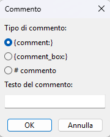

| Forma                    | Alias        | Std | Menu | Descrizione                                                                                              |
| ------------------------ | ------------ | --- | ---- | -------------------------------------------------------------------------------------------------------- |
| `{comment:Testo}`        | `{c:Testo}`  | ✅  | ⌨️   | Commento visibile nell'anteprima, racchiuso automaticamente tra parentesi                                |
| `{comment_italic:Testo}` | `{ci:Testo}` | ✅  | 🖊    | Come `{comment}`, ma con testo in corsivo                                                                |
| `{comment_box:Testo}`    | `{cb:Testo}` | ✅  | 🖊    | Commento in riquadro                                                                                     |
| `# Testo`                |              | ✅  | 🖊    | Riga di commento (preceduta da `#`): trattata come riga vuota, non appare nell'anteprima né in stampa    |

---

## Diagrammi accordi, tastiera e immagini

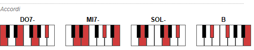
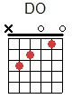

| Direttiva                                    | Std | Menu | Descrizione                                                              |
| -------------------------------------------- | --- | ---- | ------------------------------------------------------------------------ |
| `{define: C base-fret 1 frets X 3 2 0 1 0}`  | ✅  | ⌨️   | Definisce un diagramma accordo per chitarra                              |
| `{taste:Accordo}`                            | 🔧  | ⌨️   | Mostra i tasti evidenziati sulla tastiera (klavier) — es. `{taste:Am}`   |
| `{fingering: Accordo}`                       | 🔧  | ⌨️   | Mostra la tastiera del **primo accordo** con i numeri delle dita — es. `{fingering: Am 3=Do 1=Mi 2=La}` |
| `{image: nomefile}`                          | ✅  | ⌨️   | Inserisce un'immagine (PNG, JPG, GIF, BMP, TIFF) nella canzone           |

La tastiera (klavier) visualizza i tasti corrispondenti all'accordo specificato, evidenziati con il colore impostato nelle preferenze.

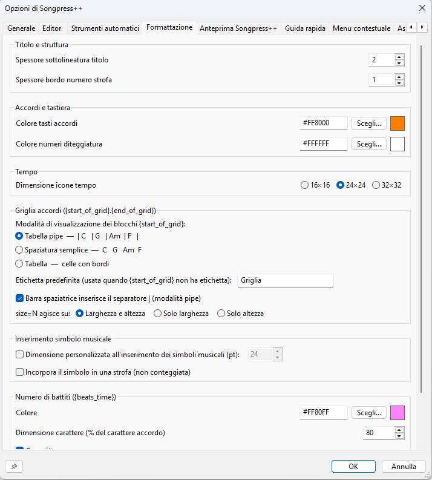

### Diteggiatura del primo accordo — `{fingering:}`

La direttiva `{fingering:}` è una variante della tastiera klavier pensata per indicare **come posizionare la mano sul primo accordo** della canzone. Oltre a evidenziare i tasti dell'accordo, può mostrare il numero del dito su ogni tasto e un'etichetta che indica quale mano utilizzare.

**Formato:**

```chordpro
{fingering: Am}
{fingering: Am 3=Do 1=Mi 2=La}
{fingering: G 2=Sol 1=Si 3=Re}
{fingering: Am hand=R 3=Do 1=Mi 2=La}
{fingering: Am hand=L}
```

La parte `dito=nota` è opzionale. Il token `hand=` è anch'esso opzionale e può comparire in qualsiasi posizione dopo il nome dell'accordo. I numeri corrispondono alle dita:

| Numero | Dito    |
| ------ | ------- |
| 1      | Pollice |
| 2      | Indice  |
| 3      | Medio   |
| 4      | Anulare |
| 5      | Mignolo |

**Indicazione della mano (`hand=`):**

| Valore   | Significato   | Etichetta visualizzata |
| -------- | ------------- | ---------------------- |
| `hand=R` | Mano destra   | *Right hand*           |
| `hand=L` | Mano sinistra | *Left hand*            |

L'etichetta compare centrata sotto la tastiera, in corsivo grigio. Se il token `hand=` è assente, non viene visualizzata alcuna etichetta. Il valore è case-insensitive (`hand=r` equivale a `hand=R`).

Le note si scrivono in notazione italiana (`Do`, `Re`, `Mi`, `Fa`, `Sol`, `La`, `Si`, con `#` per i diesis) o inglese (`C`, `D`, `E`, `F`, `G`, `A`, `B`).

> **Nota sulla notazione** — Il dialogo di inserimento e la griglia delle dita rispettano la **notazione predefinita** impostata nelle preferenze di Songpress++ (*Opzioni → Notazione predefinita*). I nomi delle note mostrati nella griglia e scritti nella direttiva generata cambiano automaticamente in base alla notazione scelta: con notazione Americana si vedrà `A, C#, E`; con Italiana `La, Do#, Mi`; con Tedesca `A, Cis, E`, e così via. Anche il riconoscimento degli accordi digitati nel campo *Accordo* segue la notazione corrente. Le notazioni Nashville e Romana non sono supportate per la diteggiatura.

**Inserimento dal menu:** *Inserisci → Altro → Diteggiatura primo accordo {fingering:}*
Si apre una finestra che mostra automaticamente le note dell'accordo e permette di assegnare un dito a ciascuna con un menu a tendina, nonché di selezionare la mano (Destra / Sinistra / Nessuna indicazione).

**Colore dei numeri delle dita:**
Il colore dei numeri visualizzati sui tasti si imposta in *Opzioni → Formattazione → Accordi e tempo → Colore numeri diteggiatura*. Per impostazione predefinita è quasi nero (`#1A1A1A`); su tasti neri il numero appare in bianco per garantire il contrasto.

**Controllo sintassi per `hand=`:**

Il controllo sintassi integrato (`Strumenti → Controlla sintassi`) valida il token `hand=` e segnala i seguenti errori:

| Errore | Esempio | Segnalazione |
| ------ | ------- | ------------ |
| Valore non valido | `{fingering: Am hand=X}` | `hand` deve essere R o L |
| Token `hand=` duplicato | `{fingering: Am hand=R hand=L}` | `hand` specificato più di una volta |

### Tempo — `{tempo:}` e varianti

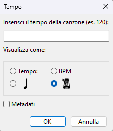

La direttiva `{tempo:BPM}` indica la velocità della canzone in battiti per minuto. Songpress++ la visualizza nell'anteprima e in stampa con un'icona e un formato scelti dall'utente.

**Inserimento dal menu:**

Il comando *Inserisci → Tempo {tempo:}…* apre un dialogo con due campi:

- **Campo testo** — inserisci il valore BPM (es. `120`). Se lasciato vuoto, viene inserito un segnaposto `{tempo:|}` con il cursore posizionato pronto per la digitazione.
- **Visualizza come** — quattro opzioni disposte in griglia 2×2:

| Opzione | Icona/Testo | Aspetto nell'anteprima |
| ------- | ----------- | ---------------------- |
| **Tempo:** | testo semplice | `Tempo: 120` |
| **BPM** | testo semplice | `BPM: 120` |
| **♩** (nota musicale) | icona nota | `♩ = 120` |
| **🎼** (metronomo) | icona metronomo | `🎼 = 120` |

- **Metadati** — se spuntato, la direttiva viene accettata dal parser ma non visualizzata nell'anteprima né in stampa. Tutte le opzioni di visualizzazione vengono disabilitate automaticamente.

La scelta fatta nel dialogo viene **salvata come preferenza globale** e si applica a tutte le successive visualizzazioni di `{tempo:}` nell'anteprima e in stampa, finché non viene modificata di nuovo.

**Sovrascrittura per singolo comando — parametro `,M`:**

Per forzare una modalità diversa su un singolo comando senza cambiare la preferenza globale, si può usare la forma `{tempo:BPM,M}`, dove `M` è un intero che corrisponde alla voce del dialogo:

| Valore `M` | Voce nel dialogo | Aspetto nell'anteprima |
| ---------- | ---------------- | ---------------------- |
| `0` | **Tempo:** | `Tempo: 120` |
| `1` | **♩** (nota musicale) | `♩ = 120` |
| `2` | **BPM** | `BPM: 120` |
| `3` | **🎼** (metronomo) | `🎼 = 120` |
| `-1` | **Metadati** | *(non visualizzato)* |

Se `,M` è omesso, viene usata la modalità impostata nelle preferenze globali.

> **Nota:** non tutti i simboli si possono dimensionare. Le modalità `1` e `3` usano icone ridimensionabili (16×16 / 24×24 / 32×32); le modalità `0` e `2` mostrano solo testo e non sono influenzate dall'impostazione della dimensione icona.

**Dimensione dell'icona:**

La dimensione dell'icona nota (o metronomo) si imposta in *Opzioni → Formato → Tempo → Dimensione icona tempo*, con tre valori disponibili:

| Valore | Uso consigliato |
| ------ | --------------- |
| **16×16** | Documenti con font piccoli o layout compatti |
| **24×24** | Dimensione predefinita, adatta alla maggior parte dei casi |
| **32×32** | Documenti con font grandi o per maggiore leggibilità |

La preferenza si applica a tutte le direttive `{tempo:}` e varianti (`{tempo_m:}`, `{tempo_s:}` ecc.) nell'anteprima e in stampa.

> **Nota — Varianti con icona fissa** — Le direttive `{tempo_m:}`, `{tempo_s:}`, `{tempo_sp:}`, `{tempo_c:}`, `{tempo_cp:}` mostrano sempre la propria icona nota specifica (rispettivamente minima, semiminima, semiminima puntata, croma, croma puntata) **indipendentemente** dalla modalità di visualizzazione globale impostata per `{tempo:}`. L'unica cosa influenzata dalla preferenza globale è il formato del numero: `= 120` oppure `BPM: 120`. Queste varianti non hanno una voce di menu dedicata e vanno digitate manualmente nell'editor.

### Durata degli accordi — `{beats_time:}`

La direttiva `{beats_time:}` specifica la **durata in battiti** di ciascun accordo della riga successiva. Songpress++ usa queste informazioni per calcolare e visualizzare i **numeri di battito** sopra gli accordi nell'anteprima, aiutando l'esecutore a capire il ritmo senza leggere la partitura.

**Formato:**

```chordpro
{beats_time: NomeAccordo=N NomeAccordo=N …}
```

- `NomeAccordo` — nome dell'accordo in notazione italiana (`Do`, `Sol`, `La-`, `Re7`…) o inglese (`C`, `G`, `Am`, `D7`…); gli accordi con basso esplicito (`Re-/Fa#`, `C/E`) vengono usati nella forma **completa** come chiave, inclusa la parte dopo `/`
- `N` — numero intero di battiti ≥ 1
- Gli accordi sono separati da spazi
- Solo gli accordi elencati ricevono un'indicazione di battito; gli altri vengono ignorati

**Esempi:**

```chordpro
{beats_time: Do=4 Sol=2 La-=2 Fa=4}
[Do]Amaz[Sol]ing [La-]grace, how [Fa]sweet
```

```chordpro
{beats_time: G=2 Em=2 C=4}
[G]Nel [Em]mezzo del [C]cammino
```

```chordpro
{beats_time: Am=4 F=2 C=2 G=4}
[Am]Tanti [F]au[C]guri a [G]te
```

```chordpro
{beats_time: La-=2 Re-/Fa#=2 LA-=2}
[LA-]Par[RE-/FA#]late ed an[LA-]nunciate
```

Ogni direttiva `{beats_time:}` si applica **alla riga di testo/accordi immediatamente successiva**. Per assegnare durate a più righe, inserisci una `{beats_time:}` prima di ognuna.

**Inserimento dal menu — dialogo guidato:**

Il comando *Inserisci → Durata accordo {beats_time:}…* è accessibile anche tramite la scorciatoia da tastiera <kbd>Ctrl</kbd>+<kbd>Shift</kbd>+<kbd>D</kbd>.

Il comando riconosce automaticamente la situazione:

- **Se nessuna riga vicina al cursore contiene accordi `[…]`** — inserisce direttamente `{beats_time: }` senza aprire nessuna finestra.
- **Se la riga corrente (o quella precedente o successiva) contiene accordi `[…]`** — apre un dialogo con un campo numerico (`SpinCtrl`) per ogni accordo unico trovato, preimpostato su 1 battito. Mentre si modificano i valori, il campo **Anteprima** mostra in tempo reale la direttiva che verrà inserita (es. `{beats_time: Do=4 Sol=2 La-=2 Fa=1}`). Impostando un accordo a **0** viene escluso dalla direttiva. Se la riga contiene più di **8** accordi, l'elenco diventa scorrevole. Gli accordi con basso esplicito (es. `Re-/Fa#`) sono mostrati nella loro forma completa — sia come etichetta che come chiave nella direttiva generata.

> **Nota — Posizionamento cursore** — Per aprire il dialogo, il comando cerca gli accordi nell'ordine: **riga corrente** → **successiva** → **precedente**. Una volta confermato, l'inserimento cerca nell'ordine: **riga corrente** → **precedente** → **successiva**. Il modo più diretto è posizionare il cursore direttamente sulla riga con gli accordi.

> **Nota — Sostituzione in-place** — Se la riga che precede immediatamente la riga degli accordi è già una direttiva `{beats_time:}`, al click **OK** essa viene **sostituita** anziché duplicata. Se invece tra la `{beats_time:}` esistente e la riga degli accordi ci sono righe vuote, l'inserimento avviene in cima alla riga degli accordi, scavalcando le righe vuote per evitare interruzioni visive indesiderate.

Il dialogo offre tre controlli aggiuntivi:

- **Tutti: [N] [Applica a tutti]** — imposta in un solo clic lo stesso numero di battiti su tutti gli accordi presenti nel dialogo.
- **[Applica all'intero brano…]** — inserisce automaticamente una direttiva `{beats_time:}` prima di ogni riga con accordi nell'intero brano, usando i valori impostati nel dialogo. Le righe già precedute da una `{beats_time:}` vengono saltate. L'operazione è annullabile con un singolo `Ctrl+Z`. Per gli accordi che appaiono nel brano ma **non sono presenti nel dialogo** (perché la riga di riferimento del cursore era diversa), il numero di battiti predefinito è **1** — a meno che tutti gli spin del dialogo siano impostati a **0**, nel qual caso anche questi accordi vengono omessi dalla direttiva, producendo `{beats_time: }` vuota.
- **[OK +] [↕N] [s]** — conferma e inserisce la direttiva esattamente come il pulsante **OK**, ma riapre automaticamente il dialogo dopo il ritardo scelto. Il ritardo si imposta con lo **SpinCtrl** (1–60 secondi, default 5) affiancato al pulsante: si modifica direttamente prima di cliccare, e il valore viene **salvato** nelle preferenze e ripristinato alla prossima apertura. Utile quando si lavora su un brano lungo e si vuole assegnare la durata accordo riga per riga: nel tempo di pausa configurato è possibile spostare il cursore sulla riga successiva nell'editor, dopodiché il dialogo si riapre già aggiornato con i nuovi accordi.

> **Nota — Modalità selezione** — Se si seleziona un intervallo di testo prima di aprire il dialogo, il dialogo mostra un **badge blu** («● Modalità selezione: N righe con accordi selezionate») e raccoglie in un unico elenco tutti gli accordi unici presenti nelle righe selezionate. Al click **OK**, la direttiva viene inserita (o sostituita in-place) prima di **ogni riga con accordi** nell'intervallo, in un solo `Ctrl+Z`. Ogni riga riceve una direttiva personalizzata con i propri accordi, usando i valori impostati nel dialogo.

> **Nota — Multicursore** — Il comando è compatibile con il multicursore (Alt+Clic, Ctrl+D). Se sono attivi più cursori sulla stessa sequenza di accordi, il dialogo mostra un **badge verde** («● Multicursore attivo: N posizioni») e la direttiva viene inserita in tutte le posizioni in un solo `Ctrl+Z`. Se invece i cursori puntano a **sequenze di accordi diverse** (multicursore eterogeneo), il dialogo apre un **Notebook** con una tab per ogni cursore (fino a un massimo di 5): ogni tab mostra gli SpinCtrl specifici per quella posizione e la propria anteprima in tempo reale. Sotto il Notebook è sempre visibile un campo **Anteprima (cursore 1)** riepilogativo. Se i cursori attivi superano 5, viene mostrato un avviso «⚠ Visualizzati i primi 5 cursori su N».
>
> Nella modalità multicursore eterogeneo il dialogo mostra anche la checkbox **☑ Evidenzia le righe degli accordi nell'editor**, affiancata da un **colour picker**. Quando è attiva, le righe degli accordi a cui si riferisce ogni cursore vengono evidenziate nell'editor con un colore di sfondo: la riga del **cursore attivo** (la tab selezionata nel Notebook) usa il **colore pieno** scelto con il picker, mentre le righe degli **altri cursori** usano la stessa tinta in versione più chiara (schiarita automaticamente verso il bianco). Il colore scelto e lo stato della checkbox vengono **salvati nelle preferenze** e ripristinati alla prossima apertura. Le evidenziazioni vengono rimosse automaticamente alla chiusura del dialogo (OK, Annulla o X).

**Visualizzazione nell'anteprima:**

La voce **Visualizza → Mostra battiti accordi** abilita o disabilita la visualizzazione dei numeri di battito nell'anteprima. Quando abilitata, sopra ogni accordo compare un'indicazione del battito secondo la modalità impostata nelle preferenze.

**Preferenze — *Opzioni → Formattazione → Conteggio battiti ({beats_time})*:**

| Opzione | Valori | Default | Descrizione |
| ------- | ------ | ------- | ----------- |
| **Colore** | `#RRGGBB` | `#6464C8` (blu-viola) | Colore del numero/punto visualizzato sopra l'accordo. Si imposta tramite il pulsante *Scegli…* o digitando il codice esadecimale. |
| **Dimensione** | 30 % – 150 % | 60 % | Dimensione del numero di battito come percentuale della dimensione del font degli accordi. |
| **Grassetto** | ☐ / ☑ | ☐ (disabilitato) | Se spuntato, il numero viene disegnato in grassetto. |
| **Allineamento** | Sinistra / Centro / Destra | Destra | Posizione del numero rispetto al nome dell'accordo. |
| **Modalità** | Numero / Punti / Entrambi | Numero | Controlla *cosa* viene visualizzato sopra l'accordo (vedi dettaglio sotto). |

**Modalità di visualizzazione:**

| Modalità | Aspetto | Descrizione |
| -------- | ------- | ----------- |
| **Numero** | `4` sopra l'accordo | Mostra il numero di battiti come cifra. |
| **Punti** | `· · · ·` tra gli accordi | Mostra un punto per ogni battito nello spazio tra un accordo e il successivo. |
| **Entrambi** | numero + punti | Combina le due rappresentazioni. |

**Controllo sintassi:**

Il controllo sintassi integrato (`Strumenti → Controlla sintassi`) segnala gli errori nel valore di `{beats_time:}`:

| Errore | Esempio | Segnalazione |
| ------ | ------- | ------------ |
| Token senza `=` | `{beats_time: Sol}` | formato non valido |
| Accordo non riconosciuto | `{beats_time: Xyz=2}` | accordo sconosciuto |
| Accordo ripetuto | `{beats_time: Sol=2 Sol=1}` | accordo duplicato |
| Battiti mancanti | `{beats_time: Sol=}` | valore mancante |
| Battiti non interi o ≤ 0 | `{beats_time: Sol=0}`, `Sol=1.5` | deve essere intero positivo |

### `{beats_time}` e `{linespacing}` — come interagiscono le distanze

Quando si usa `{beats_time}` insieme a `{linespacing}`, è importante capire a quale **coppia accordo+testo** si applica lo spazio extra.

La regola è semplice: `{linespacing}` agisce sulla distanza tra la riga corrente e la **successiva**; i numeri di battito (prodotti da `{beats_time}`) appaiono **sopra** gli accordi e non modificano il `linespacing` della riga stessa.

#### Schema visivo

```text
{beats_time: Do=4 Sol=2 La-=2 Fa=4}
[Do]Gloria a [Sol]Dio nell'[La-]alto dei [Fa]cieli

                 ┌──────────────────────────────────────────┐
                 │   2     2     2     2    ← numeri beats   │
                 │  DO   SOL   LA-    FA    ← accordi        │
                 │  Gloria a Dio nell'alto  ← testo          │
                 └──────────────────────────────────────────┘
                          ↕  linespacing  (spazio DOPO questa riga, verso la riga successiva)
                 ┌──────────────────────────────────────────┐
                 │   4     2     2     4    ← numeri beats   │
                 │  DO   SOL   LA-    FA    ← accordi        │
                 │  dei cieli, pace in te  ← testo           │
                 └──────────────────────────────────────────┘
```

Il `linespacing` si inserisce **tra** i blocchi riga — ovvero tra il fondo della riga corrente e il margine superiore della riga successiva (inclusi gli eventuali numeri di battito che la sovrastano). I numeri di battito rimangono compressi **dentro** la loro riga.

#### Confronto: senza e con `{linespacing}`

```text
── Senza {linespacing} ──────────────────────────────────────

  2     2     2     2
 DO   SOL   LA-    FA
 Eccomi,  eccomi!           ← riga 1 (beats sopra gli accordi)
  2     2                   ← riga 2 inizia subito sotto
 FA    DO
 Signore io vengo

── Con {linespacing: 12} ────────────────────────────────────

  2     2     2     2
 DO   SOL   LA-    FA
 Eccomi,  eccomi!
                            ← {linespacing: 12} aggiunge 12 pt qui ↕
  2     2
 FA    DO
 Signore io vengo
```

#### Dove inserire `{linespacing}` rispetto a `{beats_time}`

`{linespacing}` deve essere collocato **prima** della riga a cui si vuole applicare, o in un punto separato del file per regolare l'intera sezione. Se lo si inserisce **nella stessa riga** di `{beats_time}`, il comportamento è definito: il nuovo valore di interlinea entra in vigore a partire dalla riga degli accordi **successiva**, senza alterare i numeri di battito già associati alla riga corrente.

```chordpro
{linespacing: 12}
{beats_time: Do=4 Sol=2 La-=2 Fa=4}
[Do]Eccomi, [Sol]eccomi! [La-]Signore [Fa]io vengo
```

```text
  ↑ {linespacing: 12} si applica a partire da questa riga
  │
  │   4     2     2     4
  │  DO   SOL   LA-    FA
  │  Eccomi, eccomi!...
  │
  ╰──── 12 pt ────╮
                  │
     prossima riga...
```

> **Nota tecnica** — Internamente, `{beats_time}` e `{linespacing}` usano formati separati: il primo agisce sui `SongText` (i singoli token accordo), il secondo sul `ParagraphFormat` del blocco. Non si sovrascrivono a vicenda.

### Direttiva immagine

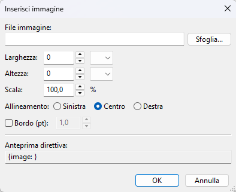

La direttiva `{image:}` inserisce un'immagine raster nel punto in cui appare nella canzone. Songpress++ supporta due modalità: **collegamento esterno** (percorso file) e **immagine incorporata** (embedded base64).

#### Opzioni della direttiva

| Opzione        | Std | Descrizione                                                                             |
| -------------- | --- | --------------------------------------------------------------------------------------- |
| `width=N`      | ✅  | Larghezza in punti tipografici (1/72 di pollice), o percentuale es. `width=50%`         |
| `height=N`     | ✅  | Altezza in punti tipografici, o percentuale                                             |
| `scale=N%`     | ✅  | Fattore di scala, es. `scale=50%` (non combinabile con width/height)                    |
| `align=left`   | ✅  | Allineamento a sinistra                                                                 |
| `align=center` | ✅  | Allineamento al centro (predefinito)                                                    |
| `align=right`  | ✅  | Allineamento a destra                                                                   |
| `border`       | ✅  | Disegna un bordo da 1pt attorno all'immagine                                            |
| `border=N`     | ✅  | Disegna un bordo di N punti tipografici                                                 |

**Formati supportati:**

| Formato | Estensioni      |
| ------- | --------------- |
| PNG     | `.png`          |
| JPEG    | `.jpg`, `.jpeg` |
| GIF     | `.gif`          |
| BMP     | `.bmp`          |
| TIFF    | `.tiff`, `.tif` |

---

#### Modalità 1 — Collegamento esterno (percorso file)

Il file immagine rimane su disco e viene caricato ogni volta che il documento viene aperto. Se il file immagine si trova nella stessa cartella del documento, è sufficiente il solo nome del file. I percorsi contenenti spazi o backslash devono essere racchiusi tra virgolette doppie.

```chordpro
{image: logo.png}
{image: logo.png width=200 align=left}
{image: logo.png scale=50% border}
{image: "C:\Users\Utente\Immagini\foto.jpg" align=center}
```

---

#### Modalità 2 — Immagine incorporata (embedded base64) 🔧

Quando si attiva la checkbox **Incorpora immagine nel file** nel dialogo di inserimento, il contenuto dell'immagine viene codificato in base64 e salvato direttamente all'interno del file documento. Il file diventa così completamente autosufficiente: non dipende da file esterni e può essere condiviso o spostato senza perdere l'immagine.

```chordpro
{image: data:image/png;base64,iVBORw0KGgoAAAANS... width=200 align=center}
```

Il dato base64 viene generato automaticamente dal dialogo — non è necessario scriverlo manualmente. Allineamento, bordo e dimensioni si impostano normalmente tramite i controlli del dialogo e vengono inclusi nella direttiva anche in modalità embedded.

> **Nota sulla dimensione** — La codifica base64 aumenta la dimensione del dato di circa il 33%. Il dialogo mostra una stima dei KB/MB che verranno aggiunti al file documento prima di confermare. Il nome dell'estensione nella stima riflette l'estensione predefinita impostata in **Opzioni → Generale 2 → Estensione dei file predefinita**.

---

#### Finestra di dialogo Inserisci immagine

L'immagine può essere inserita tramite **Inserisci → Altro → Immagine {image:}**. Il dialogo permette di selezionare il file, impostare tutte le opzioni e vedere in tempo reale la direttiva che verrà generata nel campo **Anteprima direttiva**.

| Campo      | Valore iniziale | Intervallo | Unità    | Note                                                         |
| ---------- | --------------- | ---------- | -------- | ------------------------------------------------------------ |
| Larghezza  | 0               | 0–9999     | `pt` / `%` | 0 = non incluso nella direttiva; unità di default: `pt`   |
| Altezza    | 0               | 0–9999     | `pt` / `%` | 0 = non incluso nella direttiva; unità di default: `pt`   |
| Scala      | 100             | 1–500      | `%`      | 100 = non incluso (è il valore default)                      |
| Bordo      | 1               | 0–50       | pt       | attivo solo se la checkbox **Bordo** è spuntata; passo 0,5  |

La checkbox **Incorpora immagine nel file (base64, senza dipendenza esterna)** si trova nella parte inferiore del dialogo, sotto la sezione Bordo. Quando attiva, l'anteprima mostra `{image: data:<embedded> ...}` con le opzioni reali (allineamento, bordo, ecc.) visibili e modificabili in tempo reale.

---

### Indicatore Transposer 🖊

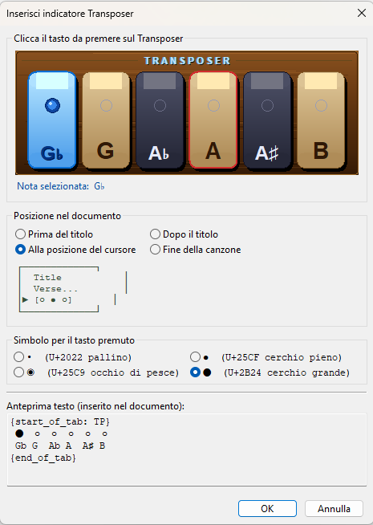

L'**indicatore Transposer** è una rappresentazione testuale a pallini che mostra quale tasto premere sul dispositivo Transposer fisico dell'organo. Viene inserito direttamente nel testo della canzone come blocco `{start_of_tab: TRANSPOSER}` in modo che sia visibile nell'anteprima e in stampa con font monospace (Courier New), garantendo l'allineamento perfetto tra i simboli e le note.

#### Accesso

**Inserisci → Altro → Immagine Transposer {image:}...**

#### Struttura dell'indicatore

Il blocco inserito è composto da due righe in font monospace:

- **Riga 1** — i simboli dei tasti: un pallino pieno per il tasto selezionato, pallini vuoti per gli altri
- **Riga 2** — le etichette delle note: `Gb  G   Ab  A   A#  B`

```
{start_of_tab: TRANSPOSER}
 ·   ·   ·   •   ·   ·
 Gb  G   Ab  A   A#  B
{end_of_tab}
```

#### Anteprima pallini

| Tasto | Riga simboli                   | Nota premuta |
|-------|-------------------------------|--------------|
| G♭    | `•   ·   ·   ·   ·   ·`      | G♭           |
| G     | `·   •   ·   ·   ·   ·`      | G            |
| A♭    | `·   ·   •   ·   ·   ·`      | A♭           |
| **A** | `·   ·   ·   •   ·   ·`      | **A** *(default)* |
| A♯    | `·   ·   ·   ·   •   ·`      | A♯           |
| B     | `·   ·   ·   ·   ·   •`      | B            |

> Il tasto **A** ha sempre un bordo rosso nel pannello grafico del dialog: indica la tonalità di riferimento del Transposer fisico.

#### Scelta del simbolo

Il dialog permette di scegliere il simbolo per il tasto premuto tra quattro opzioni:

| Simbolo | Codice Unicode | Descrizione        | Spazio colonna |
|---------|----------------|--------------------|----------------|
| `•`     | U+2022         | Bullet             | 4              |
| `●`     | U+25CF         | Black circle       | 4              |
| `◉`     | U+25C9         | Fisheye            | 4              |
| `⬤`     | U+2B24         | Large black circle | 5              |

Il simbolo per i tasti **non premuti** è sempre `·` (U+00B7) oppure `○` (U+25CB) in funzione della scelta.

#### Posizione nel documento

| Opzione                  | Descrizione                                                                 |
|--------------------------|-----------------------------------------------------------------------------|
| Prima del titolo         | Inserisce il blocco all'inizio del file, prima di qualsiasi contenuto       |
| Dopo il titolo           | Cerca `{title:}` o `{t:}` e inserisce subito dopo                          |
| Alla posizione del cursore | Inserisce nel punto corrente del cursore *(predefinito)*                  |
| Fine della canzone       | Inserisce in fondo al testo, prima delle righe vuote finali                 |

---


## Struttura del file — Esempio completo

```chordpro
{title: O Sole Mio}
{artist: Eduardo di Capua}
{key: C}
{time: 4/4}
{tempo: 80}
{capo: 0}

{start_verse_num}
{beats_time: C=2 G7=2}
[C]Che bella [G7]cosa na jurnata 'e [C]sole
[C]N'aria serena [G7]doppo na tempesta!
{end_verse_num}

{soc:Ritornello}
[C]O sole [C7]mio sta [F]'nfronte a [C]te
[G7]O sole, o sole [C]mio
{eoc}

{start_of_tab: Intro}
e|--0--3--2--0--|
B|--1--0--3--1--|
G|--0--0--2--0--|
{end_of_tab}

{new_page}

{start_verse_num}
[C]Ma n'atu sole [G7]cchiu bello, oje [C]ne'
{end_verse_num}
```

---

## Funzionalità dell'editor

### Inserimento guidato (menu Inserisci)

Tutte le principali direttive sono accessibili tramite il menu **Inserisci**, che apre finestre di dialogo di supporto per compilare i valori. Il cursore `|` in InsertWithCaret indica la posizione in cui il cursore verrà posizionato dopo l'inserimento.

### Gestione degli accordi

- **Inserisci accordo** — inserisce `[|]` con il cursore all'interno delle parentesi
- **Sposta accordo a destra / sinistra** — sposta l'accordo sotto il cursore di un carattere
- **Rimuovi accordi** — elimina tutti gli accordi dalla selezione
- **Incolla accordi** — incolla solo gli accordi (senza testo) dalla selezione copiata
- **Propaga accordi alle strofe** — copia gli accordi dalla prima strofa a tutte le strofe con lo stesso numero di righe
- **Propaga accordi ai ritornelli** — come sopra, per i ritornelli
- **Integra accordi** — converte due righe separate (accordi sopra / testo sotto) nel formato ChordPro inline

### Trasposizione e notazione

- **Trasponi** — apre la finestra di dialogo per trasporre gli accordi. Il dialogo offre le seguenti opzioni:

  | Opzione | Descrizione |
  |---|---|
  | **Notazione degli accordi** | Notazione rilevata automaticamente; può essere cambiata manualmente |
  | **Dalla tonalità** | Tonalità di partenza, rilevata automaticamente dal testo |
  | **Semitoni** | Numero di semitoni di trasposizione (da −11 a +12) |
  | **Alla tonalità** | Tonalità di destinazione; si aggiorna automaticamente al variare dei semitoni |
  | **Alterazioni** | Scelta tra automatico, diesis (#) o bemolle (b) per le note cromatiche |
  | **Applica solo alla selezione** | Se attiva (e solo se c'è testo selezionato), traspone esclusivamente gli accordi `[...]` e le direttive `{beats_time:}` contenuti nella selezione, lasciando invariato il resto del brano |
  | **Trasponi anche gli accordi in {beats_time:}** | Estende la trasposizione anche ai nomi degli accordi nelle direttive `{beats_time: DO=4 SOL=2 …}`, rispettando lo stesso ambito (selezione o intero brano) scelto con l'opzione precedente |

  > **Nota — Notazioni relative (Nashville e Romana):** le notazioni **Nashville** (1, 2, 3… 7) e **Romana** (I, II, III… VII) rappresentano *gradi della scala* e non altezze assolute. Per questo motivo vengono escluse dalla trasposizione: spostare il grado `[1]` da Do a Re non avrebbe alcun senso musicale, poiché il grado rimane invariato indipendentemente dalla tonalità. Se il testo contiene accordi in notazione Nashville o Romana, questi restano inalterati dopo la trasposizione.

- **Semplifica accordi** — trova la tonalità più facile da suonare
- **Cambia notazione** — converte tra notazione anglosassone (C D E…) e solfeggio (Do Re Mi…)
- **Normalizza accordi** — standardizza la scrittura degli accordi (es. `Hm` → `Bm`)
- **Converti Tab → ChordPro** — converte automaticamente il formato tab (accordi sopra il testo) in ChordPro inline

### Formato e struttura

- **Font canzone** — apre la finestra di dialogo per impostare il font globale
- **Font testo** — inserisce le direttive `{textfont}`/`{textsize}`/`{textcolour}` per il tratto corrente
- **Font accordi** — inserisce le direttive `{chordfont}`/`{chordsize}`/`{chordcolour}`
- **Etichette strofe** — mostra/nasconde le etichette delle strofe nell'anteprima
- **Accordi sopra / sotto** — posiziona gli accordi sopra o sotto il testo
- **Mostra accordi** — tre modalità: nessuno / solo prima strofa / intera canzone
- **Linee interruzione pagina/colonna** — mostra/nasconde le linee guida nell'anteprima

### Pulizia del testo

- **Rimuovi righe vuote superflue** — elimina le righe vuote doppie
- **Normalizza spazi multipli** — riduce gli spazi multipli a uno solo

### Simboli musicali Unicode ⌨️

- **Simbolo musicale (Unicode)…** (`Inserisci › Simbolo musicale (Unicode)…`, scorciatoia `Ctrl+Shift+M`) — apre la **finestra Simboli musicali**, da cui è possibile scegliere un carattere Unicode e inserirlo nel punto del cursore.

### Controllo sintassi

- **Controlla sintassi** (`Strumenti › Controllo sintassi`, <kbd>F7</kbd>) — analizza il testo e segnala le direttive non riconosciute o malformate, con la possibilità di navigare direttamente all'errore.


### Copia prompt IA per beats_time (<kbd>Ctrl</kbd>+<kbd>Shift</kbd>+<kbd>B</kbd>)

**Strumenti › Copia prompt IA per beats_time**

Copia negli appunti un **prompt pronto da incollare** in un assistente di intelligenza artificiale, chiedendogli di aggiungere le direttive `{beats_time:}` al file della canzone corrente leggendo uno spartito PDF. L'IA analizza lo spartito, calcola la durata in battiti di ciascun accordo e restituisce il file `.crd` con le direttive già inserite.

**Come si usa:**

1. Apri il file della canzone (`.crd`, `.cho`, `.chordpro`, ecc.)
2. Scegli **Strumenti › Copia prompt IA per beats_time** oppure premi <kbd>Ctrl</kbd>+<kbd>Shift</kbd>+<kbd>B</kbd>
3. Apri l'assistente IA che preferisci (vedi sotto)
4. Allega lo spartito PDF e il file della canzone
5. Incolla il prompt copiato e invia

Se lo spartito PDF ha un nome diverso dal file della canzone, modificalo nel prompt prima di inviarlo. Il nome del file della canzone e quello del PDF vengono compilati automaticamente dal documento aperto; il nome del PDF viene assunto uguale al file della canzone con estensione `.pdf`.

**Struttura del prompt copiato negli appunti:**

```
Aggiungi beats_time a MiaCanzone.crd usando lo spartito MiaCanzone.pdf.
La croma vale 1 battito. Il beats_time va scritto prima della riga con gli
accordi, esempio:
`{beats_time: DO=2 SOL=2 RE-=2 LA-=2}` / `[DO]Ecco[SOL]mi, [RE-]ecco[LA-]mi!`
```

**Assistenti IA compatibili**

Qualsiasi assistente IA in grado di leggere file PDF e di testo è adatto. I seguenti sono alcuni esempi — l'elenco non è esaustivo e non costituisce una raccomandazione:

| Assistente | Indirizzo | Note |
| ---------- | --------- | ---- |
| Claude (Anthropic) | [claude.ai](https://claude.ai) | Supporta allegati PDF e file di testo; piano gratuito disponibile |
| ChatGPT (OpenAI) | [chatgpt.com](https://chatgpt.com) | Supporta allegati PDF e file di testo; piano gratuito disponibile |
| Gemini (Google) | [gemini.google.com](https://gemini.google.com) | Supporta allegati PDF; piano gratuito disponibile |
| Copilot (Microsoft) | [copilot.microsoft.com](https://copilot.microsoft.com) | Integrato in Windows 11 e Microsoft 365 |

> **Nota** — Se nessun file canzone è aperto, viene mostrato un avviso. Apri prima il file, poi usa il comando.

### Statistiche brano (<kbd>F8</kbd>)

**Strumenti › Statistiche brano…** apre una finestra di riepilogo che analizza il documento aperto e produce una valutazione immediata della difficoltà.

#### Sezioni del dialogo

| Sezione | Informazioni mostrate |
|---|---|
| **Struttura** | Numero di strofe, ritornelli, bridge e pagine stimate |
| **Testo** | Righe di testo attive e conteggio parole (esclusi accordi e direttive) |
| **Accordi** | Totale accordi, accordi unici e percentuale di accordi complessi (7ª, dim, aug, sus, add…) |
| **Metadati** | Tonalità, tempo BPM, indicazione di tempo, capo e durata (se presenti nel file) |

#### Valutazione difficoltà

La finestra mostra una valutazione da **1 a 5 stelle** basata su un punteggio 0–100 calcolato automaticamente:

| Stelle | Giudizio | Condizioni |
|---|---|---|
| ★★★★★ | Ottimo per principianti | ≤ 12 accordi unici, nessun accordo complesso |
| ★★★★☆ | Accessibile | Pochi accordi complessi o struttura semplice |
| ★★★☆☆ | Intermedio | Accordi moderatamente complessi |
| ★★☆☆☆ | Avanzato | Molti accordi complessi o struttura articolata |
| ★☆☆☆☆ | Molto difficile | Brano senza accordi o con accordi molto complessi |

La barra sotto le stelle visualizza il punteggio grezzo (0–100).

#### Durata

Il dialogo mostra la durata del brano nella sezione **Metadati** con due modalità distinte:

- **Durata dichiarata** — se il file contiene la direttiva `{duration:MM:SS}` su una riga attiva (non commentata con `#`), viene usato quel valore e la riga nelle statistiche viene etichettata **«Durata»**.
- **Durata stimata** — se `{duration:}` è assente o commentata (`#{duration:12:45}`), il dialogo calcola una stima approssimativa a partire dalle direttive `{tempo:}` e `{time:}`, moltiplicando il numero di cambi accordo per la durata di ogni battuta. La riga viene etichettata **«Durata stimata»**.

> **Nota** — La stima automatica è orientativa: non tiene conto di ripetizioni, ritornelli multipli o pause. Inserire `{duration:MM:SS}` con la durata reale del brano permette di visualizzare un valore preciso nelle statistiche.

### Intellisense direttive (`Ctrl+Spazio`)

Premendo `Ctrl+Spazio` con il cursore posizionato all'interno di una coppia di parentesi graffe `{…}`, l'editor mostra un elenco a comparsa con tutte le direttive ChordPro supportate da Songpress++. Selezionando una voce dall'elenco (con `Enter` o doppio clic), la direttiva viene inserita nella posizione corretta.

Questa funzionalità può essere abilitata o disabilitata in **Strumenti → Opzioni… → scheda Generale → Abilita intellisense direttive (Ctrl+Spazio)**.

---

## Simboli musicali Unicode — finestra di dialogo

La finestra **Musical Symbols** (`Inserisci › Simbolo musicale (Unicode)…`, `Ctrl+Shift+M`) permette di inserire nell'editor qualsiasi carattere Unicode musicale speciale, inclusi i simboli del blocco **Musical Symbols** (U+1D100–U+1D1FF) e i caratteri BMP più comuni.

### Struttura della finestra

La finestra è organizzata in **sei schede** per categoria:

| Scheda | Contenuto |
| ---------------------- | ---------------------------------------------------------------- |
| **Note e pause** | Semibreve, minima, croma, pause di ogni valore (U+1D13B–U+1D164) |
| **Alterazioni** | Diesis, bemolle, bequadro, doppi e quarti di tono |
| **Dinamiche** | *p*, *f*, *mp*, *mf*, *sf*, crescendo, decrescendo, ecc. |
| **Pentagramma e chiavi** | Chiavi (violino, basso, Do), stanghette, segno, coda |
| **Ornamenti e articolazioni** | Legature, fermata, cesura, respiro, ecc. |
| **Comuni (BMP)** | ♩ ♪ ♫ ♬ ★ † ½ ¼ × – — … e altri caratteri d'uso comune |

### Come inserire un simbolo

1. Aprire la finestra con `Inserisci › Simbolo musicale (Unicode)…` o `Ctrl+Shift+M`.
2. Selezionare la scheda della categoria desiderata.
3. **Fare clic** su una cella per selezionare il simbolo — in basso appariranno l'anteprima ingrandita e la descrizione con il codepoint Unicode (es. `U+1D157`).
4. Premere **Insert** oppure fare **doppio clic** sulla cella per inserire il carattere nel cursore dell'editor e chiudere la finestra.
5. Premere **Close** (o `Esc`) per annullare senza inserire nulla.

> **Suggerimento** — Passando il mouse sulle celle appare un tooltip con il nome del simbolo e il codepoint.

### Opzioni di inserimento

Nella parte inferiore della finestra si trovano due opzioni che controllano il modo in cui il simbolo viene inserito nell'editor. Il loro stato viene salvato automaticamente e ripristinato alla riapertura del programma.

**Dimensione personalizzata (pt)** — checkbox + campo numerico (6–144)

Quando è attiva, il simbolo viene wrappato con le direttive `{textsize:N}` e `{textsize}` per applicare la dimensione scelta e ripristinare poi quella originale. La seconda `{textsize}` senza argomento è la forma corretta per il reset (diversamente da `{textsize:}` con due punti finali, che costituisce un errore sintattico rilevato dalla verifica sintattica).

| Checkbox | Testo inserito |
| -------- | -------------- |
| disattivata | `♩` |
| attivata (pt = 24) | `{textsize:24}♩{textsize}` |

> **Nota** — Non tutti i simboli possono essere ridimensionati: i caratteri del piano SMP (U+1D100–U+1D1FF) richiedono un font con copertura adeguata (FreeSerif, Bravura, ecc.) nella cartella `fonts/`. Se il font non copre il glifo, la dimensione viene applicata ma il carattere potrebbe non essere visibile.

**Incorpora il simbolo in una strofa (non conteggiata)** — checkbox

Quando è attiva, il simbolo viene racchiuso in un blocco `{start_verse}…{end_verse}`. In questo modo appare nell'anteprima come un blocco strofa autonomo, ma **non viene conteggiato** nella numerazione progressiva delle strofe: le strofe adiacenti mantengono la loro numerazione corretta.

| Checkbox | Testo inserito |
| -------- | -------------- |
| disattivata | `♩` |
| attivata | `{start_verse}♩{end_verse}` |

Le due opzioni sono combinabili: se entrambe sono attive, il risultato è:

```chordpro
{start_verse}{textsize:24}♩{textsize}{end_verse}
```

Le stesse impostazioni sono accessibili anche da **Preferenze → Formattazione → Inserimento simbolo musicale**, dove vengono salvate in modo permanente.

I simboli del blocco Musical Symbols (U+1D100–U+1D1FF) appartengono al piano supplementare Unicode (**SMP**, codepoint > U+FFFF). I font di sistema comuni (Arial, Times New Roman, Calibri) non coprono questo range; Songpress++ risolve il problema in due modi distinti:

**Nell'editor (pannello di testo)** — l'editor usa il motore di rendering **DirectWrite** (`SetTechnology(STC_TECHNOLOGY_DIRECTWRITE)`), che abilita il font-fallback automatico di Windows: se il font scelto per l'editor non contiene il glifo, Windows cerca automaticamente tra i font installati quello più adatto.

**Nell'anteprima e in stampa** — il renderer usa **GDI+** tramite `wx.GraphicsContext` esclusivamente per i caratteri SMP. Per ogni stringa che contiene almeno un codepoint > U+FFFF, Songpress++ crea un contesto grafico separato e imposta il font nell'ordine di preferenza:

1. **FreeSerif** (GNU FreeFont) — copertura completa del blocco Musical Symbols; deve essere presente in `<installazione>/fonts/FreeSerif.ttf`.
2. **Segoe UI Symbol** — presente di default su Windows 10/11; copertura SMP parziale.
3. Font corrente del documento — usato come ultimo tentativo (mostrerà rettangoli per i glifi mancanti).

Il testo normale (accordi, testo canzone, titoli) continua a usare il renderer GDI classico senza overhead aggiuntivo.

### Come modificare le dimensioni del simbolo nell'anteprima

I simboli musicali vengono visualizzati nella stessa dimensione del testo circostante, scalata automaticamente in base a:

- **Font globale della canzone** — modificabile da `Formato › Font canzone…`. Aumentare la dimensione in punti del font principale aumenta proporzionalmente anche i simboli SMP.
- **Direttiva `{textsize:Pt}`** — inserita direttamente nel testo ChordPro prima del simbolo, imposta la dimensione in punti per quel tratto. Esempio:

  ```chordpro
  {textsize:24}𝄞{textsize}
  ```

  La seconda `{textsize}` (senza argomento) ripristina la dimensione predefinita.

- **Direttiva `{textsize:N%}`** — versione percentuale, relativa alla dimensione base del documento. Esempio per un simbolo al 150%:

  ```chordpro
  {textsize:150%}𝅘𝅥𝅮{textsize}
  ```

- **Zoom dell'anteprima** — il cursore di zoom nella barra dell'anteprima scala tutta la pagina (testo + simboli) senza modificare le dimensioni del file. Non influisce sulla stampa.

> **Nota tecnica** — Il renderer moltiplica automaticamente la dimensione in punti del font per il fattore di zoom corrente prima di creare il `wx.GraphicsFont`, in modo che i simboli SMP abbiano sempre le stesse proporzioni del testo GDI circostante.

### Aggiungere librerie di simboli personalizzate

Songpress++ carica automaticamente **tutti** i file `.ttf` presenti nella cartella `fonts/` all'interno della directory di installazione. Per aggiungere il supporto a nuovi simboli Unicode è sufficiente copiare il file del font in quella cartella — non è richiesta nessuna configurazione aggiuntiva.

```
<installazione>/
  fonts/
    FreeSerif.ttf           ← già incluso — copertura completa Musical Symbols
    Bravura.ttf             ← font SMuFL (notazione musicale professionale)
    NotoMusic.ttf           ← Google Noto — ampia copertura SMP
    SegoeUISymbol.ttf       ← eventuale copia locale di Segoe UI Symbol
    qualsiasi_altro.ttf     ← viene caricato e usato automaticamente
```

**Ordine di priorità** — I font vengono provati nell'ordine seguente:

1. `FreeSerif.ttf` — ha precedenza assoluta (copertura Musical Symbols garantita)
2. `Bravura.ttf` — se presente
3. `NotoMusic.ttf` / `NotoMusicRegular.ttf` — se presenti
4. Tutti gli altri `.ttf` nella cartella, in ordine alfabetico
5. **Segoe UI Symbol** — font di sistema Windows 10/11 (fallback automatico, nessun file da copiare)
6. Font corrente del documento — ultimo tentativo (mostra rettangoli per i glifi mancanti)

Per ogni carattere SMP, Songpress++ percorre questa lista e usa il primo font che wx riesce a caricare correttamente. Se un font non copre un particolare glifo, GDI+ non fa ulteriore fallback automatico — il font corretto deve quindi trovarsi nella cartella `fonts/`.

> **Suggerimento** — I font **SMuFL** (Standard Music Font Layout, <https://www.smufl.org>) come Bravura, Petaluma o Leland coprono centinaia di simboli musicali specializzati non inclusi in FreeSerif. Per la notazione gregoriana o mensurale sono consigliati font come **Caeciliae** o **Volpiano**.

---


## Modalità istanza singola

**Percorso:** *Opzioni → Generale 2 → Generale → Istanza singola: apri i file nella finestra esistente*

Quando questa opzione è attiva (predefinito: **sì**), Songpress++ funziona in **modalità istanza singola**: aprire un file da Esplora risorse, dalla riga di comando o con doppio clic su un file `.crd` / `.cho` / `.chordpro` instrada sempre il file nella **finestra già aperta**, invece di avviare un nuovo processo.

### Come funziona

1. All'avvio, Songpress++ apre un **socket locale** sulla porta 47833 (solo localhost, invisibile alla rete).
2. Se viene avviata una seconda istanza (ad esempio con doppio clic su un altro file), il nuovo processo rileva il socket in ascolto, **invia il percorso del file** all'istanza in esecuzione e termina immediatamente.
3. La finestra in esecuzione riceve il percorso, **si porta in primo piano** e apre il file come se l'utente avesse usato *File → Apri*.

L'intero scambio è silenzioso: in condizioni normali non compaiono dialoghi né notifiche.

### Casi di errore

| Situazione | Comportamento |
|---|---|
| Il file passato dalla riga di comando non esiste | Viene mostrato un dialogo di errore, poi l'applicazione termina |
| Nessuna istanza in ascolto (primo avvio o istanza precedente terminata in modo anomalo) | Songpress++ si avvia normalmente e diventa la nuova istanza singola |

### Pro e contro

| ✅ Vantaggi | ⚠️ Svantaggi |
|---|---|
| Evita la proliferazione accidentale di finestre quando si aprono più file da Esplora risorse | È possibile avere un solo brano aperto per volta per finestra (a meno che il file non contenga più blocchi `{new_song}`) |
| Preserva il layout, il livello di zoom e lo stato dell'editor della finestra esistente | Se si vuole deliberatamente avere due finestre indipendenti (ad es. per confrontare due brani), occorre **disattivare** questa opzione |
| Coerente con il comportamento della maggior parte degli editor professionali (VS Code, Notepad++, Sublime Text) | Richiede che la porta TCP 47833 sia disponibile su localhost; i conflitti sono estremamente rari ma possibili in ambienti molto vincolati |
| Aprire un file porta la finestra in primo piano automaticamente, senza intervento dell'utente | |

### Quando disattivarla

Deseleziona *Istanza singola* se hai bisogno di:

- Lavorare su **due o più brani contemporaneamente** in finestre separate e indipendenti.
- Eseguire Songpress++ in un ambiente **multi-utente / RDS** dove ogni sessione deve essere completamente isolata.
- Diagnosticare un conflitto di porta (controlla `startup.log` in `%LOCALAPPDATA%\Songpress++\` per la diagnostica).

> **Nota — startup.log** — Ogni evento legato all'istanza singola viene registrato in `%LOCALAPPDATA%\Songpress++\startup.log` (Windows) oppure `~/.Songpress++/startup.log` (Linux/macOS). Il log registra il percorso del config letto, il valore della chiave `singleinstance`, se è stata trovata un'istanza esistente e se il file è stato inoltrato con successo. È il primo posto dove cercare in caso di comportamento anomalo con più finestre.

---
## Personalizzazione delle toolbar

Songpress++ consente di mostrare o nascondere singole icone in ciascuna delle quattro barre degli strumenti: **Standard**, **Formattazione**, **Inserisci** e **Visualizza**.

### Come accedere alle impostazioni

Aprire **Strumenti → Opzioni…** e selezionare la scheda **Toolbar**. La scheda contiene quattro sotto-schede, una per barra:

| Sotto-scheda    | Barra corrispondente | Icone configurabili |
|-----------------|----------------------|---------------------|
| Standard        | Barra standard       | Nuovo, Apri, Salva, Anteprima di stampa, Stampa, Annulla, Ripeti, Taglia, Copia, Copia come immagine, Incolla, Incolla accordi, Verifica sintassi, Opzioni… |
| Formattazione   | Barra di formattazione | Font, Mostra/nascondi accordi, Interlinea |
| Inserisci       | Barra di inserimento | Tutte le icone di inserimento (titolo, accordi, strofe, metadati musicali, immagini, simboli, ecc.) |
| Visualizza      | Barra di visualizzazione | Mostra anteprima Songpress++, Mostra etichette strofe e ritornelli |

### Come mostrare o nascondere un'icona

1. Nella sotto-scheda corrispondente, **spuntare** la casella per mostrare l'icona, **deselezionarla** per nasconderla.
2. I pulsanti **Seleziona tutto** e **Deseleziona tutto** agiscono solo sulla sotto-scheda corrente.
3. Fare clic su **OK**: la toolbar viene aggiornata immediatamente.

Le impostazioni vengono salvate nel file di configurazione dell'applicazione e ripristinate ad ogni avvio.

> **Nota:** nascondere un'icona dalla toolbar non rimuove il comando corrispondente. Tutti i comandi rimangono sempre accessibili dal menu e tramite le scorciatoie da tastiera.

### Comportamento dei separatori

I separatori visivi tra gruppi di icone vengono gestiti automaticamente: se tutte le icone di un gruppo vengono nascoste, il separatore tra quel gruppo e il successivo scompare, evitando separatori orfani nella toolbar.

### Note per sviluppatori

La lista completa delle icone configurabili è definita nelle costanti di classe `MAIN_TOOLBAR_ITEMS`, `FORMAT_TOOLBAR_ITEMS`, `INSERT_TOOLBAR_ITEMS` e `VIEW_TOOLBAR_ITEMS` nel mixin `SongpressToolbarsMixin` (`SongpressToolbars.py`). Ogni voce ha la forma `(xrc_name, label, pref_key)`.

Quando si aggiunge un nuovo comando a una toolbar, è sufficiente:

1. Aggiungere la voce alla costante `*_TOOLBAR_ITEMS` corrispondente.
2. Aggiungere il percorso icona in `_*_toolbar_icons` e il testo di aiuto in `_*_toolbar_helps` dentro il rispettivo metodo `_Build*ToolBar()`.

**`MyPreferencesDialog` e `SongpressFrame` non richiedono alcuna modifica**: entrambi leggono le costanti `*_TOOLBAR_ITEMS` in modo dinamico — il dialogo preferenze genera automaticamente i checkbox per ogni nuova voce, e il save/load del config itera sull'intera lista.

---

## Preferenze di visualizzazione

I seguenti controlli si trovano nella scheda **Formattazione** delle preferenze e influenzano l'anteprima e la stampa.

| Campo                                  | Predefinito | Intervallo | Passo |
| -------------------------------------- | ----------- | ---------- | ----- |
| Spessore sottolineatura titolo         | 2           | 1–5        | 1     |
| Spessore bordo numero strofa           | 1           | 1–5        | 1     |

---

## Stampa e anteprima

- **Anteprima di stampa** — mostra l'anteprima con i pulsanti «Opzioni di stampa», «Impostazione pagina» e «Impostazioni driver»
- **Stampa** — se la preferenza **Mostra anteprima di stampa prima di stampare** (scheda *Generale* delle opzioni) è attiva, viene mostrata prima l'anteprima di stampa; se è disattivata, viene aperto il dialogo di stampa del sistema (selezione stampante, numero di copie, ecc.) e la stampa parte dopo la conferma
- **Impostazione pagina** — carta, orientamento e margini (in mm)

> **Gestione automatica della selezione** — l'anteprima di stampa rileva automaticamente se è attiva una selezione di testo nell'editor (`_print_scope = 'auto'`): se c'è una selezione, viene stampata solo quella; altrimenti viene stampato l'intero documento. Non è necessaria alcuna impostazione manuale.

### Preferenze di stampa (scheda *Anteprima Songpress++*)

> **Nota — Ordinamento automatico** — Le checkbox di questo gruppo vengono ordinate alfabeticamente in base alla **lingua dell'interfaccia** attiva. L'ordine può quindi differire da quello mostrato in questa tabella.

| Preferenza | Predefinito | Descrizione |
| ---------- | ----------- | ----------- |
| Mostra anteprima di stampa prima di stampare | ✅ attivo | Se attivo, il comando **Stampa** apre prima l'anteprima; se disattivato, apre direttamente il dialogo di stampa del sistema |
| Aggiornamento in tempo reale dello stato fronte/retro e colore nell'anteprima (ogni 1,5 s) | ✅ attivo | Se attivo, la barra di stato dell'anteprima interroga il driver ogni 1,5 secondi e aggiorna gli indicatori duplex, colore e orientamento in tempo reale, anche mentre il pannello del driver è aperto; se disattivato, la lettura avviene una sola volta all'apertura |
| Mantieni sempre in primo piano la finestra di anteprima di stampa | ☐ disattivo | Se attivo, la finestra di anteprima rimane sopra a tutte le altre finestre (`wx.STAY_ON_TOP`); se disattivato, si comporta come una finestra normale |

### Opzioni di stampa

| Opzione                                              | Descrizione                                                              |
| ---------------------------------------------------- | ------------------------------------------------------------------------ |
| Pagine per foglio (1 / 2)                            | Seleziona quante pagine logiche stampare su un foglio fisico             |
| Colonne per pagina (1 / 2)                           | Distribuisce il testo su una o due colonne                               |
| Riduci se eccede la pagina                           | Riduce il contenuto solo se eccede la pagina (senza ingrandimento)       |
| Comprimi per adattare alla pagina corrente           | Riduce ulteriormente per evitare che il contenuto venga tagliato in basso|
| Non replicare (lascia metà destra vuota)             | Con 2 pagine/foglio: lascia la seconda metà vuota invece di copiare     |
| Rimuovi pagine vuote                                 | Rimuove le pagine logiche quasi vuote dall'output di stampa              |
| Soglia pagina vuota (%)                              | Percentuale massima di pagina occupata sotto cui la pagina viene rimossa |

La direttiva `{new_page}` nel testo forza una nuova pagina logica durante la stampa. Con il layout a 2 colonne, `{column_break}` forza il salto alla colonna successiva.

### Impostazioni di stampa e spiegazioni

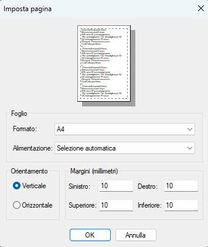
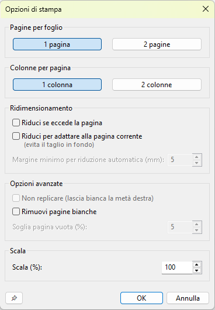

**Cosa significa «Margine minimo per compressione automatica (mm)»?**

È un parametro di controllo per la funzione Comprimi per adattare, che si attiva quando l'opzione **«Comprimi per adattare alla pagina corrente (evita taglio in basso)»** è spuntata.

Come funziona la logica: Songpress++ misura per ciascun segmento del brano (separati da `{new_page}`) quanto contenuto sfora oltre il bordo inferiore dell'ultima pagina che occupa, e tenta di recuperare esattamente quello spazio in due passi:

**Primo passo** — riduce i margini superiore e inferiore, distribuendo la riduzione in proporzione alla riducibilità di ciascuno (non necessariamente 50/50: se un margine è già vicino al minimo, viene ridotto meno dell'altro). La riduzione si ferma non appena lo sforamento è recuperato, oppure quando entrambi i margini hanno raggiunto il valore minimo configurato da questo SpinCtrl. Se il margine impostato dall'utente è, ad esempio, 20 mm, può essere compresso automaticamente fino a 5 mm (predefinito). Questo impedisce alla riduzione automatica di azzerare completamente i margini.

**Secondo passo** — scala il contenuto (rimpicciolisce testo/accordi), solo se la riduzione dei margini da sola non è stata sufficiente. Il fattore di scala viene calcolato separatamente per ogni segmento e viene applicato il più restrittivo, garantendo che nessun segmento venga tagliato.

In pratica: il valore (predefinito 5 mm) rappresenta il limite inferiore al di sotto del quale i margini non scendono mai durante la riduzione automatica. Maggiore è il valore, meno aggressiva è la compressione dei margini (e prima inizia la scalatura del testo). Il controllo è disabilitato quando la checkbox Riduci se eccede la pagina è disattivata, e si riabilita automaticamente quando viene attivata.

**Cosa significa «Soglia pagina vuota (%)»?**

È il parametro di controllo per la funzione **«Rimuovi pagine vuote»**, che si attiva quando la relativa checkbox è spuntata.

In stampa può accadere che l'ultimo elemento di una canzone (ad esempio la tastiera degli accordi) sfori di pochissimo oltre il limite della pagina, generando un foglio fisico aggiuntivo quasi completamente bianco. La funzione «Rimuovi pagine vuote» intercetta questo caso ed elimina automaticamente quella pagina residua.

La soglia (predefinita **5%**) rappresenta la percentuale massima di altezza pagina che il contenuto residuo può occupare perché la pagina venga considerata «vuota» e rimossa. Se il contenuto sfora di una quantità inferiore o uguale a questa soglia, la pagina viene soppressa; se sfora di più, la pagina viene mantenuta perché considerata effettivamente necessaria.

Esempi pratici:

- **5%** (predefinito) — rimuove la pagina solo se lo sforamento è minimo (pochi pixel, tipicamente la tastiera DO o un simbolo finale).
- **20%** — rimuove la pagina anche se il contenuto residuo occupa fino a un quinto della pagina.
- **50%** — rimuove la pagina se è meno di metà piena (uso sconsigliato: rischia di tagliare contenuto visibile).

Il controllo è disabilitato quando la checkbox «Rimuovi pagine vuote» è disattivata, e si riabilita automaticamente quando viene attivata.

### Pulsante «Impostazioni driver» nell'anteprima

La toolbar dell'anteprima include il pulsante **Impostazioni driver…** che apre il pannello nativo del driver di stampa (`DocumentProperties` su Windows). Da questo pannello si possono modificare tutte le impostazioni del driver: orientamento, fronte/retro, colore, numero di copie, formato carta e qualsiasi opzione specifica del modello (es. qualità di stampa, vassoio carta).

#### Come funziona internamente

L'apertura del pannello segue tre percorsi in cascata:

**Tentativo 1 — pywin32 (percorso preferito su Windows)**

Usa i binding `win32print` e `pywintypes` inclusi nella dipendenza `pywin32`:

1. Prima chiamata a `DocumentProperties(hwnd, hprinter, nome, None, None, 0)` → ottiene la dimensione totale del DEVMODE specifico del driver.
2. Alloca un `pywintypes.DEVMODEType(driver_extra)` con la dimensione corretta (dimensione fissa + `dmDriverExtra`).
3. Seconda chiamata con `DM_OUT_BUFFER` → legge le impostazioni correnti nel buffer allocato.
4. Terza chiamata con `DM_IN_BUFFER | DM_OUT_BUFFER | DM_IN_PROMPT` → **mostra il pannello nativo del driver** e attende la conferma dell'utente.

**Tentativo 2 — ctypes puro su `winspool.drv` (fallback, nessuna dipendenza esterna)**

Se `pywin32` non è disponibile o genera un errore, viene usata la stessa logica tramite `ctypes.WinDLL('winspool.drv')`, chiamando `DocumentPropertiesW` direttamente con buffer `ctypes.create_string_buffer`. I campi del DEVMODE risultante (orientamento, formato carta, copie, colore, duplex) vengono letti tramite offset fissi nella struttura `DEVMODEW`.

**Tentativo 3 — Finestra informativa (non-Windows o entrambi i tentativi falliti)**

Su piattaforme diverse da Windows, o se entrambi i tentativi precedenti falliscono, viene mostrata una finestra informativa che avvisa che il pannello del driver non è disponibile su questa piattaforma, suggerendo di usare la toolbar dell'anteprima per modificare orientamento, formato carta e margini. Non viene aperta nessuna finestra di dialogo aggiuntiva per evitare la comparsa di due finestre con funzioni simili.

#### Propagazione delle modifiche

Quando l'utente conferma con OK, Songpress++ propaga automaticamente in `wx.PrintData` i campi che wx espone (orientamento, duplex, colore, copie, formato carta) e aggiorna la barra di stato dell'anteprima. Se l'orientamento è cambiato, l'anteprima viene ricaricata automaticamente per mostrare il foglio nel verso corretto.

> **Nota** — Il pulsante **Impostazioni driver…** è disponibile solo nell'anteprima di stampa, non nel menu principale.

### Rilevamento automatico della stampante nell'anteprima

La barra di stato dell'anteprima di stampa mostra tre indicatori che leggono le impostazioni **reali** della stampante selezionata, non solo quelle impostate da wx:

| Indicatore | Valori possibili |
| ---------- | ---------------- |
| **Fronte/retro** | `Fronte/retro: disattivato (solo fronte)` · `ATTIVO — rilegatura lato lungo` · `ATTIVO — rilegatura lato corto` |
| **Colore** | `Colore: stampa a colori` · `Colore: bianco e nero` |
| **Orientamento** | Icona foglio verticale (ritratto) o orizzontale (landscape) |

**Come funziona il rilevamento (Windows)**

Su Windows il rilevamento del colore usa tre fonti in cascata, ognuna attivata solo se la precedente non ha prodotto un risultato; il duplex usa solo la fonte 1. Su macOS e Linux viene usato il valore restituito da `wx.PrintData`.

| Fonte | API | Quando viene usata |
| ----- | --- | ------------------ |
| **1 — DEVMODE** | `win32print.GetPrinter` livello 2 | Sempre per prima: riflette la scelta dell'utente nel pannello del driver |
| **2 — Capability hardware** | `win32print.GetPrinterCaps(DC_COLORDEVICE)` | Solo se `dmColor` è assente: indica se la stampante è fisicamente capace di colore |
| **3 — Fallback wx** | `wx.PrintData.GetColour()` | Solo se entrambe le fonti precedenti falliscono |

| Campo | Valori |
| ----- | ------ |
| `DEVMODE.dmDuplex` | `1` = solo fronte · `2` = fronte/retro lato lungo · `3` = fronte/retro lato corto |
| `DEVMODE.dmColor` | `1` = bianco e nero (`DMCOLOR_MONOCHROME`) · `2` = colore (`DMCOLOR_COLOR`) |
| `DC_COLORDEVICE` | `0` = hardware solo B/N (certezza assoluta) · `1` = hardware capace di colore |

**Affidabilità per tipo di stampante**

| Situazione | Fronte/retro rilevato? | Colore rilevato? |
| ---------- | ---------------------- | ---------------- |
| Stampante locale con driver nativo (es. Brother, HP, Canon) | ✅ sì | ✅ sì |
| Stampante di rete con driver nativo installato | ✅ sì | ✅ sì |
| Stampante PDF (Microsoft Print to PDF, PDFCreator) | ⚠️ dipende | ⚠️ dipende |
| Stampante di rete via IPP senza driver nativo (solo porta TCP/IP generica) | ❌ spesso no | ❌ spesso no |
| Stampante B/N che non espone `dmColor` nel DEVMODE | ✅ sì | ✅ sì (via `DC_COLORDEVICE`) |
| macOS / Linux | ⚠️ solo valore wx | ⚠️ solo valore wx |

> **Nota** — Se `win32print` non è disponibile o si verifica un errore globale, entrambi gli indicatori cadono automaticamente sul valore fornito da `wx.PrintData`. La fonte `DC_COLORDEVICE` è isolata da un proprio `try/except`: se `GetPrinterCaps` non è supportato dal driver, si passa comunque al fallback wx senza interrompere il rilevamento.

---

## Esporta

| Formato              | Note                                         |
| -------------------- | -------------------------------------------- |
| SVG                  | Vettoriale, scalabile                        |
| EMF                  | Formato vettoriale Windows                   |
| PNG                  | Immagine raster                              |
| HTML                 | Pagina web con accordi colorati              |
| Tab                  | Formato testo con accordi sopra              |
| PDF                  | Documento PDF (chiede prima l'impostazione pagina, poi il nome file) |
| PowerPoint (.pptx)   | Presentazione                                |
| Crea Songbook PDF    | Raccolta PDF di canzoni con indice cliccabile |
| Canzonatore          | Unisce più file ChordPro in un unico file    |
| Copia come immagine  | Copia negli appunti come immagine vettoriale |
| Copia solo testo     | Copia il testo senza accordi                 |

> **Nota — Esporta PDF:** il flusso di esportazione apre prima il dialogo **Impostazione pagina** (formato carta, orientamento, margini in mm); solo dopo la conferma viene chiesto il nome del file di output. I margini impostati vengono memorizzati e riutilizzati nelle successive esportazioni.

---

## Crea Songbook PDF

La funzione **Crea Songbook PDF** (menu *File → Crea Songbook PDF…*) genera un documento PDF completo da tutti i brani ChordPro presenti in una cartella selezionata.

### Come si usa

1. Scegliere la **cartella dei brani** tramite il pulsante *Sfoglia…*
2. Indicare il **file PDF di output**
3. Compilare i campi facoltativi: **Titolo Songbook**, **Autore / Gruppo**, **Anno**
4. Selezionare le **estensioni** da includere (`.crd`, `.cho`, `.chordpro`, `.chopro`, `.pro`, `.tab`, `.sng`, `.txt`)
5. Scegliere se rendere le **voci dell'indice cliccabili**
6. Regolare le impostazioni di pagina e le opzioni di stampa
7. Premere **OK** per avviare la generazione

### Struttura del PDF generato

| Sezione   | Descrizione |
| --------- | ----------- |
| Copertina | Titolo, autore e anno su sfondo blu scuro con banda arancione |
| Brani     | Un brano per pagina (o più se il testo è lungo); i brani sono ordinati alfabeticamente per titolo estratto da `{t:}` o `{title:}`, con fallback al nome del file |
| Indice    | Elenco numerato di tutti i brani con puntini di connessione e numero di pagina |

### Opzioni

| Opzione | Descrizione |
| ------- | ----------- |
| Estensioni | Selezionare quali tipi di file includere nella raccolta |
| Voci indice cliccabili (link PDF) | Se attivo, ogni voce dell'indice è un link interno che porta direttamente alla pagina del brano nel PDF; il titolo appare in blu con sottolineatura |
| Pagine per foglio (1 / 2) | Affianca due brani sullo stesso foglio fisico |
| Imposta pagina | Formato carta, orientamento e margini |
| Opzioni di stampa | Modalità 2 pagine per foglio |

### Note

- Le immagini `{image: nomefile.png}` inserite nei brani vengono cercate **nella stessa cartella del file sorgente** e incluse automaticamente nel PDF.
- I brani sono sempre ordinati alfabeticamente, indipendentemente dall'ordine dei file nella cartella.
- Per includere file `.txt` (che di norma non contengono direttive ChordPro), spuntare l'apposita estensione nell'elenco.

---

## Canzonatore — Unisci brani

La funzione **Canzonatore** (menu *File → Canzonatore (unisci brani)…*) unisce più file ChordPro in un unico file di testo, inserendo un separatore tra un brano e l'altro.

### Come si usa

1. Aprire il dialogo dal menu *File → Canzonatore (unisci brani)…*
2. Aggiungere i file tramite **Aggiungi file…** (selezione multipla) o **Aggiungi cartella…** (importa tutti i file supportati nella cartella in ordine alfabetico)
3. Riordinare i brani con i pulsanti **▲ Su** e **▼ Giù**
4. Scegliere il **separatore** tra i brani e la **codifica di output**
5. Premere **Unisci…**, scegliere dove salvare il file risultante e confermare

### Opzioni

| Opzione | Valori | Descrizione |
| ------- | ------ | ----------- |
| Separatore brani | `{new_page}` (predefinito) | Inserisce un'interruzione di pagina esplicita tra i brani |
| | Riga vuota | Separa i brani con una riga vuota |
| Codifica output | UTF-8 (predefinito) | Raccomandato per la massima compatibilità |
| | Latin-1 (ISO-8859-1) | Per compatibilità con software più datati |
| Apri file unito nell'editor | ✅ attivo per default | Apre automaticamente il file risultante nell'editor di Songpress++ al termine dell'unione |

### Estensioni supportate

`.crd` `.cho` `.chordpro` `.chopro` `.pro` `.tab` `.cpm`

### Doppio clic nella lista

Fare doppio clic (o premere Invio) su un file nell'elenco apre quel file nell'editor di Songpress++. Se nell'elenco è presente un file da rivedere prima di unire, non è necessario uscire dal dialogo.

### Dialogo di completamento

Al termine dell'unione appare un dialogo con:
- **Link al file** — clic apre il file con l'applicazione predefinita del sistema operativo
- **Link alla cartella** — clic apre il file manager sulla cartella contenente il file (con selezione del file su Windows e macOS)

### Note

- I file già presenti nell'elenco non vengono aggiunti una seconda volta (deduplicazione automatica).
- La codifica dei file sorgente viene rilevata automaticamente (UTF-8-BOM → UTF-8 → Latin-1).
- Se un file non può essere letto, viene saltato e segnalato nel dialogo di completamento; l'unione prosegue con gli altri file.

## Formati di importazione supportati

| Estensione  | Descrizione                           |
| ----------- | ------------------------------------- |
| `.crd`      | ChordPro (estensione principale)      |
| `.cho`      | ChordPro                              |
| `.chordpro` | ChordPro                              |
| `.chopro`   | ChordPro                              |
| `.pro`      | ChordPro                              |
| `.tab`      | Formato tab (accordi sopra il testo)  |

---

## Guida: Pannello anteprima — Songpress++

Il pannello **Anteprima** (PreviewCanvas) mostra in tempo reale il rendering grafico della canzone ChordPro mentre si digita nell'editor. È ancorato come pannello AUI sul lato destro della finestra principale e può essere ridimensionato, nascosto o sganciato come qualsiasi altro pannello AUI.

---

## Struttura visiva

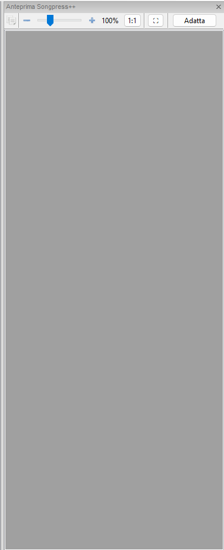

La barra degli strumenti compatta in alto raggruppa tutti i controlli; al di sotto si trova l'area scorrevole con il contenuto della canzone renderizzato.

---

## Barra degli strumenti dell'anteprima

### 📋 Copia negli appunti

Copia il rendering grafico della canzone negli **appunti di sistema** come immagine (metafile / bitmap), pronta per essere incollata in un documento Word, una presentazione o un'altra applicazione.

---

### Controlli zoom

| Elemento              | Funzione                                                       |
| --------------------- | -------------------------------------------------------------- |
| Pulsante **−**        | Riduce lo zoom del 10%                                         |
| **Slider** orizzontale| Trascina per impostare liberamente lo zoom tra 30% e 300%      |
| Pulsante **+**        | Aumenta lo zoom del 10%                                        |
| Etichetta **`xx%`**   | Mostra la percentuale corrente (sola lettura)                  |
| Pulsante **1:1**      | Reimposta lo zoom esattamente al 100%                          |

Tutti i controlli sono **sincronizzati bidirezionalmente**: usare la rotella del mouse, la tastiera o trascinare lo slider aggiorna sempre tutti gli altri elementi.

**Intervallo:** 30% – 300%, passo 10%.

---

### ⛶ Schermo intero

Apre l'anteprima in una **finestra a schermo intero dedicata** (`F11`).

La finestra a schermo intero condivide lo stesso renderer del pannello principale: il contenuto è sempre aggiornato. Ha una propria barra degli strumenti con slider zoom e pulsante *Adatta*. Si chiude con `Esc`, `F11` o il pulsante *Esci da schermo intero*.

> Il doppio clic per navigare alla riga corrispondente nell'editor è attivo anche nella finestra a schermo intero.

---

### Adatta (Adatta alla larghezza)

Calcola automaticamente lo zoom che fa corrispondere esattamente la larghezza della canzone alla larghezza disponibile del pannello, tenendo conto dei margini dinamici (3% per lato) e dell'eventuale barra di scorrimento verticale. Premere il pulsante più volte dà lo stesso risultato (operazione idempotente).

**Scorciatoia:** `Ctrl+Shift+G`

---

### Indicatore di pagina

L'etichetta in fondo alla barra degli strumenti (es. `Pagina 2 di 5`) mostra la pagina corrente in base alla posizione di scorrimento verticale. Si aggiorna ad ogni scorrimento. Può essere nascosta nelle preferenze.

Il conteggio delle pagine è calcolato in base al **formato carta corrente** (larghezza, altezza e margini) impostato in *File → Impostazione pagina*.

---

## Interazione con mouse e tastiera

### Zoom

| Gesto / tasto             | Effetto                                  |
| --------------------- --- | ---------------------------------------- |
| `Ctrl` + scorrimento su   | Zoom avanti (+10%)                       |
| `Ctrl` + scorrimento giù  | Zoom indietro (−10%)                     |
| `Ctrl++`                  | Zoom avanti (+10%)                       |
| `Ctrl+-`                  | Zoom indietro (−10%)                     |
| `Ctrl+0`                  | Reimposta zoom 100%                      |
| `Ctrl+Shift+G`            | Adatta alla larghezza                    |
| `F11`                     | Apre / chiude la finestra schermo intero |

### Scorrimento

| Tasto                          | Effetto                            |
| ------------------------------ | ---------------------------------- |
| Rotella del mouse (senza Ctrl) | Scorrimento verticale normale      |
| `Ctrl+PgDn`                    | Scorri una pagina in giù           |
| `Ctrl+PgUp`                    | Scorri una pagina in su            |

> La granularità dello scorrimento è **proporzionale allo zoom**: a zoom molto elevato lo scorrimento è più fine, così la navigazione rimane precisa.

### Doppio clic → Navigazione nell'editor

**Facendo doppio clic** su un punto dell'anteprima, Songpress++ identifica il token più vicino al clic (parola o accordo) e **sposta il cursore dell'editor** alla riga sorgente corrispondente.

Il meccanismo funziona in tre passi:

1. Le coordinate del clic vengono corrette per lo scorrimento e lo zoom e riportate alle coordinate del renderer.
2. Viene eseguito un **hit-test preciso** sull'albero dei box renderizzati (SongSong → SongBlock → SongLine → SongText), trovando il token più vicino per distanza euclidea.
3. Il testo del token viene cercato nel sorgente ChordPro usando una **strategia a cerchi concentrici** (±5 righe → ±20 righe → intero file), per gestire correttamente gli accordi ripetuti molte volte.

Questa funzione può essere disabilitata nelle preferenze.

---

## Layout e sfondo

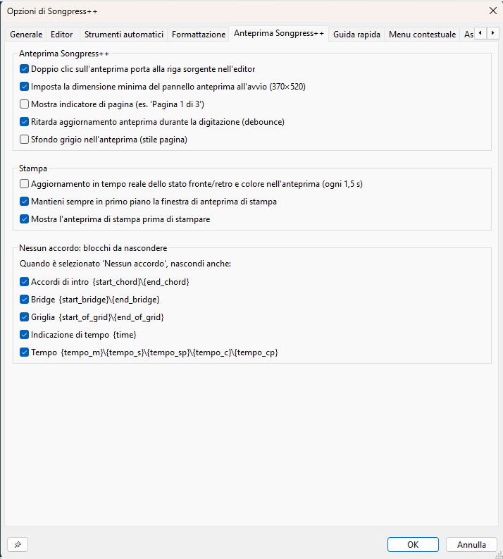

### Sfondo della pagina

L'area di anteprima simula un **foglio bianco su sfondo grigio**: il renderer disegna il contenuto come su carta, con le stesse dimensioni e margini del formato carta corrente. Lo sfondo grigio può essere cambiato in bianco puro nelle preferenze.

### Margine orizzontale dinamico

Il margine sinistro e destro del contenuto è calcolato come **3% della larghezza del pannello** (minimo 8 px). Questo fa sì che l'anteprima si adatti automaticamente quando il pannello viene ridimensionato.

### Colonne

Se il testo sorgente contiene la direttiva `{column_break}` (o `{colb}`), il renderer passa automaticamente a un **layout a due colonne**. Non è richiesta alcuna azione manuale.

---

## Debounce del refresh

Per evitare ridisegni continui durante la digitazione rapida, il refresh dell'anteprima è governato da un **timer debounce di 300 ms**:

- Ogni modifica del testo avvia (o riavvia) il timer.
- Il ridisegno avviene solo **quando la digitazione si ferma** per almeno 300 ms.
- Se si preferisce un feedback immediato ad ogni tasto premuto, il debounce può essere disabilitato nelle preferenze.

---

## Dimensione minima del pannello

Per impostazione predefinita il pannello di anteprima ha una dimensione minima di **370 × 520 px**: trascinare il divisore AUI al di sotto di questa soglia non è possibile, né all'avvio né durante la sessione. La soglia può essere rimossa nelle preferenze per chi lavora su monitor piccoli o vuole massimizzare lo spazio dell'editor.

---

## Opzioni anteprima

Le opzioni si trovano in **Strumenti → Opzioni... → scheda Anteprima Songpress++**.
Tutte le modifiche vengono applicate **immediatamente** al pannello aperto, senza necessità di riavvio.

> **Nota — Ordinamento automatico** — Le checkbox di questo gruppo (come quelle dei gruppi *Stampa* e *Nessun accordo: blocchi da nascondere*) vengono ordinate alfabeticamente in base alla **lingua dell'interfaccia** attiva. L'ordine può quindi differire da quello mostrato in questa tabella.

| Opzione                                        | Predefinito | Descrizione                                                                                        |
| ---------------------------------------------- | :---------: | -------------------------------------------------------------------------------------------------- |
| **Mostra indicatore pagina**                   | ✓           | Mostra/nasconde l'etichetta «Pagina X di Y» nella barra degli strumenti                            |
| **Sfondo grigio**                              | ✓           | Sfondo grigio con «foglio bianco» simulato; se deselezionato, sfondo bianco puro                   |
| **Debounce refresh**                           | ✓           | Ritarda il ridisegno di 300 ms dopo l'ultimo tasto premuto; deselezionare per feedback immediato   |
| **Doppio clic porta il focus all'editor**      | ✓           | Abilita la navigazione nell'editor con doppio clic nell'anteprima                                  |
| **Dimensione minima pannello**                 | ✓           | Impone la dimensione minima di 370 × 520 px sul pannello AUI                                       |

> **Nota su *Dimensione minima pannello*:** questa preferenza agisce sia sul `wx.Window` sottostante sia sul riquadro AUI tramite `_ApplyPreviewMinSize()`. La modifica è quindi efficace immediatamente, senza riavvio.

---

## Nessun accordo: blocchi da nascondere

Quando lo slider **Mostra accordi** (barra degli strumenti Formato) è impostato su **Nessuno**, l'anteprima e la stampa omettono tutti gli accordi inline `[…]`. Con questa impostazione attiva è possibile nascondere anche i blocchi di struttura che contengono solo accordi e che diventerebbero privi di significato senza di essi.

Le opzioni si trovano in **Strumenti → Opzioni... → scheda Anteprima Songpress++ → Nessun accordo: blocchi da nascondere**.

> **Nota — Ordinamento automatico** — Le checkbox di questo gruppo vengono ordinate alfabeticamente in base alla **lingua dell'interfaccia** attiva. L'ordine può quindi differire da quello mostrato in questa tabella.

| Opzione | Predefinito | Descrizione |
| ------- | :---------: | ----------- |
| **Accordi di intro `{start_chord}`\`{end_chord}`** | ☐ | Nasconde l'intero blocco intro accordi (compreso il suo contenuto) quando gli accordi sono disabilitati |
| **Bridge `{start_bridge}`\`{end_bridge}`** | ☐ | Nasconde i blocchi bridge quando gli accordi sono disabilitati (copre anche le forme `{start_of_bridge}`/`{sob}`) |
| **Griglia `{start_of_grid}`\`{end_of_grid}`** | ☐ | Nasconde i blocchi griglia accordi quando gli accordi sono disabilitati (copre anche le forme `{sog}`, `{grid}`) |
| **Tempo `{tempo_m}`\`{tempo_s}`\`{tempo_sp}`\`{tempo_c}`\`{tempo_cp}`** | ☐ | Nasconde tutte le direttive di indicazione del tempo quando gli accordi sono disabilitati |
| **Indicazione di tempo `{time}`** | ☐ | Nasconde le direttive `{time:…}` (indicazione metrica, es. `4/4`) quando gli accordi sono disabilitati |

> **Nota:** le checkbox agiscono **esclusivamente** quando lo slider Mostra accordi è su *Nessuno* (valore 0). Con le altre modalità (*Solo prima strofa*, *Intera canzone*) i blocchi vengono sempre visualizzati normalmente, indipendentemente da queste impostazioni.

> **Nota:** il filtro agisce sul testo passato al renderer prima del ridisegno. Il documento sorgente nell'editor non viene mai modificato.

> **Nota tecnica:** `{start_chord}`, `{start_bridge}`, `{start_of_grid}` sono **blocchi paired** (apertura + contenuto + chiusura): l'intera sezione viene soppressa. `{tempo_m}`, `{tempo_s}`, `{tempo_sp}`, `{tempo_c}`, `{tempo_cp}` e `{time}` sono invece **direttive singole**: viene rimossa soltanto la riga che le contiene.

### Compatibilità di `{new_song}` con i filtri accordi

| Modalità slider *Mostra accordi* | Valore interno | Compatibile con `{new_song}`? | Note |
| -------------------------------- | :------------: | :---------------------------: | ---- |
| **Nessuno** | `0` | ✅ | `_strip_nochords_blocks()` non tocca `{new_song}`; il brano successivo viene filtrato correttamente |
| **Solo prima strofa** *(una strofa per ogni schema di accordi)* | `1` | ✅ | `{new_song}` azzera anche `chordPatterns`: gli schemi del brano precedente non inquinano il confronto sul brano successivo |
| **Intera canzone** | `2` | ✅ | Nessun filtraggio attivo; `{new_song}` si limita ad azzerare i contatori di strofe/ritornelli |

> **Dettaglio tecnico (modalità 1):** prima della correzione, `chordPatterns` non veniva resettato al `{new_song}`. Il renderer confrontava le strofe del secondo brano con gli schemi accordi del primo tramite `minEditDist`, rimuovendo erroneamente gli accordi da strofe che avrebbero dovuto mostrarli. La correzione aggiunge `self.chordPatterns = []` contestualmente agli altri azzeramenti in `Renderer.py`.

---

## Scorciatoie — Riepilogo

| Scorciatoia             | Funzione                                      |
| ----------------------- | --------------------------------------------- |
| `Ctrl++`                | Zoom avanti                                   |
| `Ctrl+-`                | Zoom indietro                                 |
| `Ctrl+0`                | Zoom 100%                                     |
| `Ctrl+Shift+G`          | Adatta larghezza al pannello                  |
| `F11`                   | Apre / chiude la finestra schermo intero      |
| `Ctrl+Rotella`          | Zoom con la rotella del mouse                 |
| `Ctrl+PgDn`/`Ctrl+PgUp` | Scorri una pagina                             |
| Doppio clic             | Naviga alla riga sorgente nell'editor         |
| `Esc` (schermo intero)  | Chiudi la finestra schermo intero             |

---

## Guida: Trova / Sostituisci — Songpress++

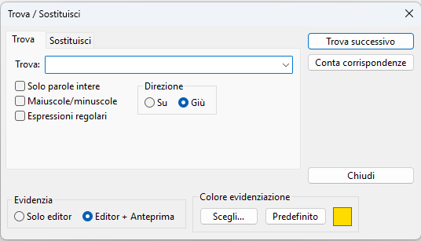

La finestra **Trova / Sostituisci** (`Ctrl+H` o menu *Modifica*) è organizzata in due schede affiancate da una colonna verticale di pulsanti. Le opzioni sono **sincronizzate** tra le due schede: spuntare una checkbox nella scheda *Trova* aggiorna automaticamente la scheda *Sostituisci*, e viceversa.

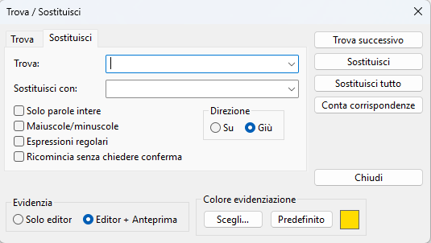

---

## Struttura della finestra

| Area                   | Contenuto                                                                           |
| ---------------------- | ----------------------------------------------------------------------------------- |
| Scheda **Trova**       | Campo di ricerca, opzioni, direzione                                                |
| Scheda **Sostituisci** | Due campi (Trova / Sostituisci con), stesse opzioni + *Avvolgi silenziosamente*     |
| Colonna destra         | Pulsanti di azione                                                                  |
| Etichetta inferiore    | Contatore o messaggi di risultato (es. «3 corrispondenze trovate»)                  |

---

## Pulsanti

| Pulsante                 | Funzione                                                                                                                                                        |
| ---------------------    | --------------------------------------------------------------------------------------------------------------------------------------------------------------- |
| **Trova successivo**     | Trova la corrispondenza successiva (o precedente, a seconda della direzione). Premere `Enter` nel campo di testo equivale a fare clic su questo pulsante.       |
| **Sostituisci**          | Se il testo attualmente selezionato corrisponde al termine di ricerca, lo sostituisce e avanza alla corrispondenza successiva.                                  |
| **Sostituisci tutto**    | Sostituisce tutte le occorrenze nel documento in un'unica operazione **annullabile** con `Ctrl+Z`. Mostra il numero di sostituzioni effettuate al termine.      |
| **Conta corrispondenze** | Conta tutte le occorrenze e mostra il numero nell'etichetta sotto la scheda, senza spostare il cursore.                                                         |
| **Chiudi**               | Chiude la finestra di dialogo (o `Esc`).                                                                                                                        |

> **Nota:** i pulsanti *Sostituisci* e *Sostituisci tutto* sono visibili solo quando la scheda **Sostituisci** è attiva.

---

## Opzioni (Checkbox)

### ☐ Solo parole intere

Limita la ricerca alle occorrenze in cui il termine è delimitato da **caratteri non alfanumerici** (spazi, punteggiatura, inizio/fine riga).

| Ricerca                              | Testo       | Trovato?                                 |
| ------------------------------------ | ----------- | ---------------------------------------- |
| `sol` — ✗ Solo parole intere         | `dissolve`  | **Sì** (`dis`**`sol`**`ve`)              |
| `sol` — ✓ Solo parole intere         | `dissolve`  | **No**                                   |
| `sol` — ✓ Solo parole intere         | `[Sol]`     | **Sì** (`[` `]` sono delimitatori)       |
| `sol` — ✓ Solo parole intere         | `sol mi fa` | **Sì**                                   |

**Uso tipico in Songpress++:** trovare l'accordo `[La]` senza colpire `[LaM]` o `[La7]` — ma per questo caso è più efficace usare le espressioni regolari (vedi sotto).

> ⚠️ *Solo parole intere* è **incompatibile** con le Espressioni regolari: se entrambe sono attive, la ricerca usa solo il flag regex e ignora il confine di parola automatico. Per combinare i due comportamenti, incorporare `\b` nel pattern (es. `\bsol\b`).

---

### ☐ Maiuscole/minuscole

Per impostazione predefinita la ricerca è **senza distinzione di maiuscole/minuscole**: `Alleluia`, `alleluia` e `ALLELUIA` sono equivalenti.

Abilitando questa opzione la corrispondenza diventa **esatta**:

| Ricerca                   | Testo      | Trovato?   |
| ------------------------- | ---------- | ---------- |
| `Alleluia` — ✗ Maiuscole  | `alleluia` | **Sì**     |
| `Alleluia` — ✓ Maiuscole  | `alleluia` | **No**     |
| `Alleluia` — ✓ Maiuscole  | `Alleluia` | **Sì**     |

**Uso tipico:** correggere le maiuscole uniformi di un titolo o un accordo scritto in modo non coerente (`Re` vs `re`).

---

### ☐ Espressioni regolari

Attiva il motore **regex** integrato in Scintilla (compatibile con POSIX esteso / ECMA). Il campo *Trova* diventa un **pattern** e il campo *Sostituisci con* può usare **riferimenti ai gruppi**.

Quando questa opzione è attiva, il testo viene interpretato letteralmente solo per i caratteri normali; i metacaratteri hanno significato speciale.

---

## Espressioni regolari — Guida ed esempi

### Metacaratteri fondamentali

---

### Esempi pratici in contesto ChordPro

#### 1 — Trovare un accordo specifico (senza colpire le varianti)

**Problema:** cercare `[Re]` senza trovare `[Rem]`, `[Re7]`, `[Re/Fa#]` ecc.

```text
Pattern:  \[Re\]
```

I `[` e `]` devono essere **escaped** perché sono metacaratteri (delimitatori di classe di caratteri).

---

#### 2 — Trovare qualsiasi accordo maggiore: Do, Re, Mi…

```text
Pattern:  \[(Do|Re|Mi|Fa|Sol|La|Si)\]
```

Trova `[Do]`, `[Re]`, `[Mi]` ecc. ma **non** `[Dom]`, `[Re7]`.

---

#### 3 — Trovare qualsiasi accordo (apertura + contenuto + chiusura)

```text
Pattern:  \[[^\]]+\]
```

Si legge: `\[` — parentesi quadra aperta letterale; `[^\]]+` — uno o più caratteri che **non** sono `]`; `\]` — parentesi quadra chiusa letterale.

Trova tutti gli accordi nel documento; utile con *Conta corrispondenze* per contare quanti accordi ci sono.

---

#### 4 — Rinominare un accordo mantenendo le varianti (sostituzione con gruppo)

**Problema:** la canzone usa `Sib` ma voglio `Bb`. Devo trasformare `[Sib]`, `[Sibm]`, `[Sib7]`, `[Sibm7]` ecc. tutti in una volta.

```text
Trova:      \[Sib([^\]]*)\]
Sostituisci: [Bb\1]
```

- `([^\]]*)` cattura tutto ciò che segue `Sib` fino a `]` (es. `m`, `7`, `m7`, vuoto).
- `\1` nel campo *Sostituisci* reinserisce il suffisso catturato.

| Prima     | Dopo     |
| --------- | -------- |
| `[Sib]`   | `[Bb]`   |
| `[Sibm]`  | `[Bbm]`  |
| `[Sib7]`  | `[Bb7]`  |
| `[Sibm7]` | `[Bbm7]` |

---

#### 5 — Rimuovere spazi doppi (o multipli) in una riga di testo

```text
Trova:      [ ]{2,}
Sostituisci: (campo vuoto)
```

`[ ]{2,}` significa «almeno 2 spazi consecutivi». In alternativa: `<spazio><spazio>+` (uno spazio seguito da `+`).

---

### 6 — Aggiungere un'etichetta a tutte le righe di commento

Le righe di commento ChordPro iniziano con `#`. Per racchiuderle in `{comment: …}`:

```chordpro
Trova:      ^#(.+)$
Sostituisci: {comment: \1}
```

- `^` — inizio riga
- `#` — il carattere cancelletto letterale
- `(.+)` — cattura il resto della riga (gruppo 1)
- `$` — fine riga
- `\1` — reinserisce il contenuto catturato

---

#### 7 — Trovare strofe vuote (righe completamente vuote)

```text
Pattern:  ^$
```

Trova ogni riga che non contiene nulla. Utile per contare o rimuovere righe vuote extra. Con *Sostituisci tutto* e un campo di sostituzione vuoto, tutte le righe vuote vengono eliminate (attenzione: operazione invasiva).

---

#### 8 — Trovare titoli scritti in MAIUSCOLO

```text
Pattern:  ^[A-Z][A-Z ]+$
```

Trova righe composte solo da lettere maiuscole (e spazi), lunghezza ≥ 2. Utile per identificare titoli in caps-lock da normalizzare.

---

### Note sul comportamento di Scintilla

- Il motore regex è quello di **Scintilla (simile a POSIX)**: supporta `()`, `[]`, `\b`, `\d`, `\w`, `\s`, `{n,m}`, ma **non** lookahead `(?=…)` o lookbehind `(?<=…)`.
- Nei pattern i **backslash devono essere singoli** (`\[`, `\d`), non raddoppiati come in Python.
- I riferimenti ai gruppi nel campo *Sostituisci* si scrivono `\1`, `\2` (non `$1`).
- Il flag *Maiuscole/minuscole* si combina liberamente con regex.

---

## Opzione esclusiva della scheda Sostituisci

### ☐ Avvolgi silenziosamente

Quando la ricerca raggiunge la fine del documento (o l'inizio, se la direzione è *Su*), normalmente appare una finestra di dialogo che chiede conferma prima di tornare all'inizio.

Abilitando questa opzione l'**avvolgimento avviene automaticamente e silenziosamente**, senza interrompere il flusso di lavoro.

---

## Direzione: Su / Giù

Controlla se *Trova successivo* cerca **verso il basso** (dopo il cursore) o **verso l'alto** (prima del cursore). La direzione predefinita è **Giù**.

Non ha effetto su *Sostituisci tutto* e *Conta corrispondenze*, che operano sempre sull'intero documento.

---

## Cronologia delle ricerche

I campi *Trova* e *Sostituisci con* sono **ComboBox** che memorizzano fino a **10** ricerche recenti. Fare clic sulla freccia del campo (o premere `Alt+↓`) apre l'elenco della cronologia.

---

## Scorciatoie da tastiera

| Tasto                              | Azione                          |
| ---------------------------------- | ------------------------------- |
| `Enter` nel campo Trova            | Trova successivo                |
| `Enter` nel campo Sostituisci con  | Esegui Sostituisci              |
| `Esc`                              | Chiudi finestra di dialogo      |
| `Ctrl+Z` (nell'editor)             | Annulla un *Sostituisci tutto*  |

---

## Licenza e crediti

**Songpress++** è un'opera derivata di **Songpress**, originariamente sviluppato da Luca Allulli / [Skeed](https://www.skeed.it/songpress) — copyright © 2009–2026 Luca Allulli (Skeed).

Le modifiche presenti in Songpress++ sono copyright © Denisov21.

Songpress++ è distribuito secondo i termini della **GNU General Public License versione 2** (GPL v2), la stessa licenza del progetto originale. Il programma è software libero: è possibile ridistribuirlo e/o modificarlo secondo i termini della GPL v2 come pubblicata dalla Free Software Foundation. Il programma è distribuito nella speranza che sia utile, ma **senza alcuna garanzia**, nemmeno la garanzia implicita di commerciabilità o idoneità a uno scopo particolare.

Il testo completo della licenza è disponibile su: <https://www.gnu.org/licenses/old-licenses/gpl-2.0.html>

## Componenti di terze parti

Songpress (e di conseguenza Songpress++) utilizza i seguenti componenti software di terze parti:

| Componente                              | Licenza                                                          | Riferimento                                    |
| --------------------------------------- | ---------------------------------------------------------------- | ---------------------------------------------- |
| Python e libreria standard Python       | Python Software Foundation License                               | <https://www.python.org>                       |
| wxPython                                | wxWindows Library Licence                                        | <https://wxpython.org>                         |
| uv (solo installatore Windows)          | MIT License — copyright © 2025 Astral Software Inc.              | <https://github.com/astral-sh/uv>              |
| INetC (plugin NSIS, solo installatore)  | zlib/libpng License — copyright © 2004–2015 Takhir Bedertdinov   | <https://nsis.sourceforge.io/Inetc_plug-in>    |
