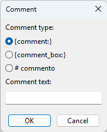
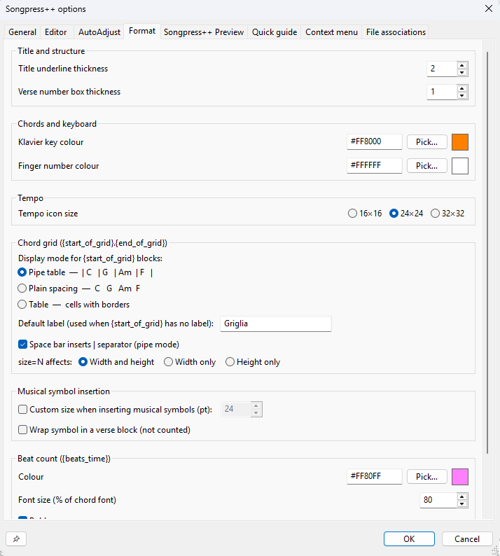
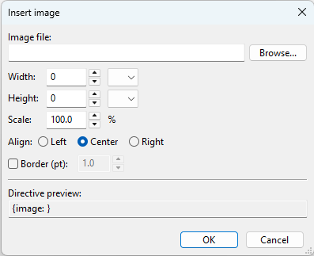
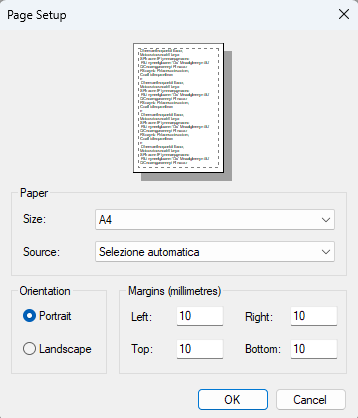
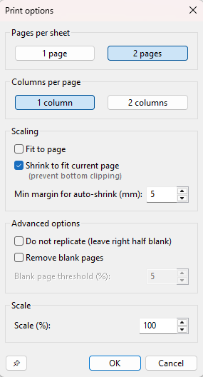
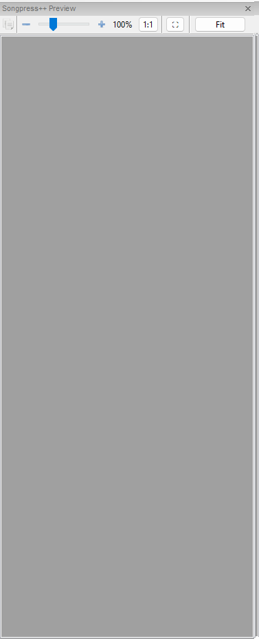
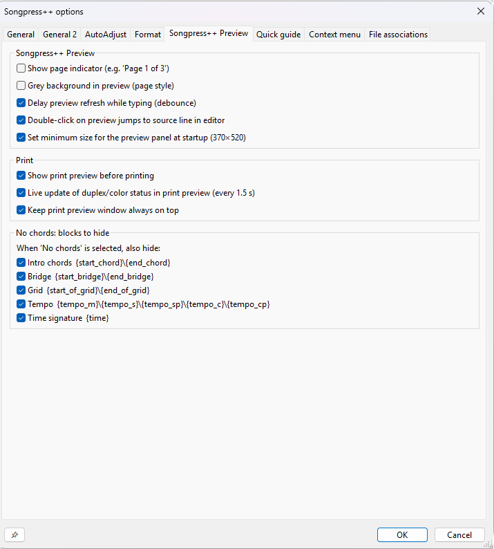
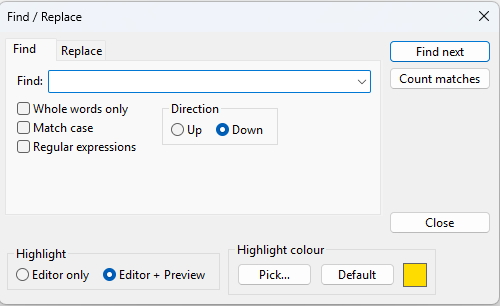
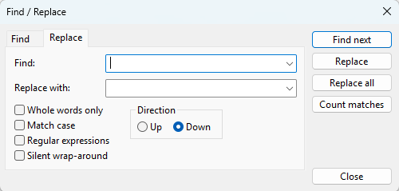

# Quick Guide — Songpress++

This guide describes all ChordPro commands supported by Songpress++ and the main editor features.

> **Legend** — The **Std** column indicates whether the directive is part of the official ChordPro standard (✅) or is specific to Songpress++ (🔧). The **Menu** column indicates whether the directive can be inserted via an application menu (⌨️) or must be typed manually in the editor (🖊).

---

## ChordPro Format — Basic Concepts

A ChordPro file is a text file where **chords** are inserted directly in the song text, enclosed in square brackets `[chord]`. Metadata and structure **directives** are enclosed in curly braces `{directive:value}`.

```chordpro
{title: Amazing Grace}
{artist: Traditional}
{key: G}

[G]Amazing [G7]grace, how [C]sweet the [G]sound
```

### How to type `{` and `}` on the keyboard

| System | `{` (opening brace) | `}` (closing brace) |
| ------ | ------------------- | ------------------- |
| **Windows / Linux** — Italian layout | <kbd>Alt Gr</kbd> + <kbd>Shift</kbd> + <kbd>[</kbd> | <kbd>Alt Gr</kbd> + <kbd>Shift</kbd> + <kbd>]</kbd> |
| **Windows / Linux** — US layout | <kbd>Shift</kbd> + <kbd>[</kbd> | <kbd>Shift</kbd> + <kbd>]</kbd> |
| **Mac** — Italian layout | <kbd>Option</kbd> + <kbd>Shift</kbd> + <kbd>[</kbd> | <kbd>Option</kbd> + <kbd>Shift</kbd> + <kbd>]</kbd> |
| **Mac** — US layout | <kbd>Option</kbd> + <kbd>[</kbd> | <kbd>Option</kbd> + <kbd>]</kbd> |

> **Tip** — In Songpress++ you can use autocomplete: type `{` followed by the first letters of the directive and press <kbd>Ctrl</kbd>+<kbd>Space</kbd> to open the completion menu. The directive will be inserted complete with `:` and `}` where needed.

---

## Song Metadata

| Directive           | Alias        | Std | Menu | Description                                                                              |
| ------------------- | ------------ | --- | ---- | ---------------------------------------------------------------------------------------- |
| `{title:Title}`     | `{t:Title}`  | ✅  | ⌨️   | Song title                                                                               |
| `{subtitle:Text}`   | `{st:...}`   | ✅  | ⌨️   | Subtitle or secondary artist                                                             |
| `{artist:Name}`     |              | ✅  | 🖊    | Artist / performer (rendered as subtitle)                                                |
| `{composer:Name}`   |              | ✅  | 🖊    | Composer (rendered as subtitle)                                                          |
| `{lyricist:Name}`   |              | ✅  | 🖊    | Lyricist / text author (rendered as «Lyrics: …»)                                         |
| `{arranger:Name}`   |              | ✅  | 🖊    | Arranger (rendered as «Arrangement: …»)                                                  |
| `{album:Title}`     |              | ✅  | 🖊    | Album title (rendered as «Album: …»)                                                     |
| `{year:Year}`       |              | ✅  | 🖊    | Publication year (rendered as subtitle)                                                  |
| `{copyright:Text}`  |              | ✅  | 🖊    | Copyright notice (rendered as «© …»)                                                     |
| `{key:Key}`         |              | ✅  | ⌨️   | Key (e.g. `Am`, `C`, `G`, `F#m`); rendered as «Key: …» if display is enabled             |
| `{capo:N}`          |              | ✅  | 🖊    | Capo at fret N (e.g. `{capo:2}`); rendered as «Capo: N»                                  |
| `{tempo:BPM}`       |              | ✅  | ⌨️   | Tempo in BPM with **quarter note** icon (e.g. `{tempo:120}`)                             |
| `{tempo_m:BPM}`     |              | 🔧  | 🖊    | Tempo with **half note** icon                                                            |
| `{tempo_s:BPM}`     |              | 🔧  | 🖊    | Tempo with **quarter note** icon                                                         |
| `{tempo_sp:BPM}`    |              | 🔧  | 🖊    | Tempo with **dotted quarter note** icon                                                  |
| `{tempo_c:BPM}`     |              | 🔧  | 🖊    | Tempo with **eighth note** icon                                                          |
| `{tempo_cp:BPM}`    |              | 🔧  | 🖊    | Tempo with **dotted eighth note** icon                                                   |
| `{time:N/M}`        |              | ✅  | ⌨️   | Time signature (e.g. `{time:4/4}`, `{time:3/4}`); rendered with a graphical time symbol  |
| `{duration: Ch=N …}` |             | ✅  | ⌨️   | Beat duration of chords (e.g. `{duration: C=2 G=1}`); displays a number, dots, or both above chords (configurable in preferences) |
| `{sorttitle:Text}`  |              | ✅  | 🖊    | Alternative title used for alphabetical sorting (metadata only, not displayed)           |
| `{keywords:...}`    |              | ✅  | 🖊    | Search keywords (metadata only, not displayed)                                           |
| `{topic:...}`       |              | ✅  | 🖊    | Topic / category (metadata only, not displayed)                                          |
| `{collection:...}`  |              | ✅  | 🖊    | Collection or songbook (metadata only, not displayed)                                    |
| `{language:...}`    |              | ✅  | 🖊    | Language of the lyrics (metadata only, not displayed)                                    |
| `{meta:key value}`  |              | ✅  | 🖊    | Generic free-form metadata (not displayed)                                               |

> **Note on extended metadata** — The directives `{sorttitle}`, `{keywords}`, `{topic}`, `{collection}`, `{language}`, and `{meta}` are recognised and accepted by the parser for compatibility with ChordPro 6 files, but their value is not shown in the preview or in print: they are treated as pure metadata and consumed silently.

> **Note on tempo** — The `{tempo*}` directives have four display modes, configurable in preferences: note icon + value (e.g. `♩ = 120`), text `BPM: 120`, plain text `Tempo: 120`, or no display at all. Checking the *Metadata* option treats the value as pure metadata — it does not appear in the preview or in print.

---

## Song Structure

### Text Blocks

| Directive                                 | Std | Menu | Description                                                                                                            |
| ----------------------------------------- | --- | ---- | ---------------------------------------------------------------------------------------------------------------------- |
| `{start_of_verse}`/`{end_of_verse}`       | ✅  | ⌨️   | Unnumbered verse, no label                                                                                             |
| `{start_verse:Label}`/`{end_verse}`       | 🔧  | ⌨️   | Unnumbered verse with optional label                                                                                   |
| `{start_verse_num}`/`{end_verse_num}`     | 🔧  | ⌨️   | Automatically numbered verse                                                                                           |
| `{verse:Label}`                           | ✅  | ⌨️   | Opens a verse with a custom label (e.g. `{verse:1}`)                                                                   |
| `{start_of_chorus}`/`{end_of_chorus}`     | ✅  | ⌨️   | Chorus                                                                                                                 |
| `{soc}`/`{eoc}`                           | ✅  | ⌨️   | Abbreviation for `start_of_chorus`/`end_of_chorus`                                                                     |
| `{soc:Label}`                             | ✅  | ⌨️   | Chorus with custom label                                                                                               |
| `{start_chorus:Label}`/`{end_chorus}`     | 🔧  | ⌨️   | Alternative chorus form (with optional label)                                                                          |
| `{start_bridge:Label}`/`{end_bridge}`     | 🔧  | ⌨️   | Bridge with optional label; defaults to «Bridge» if omitted                                                            |
| `{start_of_bridge}`/`{end_of_bridge}`     | ✅  | 🖊    | Standard ChordPro form for bridge; equivalent to `{start_bridge}`/`{end_bridge}`                                       |
| `{sob}`/`{eob}`                           | ✅  | 🖊    | Abbreviation for `start_of_bridge`/`end_of_bridge`                                                                     |
| `{start_chord:Label}`/`{end_chord}`       | 🔧  | ⌨️   | Intro/chord block; defaults to «Intro» if label is omitted                                                             |
| `{start_of_tab}`/`{end_of_tab}`           | ✅  | 🖊    | ASCII tab block; content is rendered in monospace font (Courier New) with the label «Tab»                              |
| `{sot}`/`{eot}`                           | ✅  | 🖊    | Abbreviation for `start_of_tab`/`end_of_tab`                                                                           |
| `{start_of_grid}`/`{end_of_grid}`         | ✅  | ⌨️   | Chord grid block; rendered with the label «Grid»                                                                       |
| `{sog}`/`{eog}`                           | ✅  | 🖊    | Abbreviation for `start_of_grid`/`end_of_grid`                                                                         |
| `{grid}`                                  | ✅  | 🖊    | Alternative form of `start_of_grid` (no explicit closing tag required)                                                 |
| `{row}` / `{r}` *(inside grid)*           | 🔧  | 🖊    | Inserts an empty separator row inside a grid block                                                                     |
| `{bar}` *(inside grid)*                   | ✅  | 🖊    | Explicit bar separator inside a grid block                                                                             |
| `{start_of_part:Label}`/`{end_of_part}`   | ✅  | 🖊    | Generic section (ChordPro 6): rendered as an unnumbered verse with a free label; defaults to «Part» if omitted         |
| `{sop}`/`{eop}`                           | ✅  | 🖊    | Abbreviation for `start_of_part`/`end_of_part`                                                                         |
| `{new_song}`                              | 🔧  | 🖊    | Starts a new song in the same document: resets verse and chorus counters so numbering restarts from 1                  |

> **Note on bridge** — Both forms are supported: `{start_bridge}`/`{end_bridge}` (Songpress++ form, insertable from the menu) and `{start_of_bridge}`/`{end_of_bridge}` (standard ChordPro form, with abbreviations `{sob}`/`{eob}`). The two forms are equivalent and interchangeable.

### Page and Column Breaks

| Directive        | Alias    | Std | Menu | Description                                     |
| ---------------- | -------- | --- | ---- | ----------------------------------------------- |
| `{new_page}`     | `{np}`   | ✅  | ⌨️   | Explicit page break for printing                |
| `{column_break}` | `{colb}` | ✅  | ⌨️   | Column break (two-column layout)                |

---

## Chords and Inline Formatting

### Chords

Chords are inserted in the text with square brackets, immediately before the syllable they belong to:

```chordpro
[Am]In the [F]blue [C]painted [G]blue
```

### Local Fonts and Colors

These directives change the font for the following section; used without an argument they restore the default value.

| Opening directive    | Closing directive  | Std | Menu | Description                                                                    |
| -------------------- | ------------------ | --- | ---- | ------------------------------------------------------------------------------ |
| `{textfont:Name}`    | `{textfont}`       | ✅  | ⌨️   | Text font family                                                               |
| `{textsize:Pt}`      | `{textsize}`       | ✅  | ⌨️   | Text size in pt (also accepts percentage, e.g. `{textsize:80%}`)               |
| `{textcolour:#HEX}`  | `{textcolour}`     | ✅  | ⌨️   | Text color in `#RRGGBB` format                                                 |
| `{chordfont:Name}`   | `{chordfont}`      | ✅  | ⌨️   | Chord font family                                                              |
| `{chordsize:Pt}`     | `{chordsize}`      | ✅  | ⌨️   | Chord size in pt (also accepts percentage)                                     |
| `{chordcolour:#HEX}` | `{chordcolour}`    | ✅  | ⌨️   | Chord color in `#RRGGBB` format                                                |

### Spacing

| Directive             | Std | Menu | Description                                                                                                                    |
| --------------------- | --- | ---- | ------------------------------------------------------------------------------------------------------------------------------ |
| `{linespacing:N}`     | 🔧  | ⌨️   | Line spacing in points (e.g. `{linespacing:1}`); without argument restores the default value                                   |
| `{chordtopspacing:N}` | 🔧  | ⌨️   | Space above chords in points (e.g. `{chordtopspacing:0}` to remove it); without argument restores the default value            |
| `{row}` or `{r}`      | 🔧  | 🖊    | Inserts half a vertical blank line (spacer) outside grid blocks — not available in the menu                                    |
| `{bar}`               | ✅  | 🖊    | Explicit bar separator inside a `{start_of_grid}` block; ignored outside a grid context                                       |

---

## Spacing Directives in Songpress++

---

## `{linespacing: <value>}` — **Menu item:** *Line Spacing*

### Description — linespacing

Sets the **line spacing** between text lines of the song from the point where the directive is inserted. It acts on the overall vertical spacing between one text line (with its chords) and the next.

### Syntax — linespacing

```chordpro
{linespacing: 13}
```

### Parameter — linespacing

| Value           | Effect                                                                         |
| --------------- | ------------------------------------------------------------------------------ |
| `0`             | Removes extra space between lines (default value in the insertion dialog)      |
| positive number | Adds vertical space between lines (in typographic points)                      |

### Usage Notes — linespacing

- The directive can be inserted anywhere in the song; it affects subsequent lines.
- Typical values range between `10` and `20` depending on the font and size used.
- Useful for adjusting text density in print, especially with two-column layout or two-pages-per-sheet format.

---

## `{chordtopspacing: <value>}` — **Menu item:** *Space Above Chords*

### Description — chordtopspacing

Sets the **vertical space above chords**, i.e. the distance between the top edge of the chord line and the content that precedes it (e.g. the text line of the previous verse). Allows you to loosen or compress the margin that visually separates the chords from the verse above them.

### Syntax — chordtopspacing

```chordpro
{chordtopspacing: 4}
```

### Parameter — chordtopspacing

| Value           | Effect                                                                                   |
| --------------- | ---------------------------------------------------------------------------------------- |
| `0`             | Removes extra space above chords (default value in the insertion dialog)                 |
| positive number | Increases the visual breathing room above the chord line                                 |

### Usage Notes — chordtopspacing

- Acts independently from `linespacing`: the two parameters add up in the overall spacing.
- Useful when chords appear visually "squashed" against the text of the previous line.
- Like `linespacing`, it can be used multiple times in the same song at different points to vary spacing section by section.

## Difference Between chordtopspacing and linespacing

```text
[previous text line]
                         ↕  chordtopspacing  (space above chords)
[chord line:  G    D    A]
[text line:   When the sun...]
                         ↕  linespacing      (spacing between complete lines)
[chord line:  Em   B...]
[text line:   ...rises and...]
```

In summary: `chordtopspacing` controls the margin **above** the chord+text pair, while `linespacing` controls the space **between** successive pairs.

## `{row}` / `{r}` 🖊

**Menu item:** *none — must be typed manually*

### Description — row

Inserts a **half vertical space** (spacer) between song lines. Useful for adding a small visual breath between verses without using `{linespacing}`.

### Syntax — row

```chordpro
{row}
```

or in abbreviated form:

```chordpro
{r}
```

### Usage Notes — row

- Inserts a space equal to approximately **half a line** relative to the current line spacing.
- Has no parameters: `{row}` and `{r}` are equivalent and do not accept values.
- Not accessible from the **Insert** menu: must be typed directly in the editor.

---

## `{start_of_tab}` / `{end_of_tab}` 🖊

**Short aliases:** `{sot}` / `{eot}`

### Description — start_of_tab

Delimits an **ASCII tablature block**. The content is rendered in the preview and in print using a monospace font (Courier New) with the label «Tab», so that the column alignment of the strings is preserved.

### Syntax — start_of_tab

```chordpro
{start_of_tab}
e|--0--2--3--2--0--|
B|--1--3--3--3--1--|
G|--0--2--0--2--0--|
D|--2--0--0--0--2--|
A|--3--x--2--x--3--|
E|--x--x--3--x--x--|
{end_of_tab}
```

or with short aliases:

```chordpro
{sot}
e|--0--2--3--|
B|--1--3--3--|
{eot}
```

or with a custom label:

```chordpro
{start_of_tab: Solo}
e|--12-14-15-14-12--|
{end_of_tab}
```

### Usage Notes — start_of_tab

- The monospace font ensures that tab lines are perfectly aligned in print.
- Any inline chords `[Am]` present inside the block are **not rendered** above the text: the tablature is already a complete notation.
- The block is treated as an unnumbered verse; it receives the label «Tab» (or the custom one).
- In the editor, the block content appears in **brown italic** to visually distinguish it from normal text.

---

## `{start_of_grid}` / `{end_of_grid}` 🖊

**Short aliases:** `{sog}` / `{eog}` · Alternative form: `{grid}`

### Description — start_of_grid

Delimits a **chord grid block**. Useful for indicating rhythmic chord sequences in symbolic form, e.g. for rhythm guitar or ukulele. The block is rendered with the label «Grid» (configurable in preferences).

### Syntax — start_of_grid

Basic form:

```chordpro
{start_of_grid}
| Am . . . | F . . . | C . . . | G . . . |
{end_of_grid}
```

Short aliases:

```chordpro
{sog}
| G . . . | D . . . | Em . . . | C . . . |
{eog}
```

Alternative form (closes automatically at the next blank line):

```chordpro
{grid}
| C . . . | G . . . | Am . . . | F . . . |
```

### Options — start_of_grid

All options are specified as `key=value` pairs inside the directive argument, after the optional label. They can be combined freely.

| Option              | Type    | Default         | Description                                                                                                                                              |
| ------------------- | ------- | --------------- | -------------------------------------------------------------------------------------------------------------------------------------------------------- |
| *(label)*           | text    | «Grid»          | Custom section label (free text, before any `key=value` parameters)                                                                                      |
| `size=N`            | number  | `1`             | Cell size multiplier: multiplies horizontal and/or vertical padding by N. Accepts integers or decimals up to 2 places, with `.` or `,` (e.g. `1.5`, `2,50`) |
| `size=N affects`    | choice  | Width and height | Controls which dimension is scaled by `size=N`: **Width and height** (both paddings), **Width only** (only `_pad_x`), **Height only** (only `_pad_y`). Set in Preferences. |
| `chordtopspacing=N` | integer | `0`             | Extra space in pixels **above** each row of cells                                                                                                        |
| `linespacing=N`     | integer | `0`             | Extra space in pixels **below** each row of cells                                                                                                        |

> **Note:** `chordtopspacing` and `linespacing` inside `{start_of_grid}` act locally on that grid block only, independently of the global `{chordtopspacing}` and `{linespacing}` directives which affect normal verse/chorus blocks.

### Examples — start_of_grid

Custom label only:

```chordpro
{start_of_grid: Verse}
| Am . . | F . . | G . . |
{end_of_grid}
```

Enlarged cells (`size=2` or decimal, e.g. `size=1.5`):

```chordpro
{start_of_grid: size=2}
| Am | F | G | C |
{end_of_grid}
```

```chordpro
{start_of_grid: size=1.5}
| Am | F | G | C |
{end_of_grid}
```

Label + enlarged cells:

```chordpro
{start_of_grid: Chorus size=2}
| G . . . | D . . . | Em . . . | C . . . |
{end_of_grid}
```

Extra vertical spacing between rows:

```chordpro
{start_of_grid: chordtopspacing=8 linespacing=4}
| Am | F |
| C  | G |
{end_of_grid}
```

All options combined:

```chordpro
{start_of_grid: Intro size=2 chordtopspacing=6 linespacing=3}
| Am . . . | F . . . |
| C . . .  | G . . . |
{end_of_grid}
```

### Inserting from the Menu — start_of_grid

**Insert menu → Grid `{start_of_grid}\{end_of_grid}`**

Opens a dialog that proposes as default label the value set in **Preferences → Format → Chord grid → Default label** (default: «Grid»).

- **Confirm the default or cancel** → inserts the block without a label:
  ```chordpro
  {start_of_grid}
  | | | |
  {end_of_grid}
  ```
- **Type a different label** → inserts the block with a custom label:
  ```chordpro
  {start_of_grid:Chorus}
  | | | |
  {end_of_grid}
  ```

The pre-filled `| | | |` line provides 4 empty cells as a starting point; edit it or add more rows as needed. With the space bar (if enabled in preferences) you can quickly navigate between cells.

### Display Modes — start_of_grid

The rendering mode for all grid blocks is set globally in **Format tab → Chord grid** in preferences:

| Mode                     | Appearance                                                                 |
| ------------------------ | ---------------------------------------------------------------------------|
| **Pipe table** (default) | `\| Am  \| F   \| G   \| C   \|` — bars separated by `\|` characters       |
| **Plain spacing**        | `Am   F   G   C` — chords spaced without separators                        |
| **Table**                | cells with visible drawn borders                                           |

### Keyboard Behaviour Inside a Grid Block

When the cursor is inside a `{start_of_grid}` block:

| Key               | Action                                                                                       |
| ----------------- | -------------------------------------------------------------------------------------------- |
| **Space bar**     | Inserts a `\|` pipe separator, shifting the current cell right (configurable in preferences) |
| `{row}` / `{r}`   | Inserts an empty separator row (vertical spacer between rows)                                |

> The space-bar-as-pipe behaviour can be disabled in **Format → Chord grid → Space bar inserts \| separator**.
> The dimension scaled by `size=N` is configured in **Format → Chord grid → size=N affects**: choose between *Width and height* (default), *Width only*, or *Height only*.

### Usage Notes — start_of_grid

- The block is treated as an unnumbered verse with the label «Grid» (or the custom one specified in the directive or in preferences).
- In the editor, the block content is rendered in **brown italic**, like tab blocks.
- `size=N` multiplies `_pad_x` (horizontal padding, base 8 px) and/or `_pad_y` (vertical padding, base 4 px) by N. Which dimension is scaled depends on the **Preferences → Format → Chord grid → size=N affects** option: *Width and height* (default, both paddings), *Width only* (only `_pad_x`), *Height only* (only `_pad_y`). N can be an integer or a decimal with up to 2 digits after the separator (`.` or `,`): e.g. `size=1.5`, `size=2,50`, `size=1.7`.
- `chordtopspacing=N` adds N pixels above each row; `linespacing=N` adds N pixels below each row. Both default to `0` (no extra spacing).
- Multiple options and a label can coexist in any order after the colon: `{start_of_grid: My Label size=3 linespacing=5}`.
- In pipe mode, the raw text inside the block must already contain `|` delimiters; in plain mode, chords separated by spaces are laid out automatically.

---

## `{start_of_part}` / `{end_of_part}` 🖊

**Abbreviations:** `{sop}` / `{eop}`

### Description — start_of_part

Delimits a **generic section** of the song as defined by the ChordPro 6 specification. Use it when no other structural directive (`{start_of_verse}`, `{start_of_chorus}`, `{start_of_bridge}` …) adequately describes the section: for example an instrumental introduction, an interlude, a coda, or any part that needs a free-form label.

In Songpress++ the block is treated as an unnumbered verse with the specified label. If the label is omitted, «Part» is used as the default.

### Syntax — start_of_part

```chordpro
{start_of_part: Intro}
[Am][G][F][E7]
{end_of_part}
```

With abbreviated aliases:

```chordpro
{sop: Coda}
[G]Return to [D]you
{eop}
```

Without a label (uses the default «Part»):

```chordpro
{start_of_part}
[C][G][Am][F]
{end_of_part}
```

### Usage Notes — start_of_part

- The block is not numbered and does not increment the verse counter.
- The label is free-form: it can be any text (e.g. «Intro», «Interlude», «Coda», «Solo», «Outro»).
- It is functionally equivalent to `{start_verse:Label}` — the distinction is semantic, to maintain compatibility with ChordPro 6 files from other applications.
- Not accessible from the **Insert** menu: it must be typed directly in the editor or inserted via intellisense (`Ctrl+Space`).

---

## Comments and Editorial Notes



| Form                     | Alias        | Std | Menu | Description                                                                                          |
| ------------------------ | ------------ | --- | ---- | ---------------------------------------------------------------------------------------------------- |
| `{comment:Text}`         | `{c:Text}`   | ✅  | ⌨️   | Comment visible in the preview, automatically enclosed in parentheses                                |
| `{comment_italic:Text}`  | `{ci:Text}`  | ✅  | 🖊    | Like `{comment}`, but with italic text                                                               |
| `{comment_box:Text}`     | `{cb:Text}`  | ✅  | 🖊    | Boxed comment                                                                                        |
| `# Text`                 |              | ✅  | 🖊    | Comment line (preceded by `#`): treated as a blank line, does not appear in preview or print         |

---

## Chord Diagrams, Keyboard and Images


| Directive                                    | Std | Menu | Description                                                            |
| -------------------------------------------- | --- | ---- | ---------------------------------------------------------------------- |
| `{define: C base-fret 1 frets X 3 2 0 1 0}`  | ✅  | ⌨️   | Defines a guitar chord diagram                                         |
| `{taste:Chord}`                              | 🔧  | ⌨️   | Shows highlighted keys on the keyboard (klavier) — e.g. `{taste:Am}`   |
| `{fingering: Chord}`                         | 🔧  | ⌨️   | Shows the **first chord** keyboard with finger numbers — e.g. `{fingering: Am 3=C 1=E 2=A}` |
| `{image: filename}`                          | ✅  | ⌨️   | Inserts an image (PNG, JPG, GIF, BMP, TIFF) into the song              |

The keyboard (klavier) displays the keys corresponding to the specified chord, highlighted with the color set in preferences.



### First Chord Fingering — `{fingering:}`

The `{fingering:}` directive is a variant of the klavier keyboard designed to show **how to position the hand on the first chord** of the song. In addition to highlighting the chord keys, it can display a finger number on each key and a label indicating which hand to use.

**Format:**

```chordpro
{fingering: Am}
{fingering: Am 3=La 1=Mi 2=Do}
{fingering: G 2=G 1=B 3=D}
{fingering: Am hand=R 3=La 1=Mi 2=Do}
{fingering: Am hand=L}
```

The `finger=note` part is optional. The `hand=` token is also optional and can appear anywhere after the chord name. Numbers correspond to the fingers of the hand:

| Number | Finger |
| ------ | ------ |
| 1      | Thumb  |
| 2      | Index  |
| 3      | Middle |
| 4      | Ring   |
| 5      | Little |

**Hand indication (`hand=`):**

| Value    | Meaning    | Label displayed |
| -------- | ---------- | --------------- |
| `hand=R` | Right hand | *Right hand*    |
| `hand=L` | Left hand  | *Left hand*     |

The label appears centered below the keyboard in grey italics. If the `hand=` token is absent, no label is shown. The value is case-insensitive (`hand=r` and `hand=R` are equivalent).

Notes can be written in Italian notation (`Do`, `Re`, `Mi`, `Fa`, `Sol`, `La`, `Si`, with `#` for sharps) or English notation (`C`, `D`, `E`, `F`, `G`, `A`, `B`).

> **Note on notation** — The insertion dialog and the finger grid follow the **default notation** set in Songpress++ preferences (*Options → Default notation*). Note names shown in the grid and written into the generated directive change automatically according to the selected notation: with American notation you will see `A, C#, E`; with Italian `La, Do#, Mi`; with German `A, Cis, E`, and so on. Chord recognition in the *Chord* field also respects the current notation. Nashville and Roman notations are not supported for fingering.

**Inserting from the menu:** *Insert → Other → First chord fingering {fingering:}*
A dialog opens that automatically shows the notes of the chord and lets you assign a finger to each one using a drop-down menu, as well as select the hand (Right / Left / None).

**Finger number color:**
The color of the numbers displayed on the keys is set in *Options → Format → Chords and tempo → Finger number colour*. The default is near-black (`#1A1A1A`); on black keys the number appears in white to ensure contrast.

**Syntax checking for `hand=`:**

The built-in syntax checker (*Tools → Check Syntax*) validates the `hand=` token and reports the following errors:

| Error | Example | Message |
| ----- | ------- | ------- |
| Invalid value | `{fingering: Am hand=X}` | `hand` must be R or L |
| Duplicate `hand=` token | `{fingering: Am hand=R hand=L}` | `hand` specified more than once |

### Chord Beat Duration — `{duration:}`

The `{duration:}` directive specifies the **beat duration** of each chord on the following line. Songpress++ uses this information to calculate and display **beat numbers** above the chords in the preview, helping the performer understand the rhythm without reading sheet music.

**Format:**

```chordpro
{duration: ChordName=N ChordName=N …}
```

- `ChordName` — chord name in Italian notation (`Do`, `Sol`, `La-`, `Re7`…) or English (`C`, `G`, `Am`, `D7`…)
- `N` — positive integer number of beats (≥ 1)
- Chords are separated by spaces
- Only the listed chords receive a beat indicator; others are ignored

**Examples:**

```chordpro
{duration: C=4 G=2 Am=2 F=4}
[C]Amaz[G]ing [Am]grace, how [F]sweet
```

```chordpro
{duration: G=2 Em=2 C=4}
[G]Nel [Em]mezzo del [C]cammino
```

```chordpro
{duration: Am=4 F=2 C=2 G=4}
[Am]Tanti [F]au[C]guri a [G]te
```

Each `{duration:}` directive applies to the **line of text/chords immediately below it**. To assign durations to multiple lines, place a `{duration:}` before each one.

**Inserting from the menu — guided dialog:**

The command *Insert → Chord duration {duration:}…* automatically detects the context:

- **If the line below the cursor contains no `[…]` chords** — inserts `{duration: }` directly without opening any dialog.
- **If the line below the cursor contains `[…]` chords** — opens a dialog with a numeric field (`SpinCtrl`) for each unique chord found, preset to 1 beat. As you change the values, the **Preview** field updates in real time showing the directive that will be inserted (e.g. `{duration: C=4 G=2 Am=2 F=1}`). Setting a chord to **0** excludes it from the directive.

> **Note** — The directive is inserted at the cursor position: place the cursor on the line **above** the chord line, then select the command from the menu.

**Preview display:**

The menu item **View → Show chord beats** enables or disables the display of beat numbers in the preview. When enabled, a beat indicator appears above each chord according to the mode set in preferences.

**Preferences — *Options → Format → Beat count ({duration})*:**

| Option | Values | Default | Description |
| ------ | ------ | ------- | ----------- |
| **Colour** | `#RRGGBB` | `#6464C8` (blue-violet) | Colour of the number/dot displayed above the chord. Set via the *Pick…* button or by typing the hex code directly. |
| **Size** | 30 % – 150 % | 60 % | Size of the beat number as a percentage of the chord font size. |
| **Bold** | ☐ / ☑ | ☐ (off) | When checked, the beat number is drawn in bold. |
| **Alignment** | Left / Centre / Right | Right | Position of the beat number relative to the chord name. |
| **Mode** | Number / Dots / Both | Number | Controls *what* is displayed above the chord (see detail below). |

**Display modes:**

| Mode | Appearance | Description |
| ---- | ---------- | ----------- |
| **Number** | `4` above the chord | Shows the beat count as a digit. |
| **Dots** | `· · · ·` between chords | Shows one dot per beat in the space between consecutive chords. |
| **Both** | number + dots | Combines both representations. |

**Syntax checking:**

The built-in syntax checker (*Tools → Check syntax*) reports errors in the value of `{duration:}`:

| Error | Example | Message |
| ----- | ------- | ------- |
| Token without `=` | `{duration: G}` | invalid format |
| Unrecognised chord | `{duration: Xyz=2}` | unrecognized chord |
| Duplicate chord | `{duration: G=2 G=1}` | chord appears more than once |
| Missing beat count | `{duration: G=}` | missing beat count |
| Non-integer or ≤ 0 beats | `{duration: G=0}`, `G=1.5` | must be a positive integer |

### Image Directive



The `{image:}` directive inserts a raster image at the point where it appears in the song. Songpress++ supports two modes: **external link** (file path) and **embedded image** (base64).

#### Directive options

| Option         | Std | Description                                                                           |
| -------------- | --- | ------------------------------------------------------------------------------------- |
| `width=N`      | ✅  | Width in typographic points (1/72 of an inch), or percentage e.g. `width=50%`         |
| `height=N`     | ✅  | Height in typographic points, or percentage                                           |
| `scale=N%`     | ✅  | Scale factor, e.g. `scale=50%` (cannot be combined with width/height)                 |
| `align=left`   | ✅  | Left alignment                                                                        |
| `align=center` | ✅  | Center alignment (default)                                                            |
| `align=right`  | ✅  | Right alignment                                                                       |
| `border`       | ✅  | Draws a 1pt border around the image                                                   |
| `border=N`     | ✅  | Draws a border of N typographic points                                                |

**Supported formats:**

| Format | Extensions      |
| ------ | --------------- |
| PNG    | `.png`          |
| JPEG   | `.jpg`, `.jpeg` |
| GIF    | `.gif`          |
| BMP    | `.bmp`          |
| TIFF   | `.tiff`, `.tif` |

---

#### Mode 1 — External link (file path)

The image file stays on disk and is loaded each time the document is opened. If the image is in the same folder as the document, the filename alone is sufficient. Paths containing spaces or backslashes must be enclosed in double quotes.

```chordpro
{image: logo.png}
{image: logo.png width=200 align=left}
{image: logo.png scale=50% border}
{image: "C:\Users\User\Pictures\photo.jpg" align=center}
```

---

#### Mode 2 — Embedded image (base64) 🔧

When the **Embed image in file** checkbox is enabled in the insert dialog, the image content is encoded in base64 and saved directly inside the document file. The file becomes fully self-contained: it does not depend on any external file and can be shared or moved without losing the image.

```chordpro
{image: data:image/png;base64,iVBORw0KGgoAAAANS... width=200 align=center}
```

The base64 data is generated automatically by the dialog — no manual editing is needed. Alignment, border and dimensions are set through the dialog controls as usual and are included in the directive even in embedded mode.

> **Note on file size** — Base64 encoding increases the data size by approximately 33%. The dialog shows an estimate of the KB/MB that will be added to the document file before confirming. The file extension shown in the estimate reflects the default extension set in **Options → General 2 → Default file extension**.

---

#### Insert Image dialog

The image can be inserted via **Insert → Other → Image {image:}**. The dialog lets you select the file, configure all options, and see the resulting directive in real time in the **Directive preview** field.

| Field  | Initial value | Range  | Unit     | Notes                                                          |
| ------ | ------------- | ------ | -------- | -------------------------------------------------------------- |
| Width  | 0             | 0–9999 | `pt` / `%` | 0 = not included in the directive; default unit: `pt`        |
| Height | 0             | 0–9999 | `pt` / `%` | 0 = not included in the directive; default unit: `pt`        |
| Scale  | 100           | 1–500  | `%`      | 100 = not included (it's the default)                         |
| Border | 1             | 0–50   | pt       | active only if the **Border** checkbox is checked; step 0.5   |

The **Embed image in file (base64, no external dependency)** checkbox is located at the bottom of the dialog, below the Border section. When active, the preview shows `{image: data:<embedded> ...}` with the real options (alignment, border, etc.) visible and editable in real time.

---

## File Structure — Complete Example

```chordpro
{title: O Sole Mio}
{artist: Eduardo di Capua}
{key: C}
{time: 4/4}
{tempo: 80}
{capo: 0}

{start_verse_num}
{duration: C=2 G7=2}
[C]Che bella [G7]cosa na jurnata 'e [C]sole
[C]N'aria serena [G7]doppo na tempesta!
{end_verse_num}

{soc:Chorus}
[C]O sole [C7]mio sta [F]'nfronte a [C]te
[G7]O sole, o sole [C]mio
{eoc}

{start_of_tab: Intro}
e|--0--3--2--0--|
B|--1--0--3--1--|
G|--0--0--2--0--|
{end_of_tab}

{new_page}

{start_verse_num}
[C]Ma n'atu sole [G7]cchiu bello, oje [C]ne'
{end_verse_num}
```

---

## Editor Features

### Guided Insertion (Insert Menu)

All main directives are accessible via the **Insert** menu, which opens support dialogs to fill in values. The cursor `|` in InsertWithCaret indicates the position where the cursor will be placed after insertion.

### Chord Management

- **Insert chord** — inserts `[|]` with the cursor inside the brackets
- **Move chord right / left** — moves the chord under the cursor by one character
- **Remove chords** — deletes all chords from the selection
- **Paste chords** — pastes only the chords (without text) from the copied selection
- **Propagate chords to verses** — copies chords from the first verse to all verses with the same number of lines
- **Propagate chords to choruses** — same for choruses
- **Integrate chords** — converts two separate lines (chords above / text below) to inline ChordPro format

### Transposition and Notation

- **Transpose** — opens the dialog to transpose all chords. Transposition is applied to **all absolute-pitch notations** present in the text (American, Italian, Uppercase Italian, German, Traditional German, French, Portuguese): even a file containing chords written in mixed notations (e.g. `[Sol]` and `[G]` in the same file) is transposed correctly in its entirety.

  > **Note — Relative notations (Nashville and Roman):** **Nashville** (1, 2, 3… 7) and **Roman** (I, II, III… VII) notations represent *scale degrees*, not absolute pitches. For this reason they are intentionally excluded from transposition: shifting degree `[1]` from C to D would make no musical sense, since the degree remains the same regardless of key. If the text contains chords in Nashville or Roman notation, they are left unchanged after transposition.

- **Simplify chords** — finds the easiest key to play
- **Change notation** — converts between Anglo-Saxon notation (C D E…) and solfège (Do Re Mi…)
- **Normalize chords** — standardizes chord spelling (e.g. `Hm` → `Bm`)
- **Convert Tab → ChordPro** — automatically converts tab format (chords above text) to inline ChordPro

### Format and Structure

- **Song font** — opens the dialog to set the global font
- **Text font** — inserts `{textfont}`/`{textsize}`/`{textcolour}` directives for the current span
- **Chord font** — inserts `{chordfont}`/`{chordsize}`/`{chordcolour}` directives
- **Verse labels** — shows/hides verse labels in the preview
- **Chords above / below** — positions chords above or below the text
- **Show chords** — three modes: none / first verse only / entire song
- **Page/column break lines** — shows/hides guide lines in the preview

### Text Cleanup

- **Remove superfluous blank lines** — deletes double blank lines
- **Normalize multiple spaces** — reduces multiple spaces to one

### Musical Symbols Unicode ⌨️

- **Musical symbol (Unicode)…** (`Insert › Musical symbol (Unicode)…`, shortcut `Ctrl+Shift+M`) — opens the **Musical Symbols dialog**, from which you can choose a Unicode character and insert it at the cursor position.

### Syntax Check

- **Check syntax** — analyzes the text and reports unrecognized or malformed directives, with the ability to navigate directly to the error

### Directive Intellisense (`Ctrl+Space`)

Pressing `Ctrl+Space` while the cursor is inside a pair of curly braces `{…}` opens a pop-up list of all ChordPro directives supported by Songpress++. Selecting an entry from the list (with `Enter` or double-click) inserts the directive at the correct position.

This feature can be enabled or disabled in **Tools → Options… → General tab → Enable directive intellisense (Ctrl+Space)**.

---

## Musical Symbols Unicode — Dialog

The **Musical Symbols** dialog (`Insert › Musical symbol (Unicode)…`, `Ctrl+Shift+M`) lets you insert any special Unicode musical character into the editor, including symbols from the **Musical Symbols** block (U+1D100–U+1D1FF) and common BMP characters.

### Dialog Structure

The dialog is organized into **six tabs** by category:

| Tab | Contents |
| ---------------------------- | ------------------------------------------------------------------ |
| **Note e pause** | Whole note, half note, eighth note, rests of every value (U+1D13B–U+1D164) |
| **Alterazioni** | Sharp, flat, natural, double accidentals, quarter-tone accidentals |
| **Dinamiche** | *p*, *f*, *mp*, *mf*, *sf*, crescendo, decrescendo, etc. |
| **Pentagramma e chiavi** | Clefs (treble, bass, C clef), barlines, segno, coda |
| **Ornamenti e articolazioni** | Slurs, fermata, caesura, breath mark, etc. |
| **Comuni (BMP)** | ♩ ♪ ♫ ♬ ★ † ½ ¼ × – — … and other common characters |

### How to Insert a Symbol

1. Open the dialog with `Insert › Musical symbol (Unicode)…` or `Ctrl+Shift+M`.
2. Select the tab for the desired category.
3. **Click** a cell to select the symbol — the enlarged preview and description with the Unicode codepoint (e.g. `U+1D157`) appear at the bottom.
4. Press **Insert** or **double-click** the cell to insert the character at the cursor and close the dialog.
5. Press **Close** (or `Esc`) to cancel without inserting anything.

> **Tip** — Hovering over cells shows a tooltip with the symbol name and codepoint.

### Insertion Options

At the bottom of the dialog there are two options that control how the symbol is inserted into the editor. Their state is saved automatically and restored the next time the application is opened.

**Custom size (pt)** — checkbox + numeric field (6–144)

When enabled, the symbol is wrapped with `{textsize:N}` and `{textsize}` directives to apply the chosen point size and then restore the original. The second `{textsize}` without an argument is the correct reset form (unlike `{textsize:}` with a trailing colon, which is a syntax error detected by the syntax checker).

| Checkbox | Inserted text |
| -------- | ------------- |
| off | `♩` |
| on (pt = 24) | `{textsize:24}♩{textsize}` |

> **Note** — Not all symbols can be resized: SMP-plane characters (U+1D100–U+1D1FF) require a font with adequate coverage (FreeSerif, Bravura, etc.) in the `fonts/` folder. If the font does not cover the glyph, the size is applied but the character may not be visible.

**Wrap symbol in a verse block (not counted)** — checkbox

When enabled, the symbol is enclosed in a `{start_verse}…{end_verse}` block. It then appears in the preview as a standalone verse block, but is **not counted** in the sequential verse numbering — adjacent verses keep their correct numbers.

| Checkbox | Inserted text |
| -------- | ------------- |
| off | `♩` |
| on | `{start_verse}♩{end_verse}` |

Both options can be combined: if both are active, the result is:

```chordpro
{start_verse}{textsize:24}♩{textsize}{end_verse}
```

The same settings are also accessible from **Preferences → Format → Musical symbol insertion**, where they are saved permanently.

Symbols in the Musical Symbols block (U+1D100–U+1D1FF) belong to the Unicode **Supplementary Multilingual Plane** (SMP, codepoints > U+FFFF). Common system fonts (Arial, Times New Roman, Calibri) do not cover this range; Songpress++ solves this in two distinct ways:

**In the editor (text panel)** — the editor uses the **DirectWrite** rendering engine (`SetTechnology(STC_TECHNOLOGY_DIRECTWRITE)`), which enables automatic Windows font-fallback: if the chosen editor font does not contain the glyph, Windows automatically searches among installed fonts for a suitable one.

**In the preview and print** — the renderer uses **GDI+** via `wx.GraphicsContext` exclusively for SMP characters. For every string containing at least one codepoint > U+FFFF, Songpress++ creates a separate graphics context and sets the font in the following priority order:

1. **FreeSerif** (GNU FreeFont) — complete coverage of the Musical Symbols block; must be present at `<install>/fonts/FreeSerif.ttf`.
2. **Segoe UI Symbol** — included by default on Windows 10/11; partial SMP coverage.
3. Current document font — used as a last resort (will show boxes for missing glyphs).

Normal text (chords, song text, titles) continues to use the classic GDI renderer with no additional overhead.

### How to Change Symbol Size in the Preview

Musical symbols are rendered at the same size as the surrounding text, automatically scaled according to:

- **Global song font** — changeable via `Format › Song font…`. Increasing the point size of the main font proportionally increases SMP symbols as well.
- **`{textsize:Pt}` directive** — inserted directly in the ChordPro text before the symbol, sets the point size for that span. Example:

  ```chordpro
  {textsize:24}𝄞{textsize}
  ```

  The second `{textsize}` (without argument) restores the default size.

- **`{textsize:N%}` directive** — percentage version, relative to the document's base size. Example for a symbol at 150%:

  ```chordpro
  {textsize:150%}𝅘𝅥𝅮{textsize}
  ```

- **Preview zoom** — the zoom slider in the preview toolbar scales the whole page (text + symbols) without modifying the file. It does not affect printing.

> **Technical note** — The renderer automatically multiplies the font's point size by the current zoom factor before creating the `wx.GraphicsFont`, so SMP symbols always maintain the same proportions as the surrounding GDI text.

### Adding Custom Symbol Libraries

Songpress++ automatically loads **all** `.ttf` files found in the `fonts/` folder inside the installation directory. To add support for new Unicode symbols, simply copy the font file into that folder — no additional configuration is required.

```
<installation>/
  fonts/
    FreeSerif.ttf           ← included — complete Musical Symbols coverage
    Bravura.ttf             ← SMuFL font (professional music notation)
    NotoMusic.ttf           ← Google Noto — broad SMP coverage
    SegoeUISymbol.ttf       ← optional local copy of Segoe UI Symbol
    any_other.ttf           ← loaded and used automatically
```

**Priority order** — Fonts are tried in the following order:

1. `FreeSerif.ttf` — highest priority (guaranteed Musical Symbols coverage)
2. `Bravura.ttf` — if present
3. `NotoMusic.ttf` / `NotoMusicRegular.ttf` — if present
4. All other `.ttf` files in the folder, in alphabetical order
5. **Segoe UI Symbol** — Windows 10/11 system font (automatic fallback, no file to copy)
6. Current document font — last resort (will show boxes for missing glyphs)

For each SMP character, Songpress++ walks this list and uses the first font that wx can load successfully. If a font does not cover a particular glyph, GDI+ does not perform further automatic fallback — the correct font must therefore be present in the `fonts/` folder.

> **Tip** — **SMuFL** fonts (Standard Music Font Layout, <https://www.smufl.org>) such as Bravura, Petaluma or Leland cover hundreds of specialized musical symbols not included in FreeSerif. For Gregorian or mensural notation, fonts such as **Caeciliae** or **Volpiano** are recommended.

---

## Display Preferences

The following controls are found in the **Formatting** tab of preferences and affect the preview and print output.

| Field                         | Default | Range | Step |
| ----------------------------- | ------- | ----- | ---- |
| Title underline thickness     | 2       | 1–5   | 1    |
| Verse number border thickness | 1       | 1–5   | 1    |

---

## Printing and Preview

- **Print preview** — shows the preview with "Print options" and "Page setup" buttons
- **Print** — prints directly (without preview if the option is disabled in preferences)
- **Page setup** — paper, orientation and margins (in mm)

### Print Options

| Option                                         | Description                                                         |
| ---------------------------------------------- | ------------------------------------------------------------------- |
| Print 2 pages per sheet                        | Prints two logical pages side by side on one physical sheet         |
| Columns per page (1 / 2)                       | Distributes text across one or two columns                          |
| Shrink and fit to page                         | Reduces content to fit on a single page                             |
| Shrink to fit current page                     | Further reduces to avoid content being cut at the bottom            |
| Don't replicate (leave right half blank)       | With 2 pages/sheet: leaves the second half blank instead of copying |
| Remove blank pages                             | Removes empty pages from the print output                           |

The `{new_page}` directive in the text forces a new logical page during printing. With the 2-column layout, `{column_break}` forces a jump to the next column.

### Print Settings and Explanations




**What is "Minimum margin for auto-shrink (mm)"?**

This is a control parameter for the Shrink to fit function, which activates when the option **"Shrink to fit current page (avoid bottom cut)"** is checked.

How the logic works: when the song content risks being cut at the bottom of the page, Songpress++ attempts to recover space in two steps:

**First step** — reduces margins (top/bottom symmetrically), but only down to the minimum value configured by this SpinCtrl. If the user-set margin is, for example, 20 mm, it can be automatically compressed down to 5 mm (default). This prevents the auto-reduction from completely zeroing out the margins.

**Second step** — scales the content (shrinks text/chords), only if margin reduction alone was not sufficient.

In practice: the value (default 5 mm) represents the floor below which margins never drop during auto-reduction. The higher the value, the less aggressive the margin compression (and the sooner text scaling begins). The control is disabled when the Shrink to fit checkbox is off, and re-enables automatically when it is turned on (`on_shrink_changed`).

---

## Export

| Format              | Notes                                 |
| ------------------- | ------------------------------------- |
| SVG                 | Vector, scalable                      |
| EMF                 | Windows vector format                 |
| PNG                 | Raster image                          |
| HTML                | Web page with colored chords          |
| Tab                 | Text format with chords above         |
| PDF                 | PDF document                          |
| PowerPoint (.pptx)  | Presentation                          |
| Songbook            | Song collection                       |
| Copy as image       | Copies to clipboard as vector image   |
| Copy text only      | Copies text without chords            |

---

## Supported Import File Formats

| Extension   | Description                          |
| ----------- | ------------------------------------ |
| `.crd`      | ChordPro (main extension)            |
| `.cho`      | ChordPro                             |
| `.chordpro` | ChordPro                             |
| `.chopro`   | ChordPro                             |
| `.pro`      | ChordPro                             |
| `.tab`      | Tab format (chords above text)       |

---

## Guide: Preview Panel — Songpress++

The **Preview** panel (PreviewCanvas) shows in real time the graphical rendering of the ChordPro song as you type in the editor. It is docked as an AUI panel on the right side of the main window and can be resized, hidden, or undocked like any other AUI panel.

---

## Visual Structure



The compact toolbar at the top groups all controls; below it is the scrollable area with the rendered song content.

---

## Preview Toolbar

### 📋 Copy to Clipboard

Copies the graphical rendering of the song to the **system clipboard** as an image (metafile / bitmap), ready to be pasted into a Word document, presentation, or other application.

---

### Zoom Controls

| Element               | Function                                                   |
| --------------------- | ---------------------------------------------------------- |
| **−** button          | Reduces zoom by 10%                                        |
| Horizontal **slider** | Drag to freely set zoom between 30% and 300%               |
| **+** button          | Increases zoom by 10%                                      |
| **`xx%`** label       | Shows current percentage (read-only)                       |
| **1:1** button        | Resets zoom to exactly 100%                                |

All controls are **bidirectionally synchronized**: using the mouse wheel, keyboard, or dragging the slider always updates all other elements.

**Range:** 30% – 300%, step 10%.

---

### ⛶ Fullscreen

Opens the preview in a **dedicated fullscreen window** (`F11`).

The fullscreen window shares the same renderer as the main panel: content is always up to date. It has its own toolbar with a zoom slider and *Fit* button. Close it with `Esc`, `F11`, or the *Exit Fullscreen* button.

> Double-click to navigate to the corresponding editor line is also active in the fullscreen window.

---

### Fit (Fit-to-width)

Automatically calculates the zoom that makes the song width fit **exactly** in the available panel width, taking into account dynamic margins (3% per side) and any vertical scrollbar. Pressing the button multiple times gives the same result (idempotent operation).

**Shortcut:** `Ctrl+Shift+G`

---

### Page Indicator

The label at the bottom of the toolbar (e.g. `Page 2 of 5`) shows the current page based on the vertical scroll position. It updates on every scroll. Can be hidden in preferences.

The page count is calculated based on the **current paper format** (width, height and margins) set in *File → Page Setup*.

---

## Mouse and Keyboard Interaction

### Zoom

| Gesture / key        | Effect                             |
| -------------------- | ---------------------------------- |
| `Ctrl` + scroll up   | Zoom in (+10%)                     |
| `Ctrl` + scroll down | Zoom out (−10%)                    |
| `Ctrl++`             | Zoom in (+10%)                     |
| `Ctrl+-`             | Zoom out (−10%)                    |
| `Ctrl+0`             | Reset zoom 100%                    |
| `Ctrl+Shift+G`       | Fit-to-width                       |
| `F11`                | Open / close fullscreen window     |

### Scrolling

| Key                       | Effect                           |
| ------------------------- | -------------------------------- |
| Mouse wheel (without Ctrl)| Normal vertical scrolling        |
| `Ctrl+PgDn`               | Scroll one page down             |
| `Ctrl+PgUp`               | Scroll one page up               |

> Scroll granularity is **proportional to zoom**: at very high zoom the scroll is finer, so navigation remains precise.

### Double Click → Editor Navigation

By **double-clicking** on a point in the preview, Songpress++ identifies the nearest token (word or chord) to the click and **moves the editor cursor** to the corresponding source line.

The mechanism works in three steps:

1. The click coordinates are corrected for scroll and zoom and mapped back to renderer coordinates.
2. A **precise hit-test** is performed on the tree of rendered boxes (SongSong → SongBlock → SongLine → SongText), finding the nearest token by Euclidean distance.
3. The token text is searched in the ChordPro source using a **concentric circles strategy** (±5 lines → ±20 lines → entire file), to correctly handle chords repeated many times.

This function can be disabled in preferences.

---

## Layout and Background



### Page Background

The preview area simulates a **white sheet on a gray background**: the renderer draws the content as if on paper, with the same dimensions and margins as the current paper format. The gray background can be changed to pure white in preferences.

### Dynamic Horizontal Margin

The left and right margin of the content is calculated as **3% of the panel width** (minimum 8 px). This makes the preview adapt automatically when the panel is resized.

### Columns

If the source text contains the `{column_break}` (or `{colb}`) directive, the renderer automatically switches to a **two-column layout**. No manual action is required.

---

## Refresh Debounce

To avoid continuous redraws during fast typing, the preview refresh is governed by a **300 ms debounce timer**:

- Every text change starts (or restarts) the timer.
- The redraw only happens **when typing stops** for at least 300 ms.
- If you prefer immediate feedback on every keystroke, debounce can be disabled in preferences.

---

## Minimum Panel Size

By default the preview panel has a minimum size of **370 × 520 px**: dragging the AUI splitter below this threshold is not possible, either at startup or during the session. The threshold can be removed in preferences for those working on small monitors or wanting to maximize editor space.

---

## Preview Options

Options are found in **Tools → Options... → Songpress++ Preview tab**.
All changes are applied **immediately** to the open panel, without needing to restart.

| Option                                     | Default | Description                                                                                     |
| ------------------------------------------ | :-----: | ----------------------------------------------------------------------------------------------- |
| **Show page indicator**                    | ✓       | Shows/hides the "Page X of Y" label in the toolbar                                              |
| **Gray background**                        | ✓       | Gray background with simulated "white sheet"; if unchecked, pure white background               |
| **Debounce refresh**                       | ✓       | Delays redraw by 300 ms after last keystroke; uncheck for immediate feedback                    |
| **Double-click brings focus to editor**    | ✓       | Enables editor navigation on double-click in the preview                                        |
| **Minimum panel size**                     | ✓       | Enforces minimum size of 370 × 520 px on the AUI panel                                          |

> **Note on *Minimum panel size*:** this preference acts both on the underlying `wx.Window` and on the AUI pane via `_ApplyPreviewMinSize()`. The change is therefore effective immediately, without restarting.

---

## Shortcuts — Summary

| Shortcut                | Function                                  |
| ----------------------- | ----------------------------------------- |
| `Ctrl++`                | Zoom in                                   |
| `Ctrl+-`                | Zoom out                                  |
| `Ctrl+0`                | Zoom 100%                                 |
| `Ctrl+Shift+G`          | Fit width to panel                        |
| `F11`                   | Open / close fullscreen window            |
| `Ctrl+Wheel`            | Zoom with mouse wheel                     |
| `Ctrl+PgDn`/`Ctrl+PgUp` | Scroll one page                           |
| Double click            | Navigate to source line in editor         |
| `Esc` (fullscreen)      | Close fullscreen window                   |

---

## Guide: Find / Replace — Songpress++



The **Find / Replace** window (`Ctrl+H` or *Edit* menu) is organized in two tabs alongside a vertical column of buttons. Options are **synchronized** between the two tabs: checking a checkbox in the *Find* tab automatically updates the *Replace* tab, and vice versa.



---

## Window Structure

| Area                  | Content                                                                          |
| --------------------- | -------------------------------------------------------------------------------- |
| **Find** tab          | Search field, options, direction                                                 |
| **Replace** tab       | Two fields (Find / Replace with), same options + *Silent wrap*                   |
| Right column          | Action buttons                                                                   |
| Bottom label          | Counter or result messages (e.g. "3 matches found")                              |

---

## Buttons

| Button                | Function                                                                                                                                                   |
| --------------------- | ---------------------------------------------------------------------------------------------------------------------------------------------------------- |
| **Find Next**         | Finds the next (or previous, depending on direction) occurrence. Pressing `Enter` in the text field is equivalent to clicking this button.                 |
| **Replace**           | If the currently selected text matches the search term, replaces it and advances to the next occurrence.                                                   |
| **Replace All**       | Replaces all occurrences in the document in a single **undoable** operation with `Ctrl+Z`. Shows the number of replacements made when done.                |
| **Count Matches**     | Counts all occurrences and shows the number in the label below the tab, without moving the cursor.                                                         |
| **Close**             | Closes the dialog (or `Esc`).                                                                                                                              |

> **Note:** the *Replace* and *Replace All* buttons are only visible when the **Replace** tab is active.

---

## Options (Checkboxes)

### ☐ Whole Words Only

Limits the search to occurrences where the term is delimited by **non-alphanumeric characters** (spaces, punctuation, start/end of line).

| Search                           | Text        | Found?                                |
| -------------------------------- | ----------- | ------------------------------------- |
| `sol` — ✗ Whole words only       | `dissolve`  | **Yes** (`dis`**`sol`**`ve`)          |
| `sol` — ✓ Whole words only       | `dissolve`  | **No**                                |
| `sol` — ✓ Whole words only       | `[Sol]`     | **Yes** (`[` `]` are delimiters)      |
| `sol` — ✓ Whole words only       | `sol mi fa` | **Yes**                               |

**Typical use in Songpress++:** find the chord `[La]` without hitting `[LaM]` or `[La7]` — but for this case it is more effective to use regular expressions (see below).

> ⚠️ *Whole words only* is **incompatible** with Regular Expressions: if both are active, the search uses only the regex flag and ignores the automatic word boundary. To combine the two behaviors, embed `\b` in the pattern (e.g. `\bsol\b`).

---

### ☐ Match Case

By default the search is **case-insensitive**: `Alleluia`, `alleluia` and `ALLELUIA` are equivalent.

Enabling this option makes the match **exact**:

| Search                  | Text       | Found?    |
| ----------------------- | ---------- | --------- |
| `Alleluia` — ✗ Case     | `alleluia` | **Yes**   |
| `Alleluia` — ✓ Case     | `alleluia` | **No**    |
| `Alleluia` — ✓ Case     | `Alleluia` | **Yes**   |

**Typical use:** correcting uniform capitalization of a title or a chord written inconsistently (`Re` vs `re`).

---

### ☐ Regular Expressions

Activates the **regex** engine built into Scintilla (compatible with extended POSIX / ECMA). The *Find* field becomes a **pattern** and the *Replace with* field can use **group references**.

When this option is active, text is interpreted literally only for normal characters; metacharacters have special meaning.

---

## Regular Expressions — Guide and Examples

### Fundamental Metacharacters

---

### Practical Examples in ChordPro Context

#### 1 — Find a Specific Chord (Without Hitting Variants)

**Problem:** search for `[Re]` without finding `[Rem]`, `[Re7]`, `[Re/Fa#]` etc.

```text
Pattern:  \[Re\]
```

The `[` and `]` must be **escaped** because they are metacharacters (character class delimiters).

---

#### 2 — Find Any Major Chord: Do, Re, Mi…

```text
Pattern:  \[(Do|Re|Mi|Fa|Sol|La|Si)\]
```

Finds `[Do]`, `[Re]`, `[Mi]` etc. but **not** `[Dom]`, `[Re7]`.

---

#### 3 — Find Any Chord (Opening + Content + Closing)

```text
Pattern:  \[[^\]]+\]
```

Read: `\[` — literal open square bracket; `[^\]]+` — one or more characters that are **not** `]`; `\]` — literal close square bracket.

Finds all chords in the document; useful with *Count Matches* to count how many chords there are.

---

#### 4 — Rename a Chord While Keeping Variants (Group Substitution)

**Problem:** the song uses `Sib` but I want `Bb`. I need to transform `[Sib]`, `[Sibm]`, `[Sib7]`, `[Sibm7]` etc. all at once.

```text
Find:     \[Sib([^\]]*)\]
Replace:  [Bb\1]
```

- `([^\]]*)` captures everything after `Sib` up to `]` (e.g. `m`, `7`, `m7`, empty).
- `\1` in the *Replace* field reinserts the captured suffix.

| Before    | After    |
| --------- | -------- |
| `[Sib]`   | `[Bb]`   |
| `[Sibm]`  | `[Bbm]`  |
| `[Sib7]`  | `[Bb7]`  |
| `[Sibm7]` | `[Bbm7]` |

---

#### 5 — Remove Double (or Multiple) Spaces in a Text Line

```text
Find:     [ ]{2,}
Replace:  (empty field)
```

`[ ]{2,}` means "at least 2 consecutive spaces". Alternatively: `<space><space>+` (one space followed by `+`).

---

### 6 — Add a Label to All Comment Lines

ChordPro comment lines start with `#`. To wrap them in `{comment: …}`:

```chordpro
Find:     ^#(.+)$
Replace:  {comment: \1}
```

- `^` — start of line
- `#` — the literal hash character
- `(.+)` — captures the rest of the line (group 1)
- `$` — end of line
- `\1` — reinserts the captured content

---

#### 7 — Find Empty Verses (Completely Blank Lines)

```text
Pattern:  ^$
```

Finds every line that contains nothing. Useful for counting or removing extra blank lines. With *Replace All* and an empty replacement field, all blank lines are deleted (caution: invasive operation).

---

#### 8 — Find Titles Written in ALL CAPS

```text
Pattern:  ^[A-Z][A-Z ]+$
```

Finds lines composed only of uppercase letters (and spaces), length ≥ 2. Useful for identifying caps-lock titles to normalize.

---

### Notes on Scintilla Behavior

- The regex engine is **Scintilla's (POSIX-like)**: supports `()`, `[]`, `\b`, `\d`, `\w`, `\s`, `{n,m}`, but **not** lookahead `(?=…)` or lookbehind `(?<=…)`.
- In patterns **backslashes must be single** (`\[`, `\d`), not doubled as in Python.
- Group references in the *Replace* field are written `\1`, `\2` (not `$1`).
- The *Match Case* flag combines freely with regex.

---

## Exclusive Option of the Replace Tab

### ☐ Silent Wrap

When the search reaches the end of the document (or the beginning, if direction is *Up*), normally a dialog appears asking for confirmation before wrapping around.

Enabling this option causes **wrapping to happen automatically and silently**, without interrupting the workflow.

---

## Direction: Up / Down

Controls whether *Find Next* searches **downward** (after the cursor) or **upward** (before the cursor). The default direction is **Down**.

Has no effect on *Replace All* and *Count Matches*, which always operate on the entire document.

---

## Search History

The *Find* and *Replace with* fields are **ComboBoxes** that store up to **10** recent searches. Clicking the field arrow (or pressing `Alt+↓`) opens the history list.

---

## Keyboard Shortcuts

| Key                              | Action                          |
| -------------------------------- | ------------------------------- |
| `Enter` in Find field            | Find Next                       |
| `Enter` in Replace with field    | Execute Replace                 |
| `Esc`                            | Close dialog                    |
| `Ctrl+Z` (in editor)             | Undo a *Replace All*            |

---

## License and Credits

**Songpress++** is a derivative work of **Songpress**, originally developed by Luca Allulli / [Skeed](https://www.skeed.it/songpress) — copyright © 2009–2026 Luca Allulli (Skeed).

The modifications present in Songpress++ are copyright © Denisov21.

Songpress++ is distributed under the terms of the **GNU General Public License version 2** (GPL v2), the same license as the original project. The program is free software: you can redistribute it and/or modify it under the terms of the GPL v2 as published by the Free Software Foundation. The program is distributed in the hope that it will be useful, but **without any warranty**, not even the implied warranty of merchantability or fitness for a particular purpose.

The full text of the license is available at: <https://www.gnu.org/licenses/old-licenses/gpl-2.0.html>

## Third-Party Components

Songpress (and consequently Songpress++) makes use of the following third-party software components:

| Component                               | License                                                         | Reference                                      |
| --------------------------------------- | --------------------------------------------------------------- | ---------------------------------------------- |
| Python and Python standard library      | Python Software Foundation License                              | <https://www.python.org>                       |
| wxPython                                | wxWindows Library Licence                                       | <https://wxpython.org>                         |
| Editra (error reporting dialog)         | wxWindows Library Licence v3.1                                  | <https://github.com/cjprecord/editra>          |
| uv (Windows installer only)             | MIT License — copyright © 2025 Astral Software Inc.             | <https://github.com/astral-sh/uv>              |
| INetC (NSIS plugin, installer only)     | zlib/libpng License — copyright © 2004–2015 Takhir Bedertdinov  | <https://nsis.sourceforge.io/Inetc_plug-in>    |
